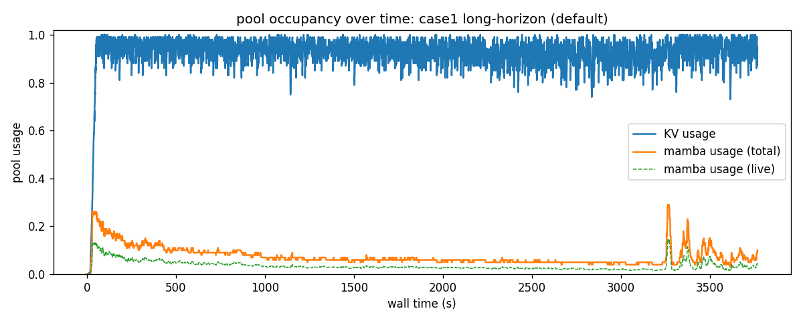
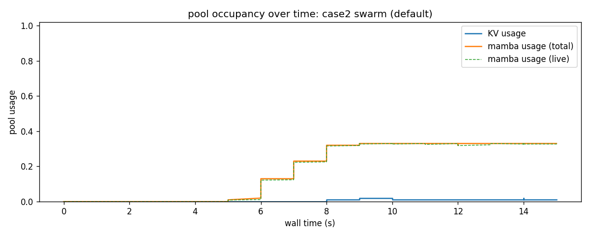
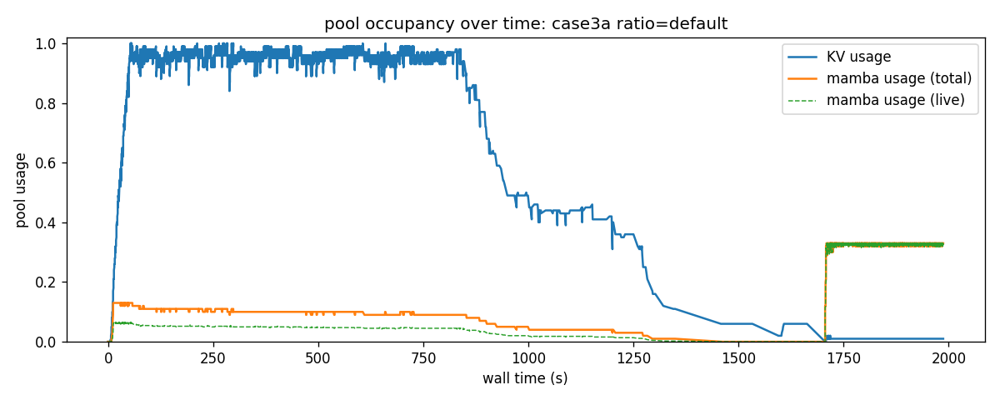
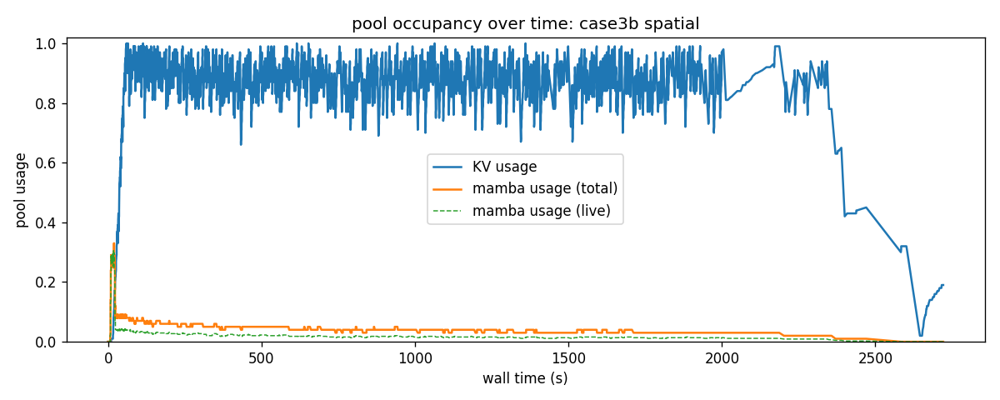

# interlayer: design

Cross-pool capacity reallocation for sglang's hybrid models (paged-attention KV pool + recurrent-state mamba pool). 
When one pool sits idle while the other binds, this layer re-binds physical handles from src to dst, fire wall runs on a worker thread, decode stream sees ~0 ms impact, no CUDA-graph re-capture, no in-flight request loss.

The implementation realizes the **full paper page-state machine** (4 states × 4 actuator transitions, Cap-barrier, Unmap, Drain, Migration, paper appendix line 48-54; plus 3 engine-driven transitions, alloc / finalize / cache-evict, that don't go through the cost model). 
Cross-pool transfers are routed through the Admitter's cost-model program: any arrival picks the cheapest of seven candidates (own/cross × {free, evict, migrate} plus defer) and synchronously fires the chosen transition. Steady-state rebalance is handled by the Budgeter.

This document describes the **architecture**.
Where the shipped build differs from the first-principles target (e.g. the discrete-tick EWMA planner vs the BOCPD estimator), the relevant section says so inline.
Progress tracking, the shipped-milestone record, and the forward roadmap live in `PLAN.md`, not here.

**Paper-eval cells.**
The design supports the full 2×2 matrix from the paper, selected by the cross-pool Budgeter (on/off) and the eviction sort key (`--radix-eviction-policy lru|lpb`):


|                 | LRU eviction              | LPB eviction   |
| --------------- | ------------------------- | -------------- |
| no cross-pool   | **off** (sglang baseline) | **intra-only** |
| with cross-pool | **inter-only**            | **full**       |


## 1. The problem

The KV pool and the mamba pool are heterogeneous, both in how they grow with a request and in what can be reclaimed under pressure.
KV grows densely: every token in flight adds a cache entry, and for prefix reuse the interior tokens cannot be dropped, because reusing a prefix replays its entire KV.
Mamba does not grow this way: it stores one fixed-size recurrent-state snapshot per cached-prefix boundary, so the longer the span between snapshots the fewer it keeps, and its occupancy grows slower than KV's.
Mamba's interior is also reclaimable: reusing a prefix needs only the recurrent state at its end, so intermediate snapshots can be evicted without losing reuse, where the equivalent KV cannot.

This asymmetry produces opposite bottlenecks under different workloads.

1. **Long-horizon agents.**
   Coding agents, deep research, and multi-turn sessions with accumulated tool output run at long, growing context and low concurrency.
   KV saturates first, because it grows densely with every token while mamba's total occupancy grows slower.
   And even when mamba's occupancy is high, its reclaimable interior makes its eviction cost far below KV's: the system drops mamba's intermediate snapshots cheaply and lends the freed capacity to both pools, a large net gain.
2. **Large-concurrency short Q&A.**
   A large share of production traffic is short user questions answered at high concurrency.
   Here each concurrent request takes a full mamba slot while its tiny context barely grows KV, so mamba's growth rate far exceeds KV's and mamba saturates first while KV sits idle.

For either stable workload there is a simple fix: choose the static pool ratio (`mamba_full_memory_ratio`) that matches its two-pool growth rates.
Such a ratio always exists for a single stable workload, but it cannot solve the third case.

3. **Dynamic workloads.**
   Because these two opposite workloads exist, so do dynamic ones: a mix of the two at the same time, or a switch between them across time.
   No static ratio is optimal for every phase, because the ratio that fits one phase is wrong for the other.

Therefore a runtime reallocator that follows the current pressure is at least as good as the best static ratio on any stable workload, reaching that split with no pre-configuration, and strictly better than any static ratio on a dynamic workload, because it re-binds capacity as the bottleneck moves.

## 2. Where we win

Measured on the agentreplay token-exact cc harness, baseline sglang (LRU, no
cross-pool), sglang's DEFAULT static split (`reproduce/waste/`). Occupancy is the
PEAK pool usage (max over active ticks): the bottleneck pool reaches near its
ceiling while the other peaks low, so the idle pool is the wasted / borrowable
capacity, in GB = pool size x (1 - peak). mamba usage is reported both with-cache
(live SSM states + cached snapshots) and live (states only); the gap is
reclaimable cache.

| case | bottleneck | KV usage | mamba usage (cache) | mamba usage (live) | wasted pool |
|---|---|---|---|---|---|
| 1 long-horizon | KV | 100% | 9% | 4% | mamba 19 GB |
| 2 short swarm | mamba (via `max_running`) | 2% | 33% | 33% | KV 23 GB |
| 3a dynamic (temporal) | flips per phase | (per phase, see figure) | | | both, over time |
| 3b dynamic (spatial) | KV (degenerates to case1) | 100% | 33% | 30% | mamba 14 GB |

case1 has mamba far below KV (9% vs 100%), live lower still (4%): mamba grows
slower than KV even counting cache, slower again without it. case2's mamba usage
peaks at only 33% yet it is the bottleneck: the bind is on `max_running`
(= mamba_pool/3, the concurrency cap), so mamba live is capped at 1/3 of the pool
by construction and can never saturate in bytes, the rest of the pool sits idle.

Static-best vs dynamic: sweeping the split (`--mamba-full-memory-ratio`) gives
the wasted capacity per workload, as the wasted pool's PEAK occupancy (how full
it ever gets) and the idle GB it leaves (pool GB x (1 - peak)). A stable workload
is minimized at one ratio; the two are minimized at OPPOSITE ratios, so no single
static split serves a workload that has both phases (case3).

| ratio (mamba / KV pool GB) | case1 long: mamba idle (peak occ -> GB) | case2 swarm: KV idle (peak occ -> GB) |
|---|---|---|
| 0.05 KV-heavy (2 / 43) | 64% -> **0.8 GB** | 0% -> 42.8 GB |
| 0.3 (10 / 35) | 19% -> 8.4 GB | 1% -> 34.2 GB |
| 0.9 default (21 / 24) | 9% -> 19.4 GB | 2% -> 23.2 GB |
| 2.0 mamba-heavy (30 / 15) | 6% -> 28.2 GB | 3% -> 14.5 GB |
| 3.0 (34 / 11) | not swept | 4% -> 10.8 GB |
| 5.0 mamba-max (37 / 8) | not swept | 7% -> 7.0 GB |

case1 (long) is best at the KV-heavy end (mamba sits in a small pool, 64% used,
only 0.8 GB idle); case2 (swarm) is best at the mamba-heavy end (KV pool shrinks,
so the always-idle KV leaves fewer GB). Opposite optima. case2's idle never
bottoms out: even at the mamba-max end KV still leaves ~7 GB, because the swarm
binds on `max_running` (concurrency), not bytes, so it cannot fill any pool at any
split. The win there is reclaiming that idle KV into mamba slots (more
concurrency), not driving occupancy to 100%. At every ratio at least one workload
wastes 7-43 GB, so a workload with both phases (case3) has no good static split.
Dynamic reallocation holds each phase near its own best.

Occupancy over wall time (`reproduce/waste/figures/`):

case1 long-horizon: KV pinned near 1.0 while mamba (total and live) stays near 0, so mamba is the wasted pool.



case2 short swarm: mamba-slot-bound (max_running) with KV near 0, so KV is the wasted pool.



case3a dynamic (temporal): a long phase then a swarm phase on one server. KV saturates in the long phase (mamba idle), then KV drops to ~0 and mamba rises in the swarm phase (KV idle). The bottleneck flips over time, so no single static split fits both.



case3b spatial mix (long + swarm arriving concurrently on one engine) does not max both pools at once: the long requests bind KV (peak 100%) and cap the running batch, so the swarm has no room to also drive mamba to its wall (mamba peaks at 33%, the max_running cap, never the byte limit). KV saturates first and mamba is the wasted pool (14 GB idle), KV-bound exactly like case1. A single shared batch turns a spatial mix into the same bottleneck flip over time, not a simultaneous double-bind.



Dynamic reallocation matches static-best on the stable workloads (1, 2) and beats
every static split on the dynamic one (3), the core empirical claim.

## 3. Mechanism

The substrate is CUDA's virtual memory management (VMM), which splits a normal
allocation into two parts.
A **physical handle** is a fixed-size chunk of physical HBM (2 MiB), allocated
once by `cuMemCreate`, with no virtual address of its own.
A **VA window** is a reserved range of virtual addresses (`cuMemAddressReserve`),
separate from any physical memory; reserving it is free, it is just address space.
To **map** a handle (`cuMemMap`) binds that physical chunk into one slot of a VA
window, so the addresses in that slot become usable; to **unmap** (`cuMemUnmap`)
releases the binding, leaving the VA reserved but unbacked.

There is a single shared pool of physical handles underneath both engine pools.
Each engine pool has its own VA window; at any moment a handle is mapped into one
window or the other.
A cross-pool transfer **re-binds** a handle: unmap it from the source pool's VA
window, map it into the destination's.
The handle's physical bytes never move and no tensor is reallocated, only which
VA window addresses those bytes changes, so every other byte stays where it was
and captured CUDA graphs stay valid.

### Boot

**Initial split = sglang baseline**.
sglang's existing computation (model_runner_kv_cache_mixin.py: solve `m_mamba + m_KV = M`,
`m_mamba / m_KV = mamba_full_memory_ratio`) gives a precise
two-pool split per user config. 
interlayer reuses that result.

```python
HBM_for_pools = total_HBM - weights - activation_reserve     # net, not gross
n_handles     = HBM_for_pools / chunk_size

# sglang's existing precise split:
init_mamba_chunks, init_KV_chunks = sglang_compute_split(server_args)
assert init_mamba_chunks + init_KV_chunks == n_handles

shared_pool = SharedHandlePool(n_handles)        # cuMemCreate'd 2 MiB chunks

kv_arena = MultiTensorArena(
    shared_pool,
    va_capacity_chunks = n_handles,              # VA reservation: free, oversized
    initial_chunks     = init_KV_chunks,         # cuMemMap'd at boot
)
mamba_arena = MultiTensorArena(
    shared_pool,
    va_capacity_chunks = n_handles,
    initial_chunks     = init_mamba_chunks,
)
```

Every handle is mapped at boot, into one pool's VA window or the other: no
unmapped reserve, and the conservation law `Σ_i m_i^mapped = n_handles` holds
always except the ~µs window of a transfer (after `cuMemUnmap` on src, before
`cuMemMap` on dst).
Each pool reserved the FULL `n_handles` of VA, not just its boot share, so either
pool can grow past that share by mapping more handles into its already-reserved
window with no tensor realloc; growth is bounded only by `Σ m_i^mapped ≤
n_handles` and the source pool's working-set floor (§"Allocator floor: working set only").

CUDA graphs captured after boot dereference each pool's tensor via
`page_table[id]`, a kernel input rather than a graph-baked address, so re-mapping
is graph-safe.

### Where free pages come from, and how they move

We do not reserve spare memory at boot: every handle is mapped, so there is no
idle pool to hand out.
The free pages come from normal running.
A request finishes and its pages go back to its pool's free list.
A cache eviction frees pages too.
So whenever a pool is not fully loaded, it always has a lot of free pages sitting
idle (the paper's `lem:tail-active` proves that at arrival load `α`, a pool's free
pages stay at least `(1 - α) x size` in expectation).

To move capacity, the cost model decides WHETHER to fire; the magnitude is demand-driven, transferring all available free source pages (subject to the working-set floor).
The actuator unmaps those pages from the source pool (`cuMemUnmap`), the handles return to the SharedHandlePool, and then the recycled handles are mapped into the destination pool (`cuMemMap`).
Zero extra GPU memory: the same physical handles are rebound, not duplicated.
No `torch.cuda.synchronize` needed: unmapped slots are free, no in-flight kernel touches them.
No bytes are copied: one pool grows past its boot size, the other shrinks below it.

### Page ownership state

Every mapped page is in exactly one of four states (paper appendix line 33-47):

| state  | meaning                                                 |
| ------ | ------------------------------------------------------- |
| FREE   | in allocator's free list, no kernel reads it            |
| CACHED | backs a prefix-cache node, evictable on demand          |
| LIVE   | bound to an in-flight request's index tensor            |
| CAPPED | withheld by the actuator's cap-barrier, unmappable next |

Seven total transitions, split into engine-driven (3, no explicit cost, the
engine runs them on its own) and actuator/cost-driven (4, each priced and chosen
by the Admitter; paper appendix line 48-54):

```
ENGINE-DRIVEN (free; the engine runs them on its own):
  alloc:        FREE   → LIVE                  (sglang's allocator)
  finalize:     LIVE   → CACHED                (req done, tree retains node)
  cache-evict:  CACHED → FREE                  (sglang tree evicts on demand)

ACTUATOR / COST-DRIVEN (chosen by Admitter; priced by cost model):
  Cap-barrier:  FREE   → CAPPED                (actuator stage 1, blocks alloc reuse)
  Unmap:        CAPPED → handle leaves pool    (final stage; FREE on dst after Map)
  Drain:        CACHED → FREE                  (request a sglang cache-evict ahead of need)
  Migration:    LIVE   → FREE                  (migrate_slot byte-exact + index tensor rewrite)
```

### Threading model

**This section explains how the slow memory move is kept off the inference hot
path.**
Unmapping and re-mapping handles are slow system calls: one whole fire can take
tens of milliseconds of wall clock.
Doing that inline on the scheduler thread would freeze decode for that long.
So each fire is split into a fast **decision** and a slow **execution**, run on
two different threads.

The **decision** runs on the scheduler thread, which is single-threaded, so it
needs no locks to read state.
It covers the Admitter's per-arrival cost choice, the Budgeter's per-tick pressure
check, the fire planner's page selection, and the **cap-barrier**: the step that sets
the chosen pages aside, flipping them from FREE to CAPPED, a state the allocator
will not hand out to any request.
The Budgeter here is just a callback the scheduler runs between iterations,
rate-limited to about once a second (`SGLANG_HIMA_TICK_S`); since the planner
works in per-second rates, this interval is only a sampling rate, not a behavior
knob.
The decision is cheap, a few hundred microseconds, so the scheduler pays almost
nothing and goes straight back to admitting and decoding.

The **execution** runs on a separate worker thread (`_fire_worker`).
It does the actual `cuMemUnmap` then `cuMemMap` calls, plus, for Migration, the
`migrate_slot` byte copy on a side CUDA stream so it overlaps the normal GPU
compute instead of blocking it.
One fire runs at a time, serialized by `XPoolActuator._fire_inflight`.
The one place the two threads touch shared state, the per-arrival reservation,
takes the destination pool's `_alloc_lock`, so the worker's move cannot race the
scheduler's allocation.

This slow unmap runs at the same time as decode, and that is safe because of the
ordering.
The cap-barrier ran first, on the scheduler thread, so by the time the worker
unmaps a page it is already CAPPED.
So unmapping it on the worker thread cannot pull memory out from under a live
kernel.

Two measured properties back the claim that this overlap is safe and free.

**Property A1** (the safety claim): unmapping a free page from the worker thread,
while a real captured CUDA graph is running, neither crashes the graph nor stalls
decode, and needs no defensive synchronization.
It relies only on one invariant: the planner never unmaps a page an in-flight
request still uses.
If that invariant is ever broken, the next graph replay touching the page faults
at once, which is the chosen fail-fast behavior.

**Property A2**: Migration's side-stream byte copy is exact under captured-graph
replay and overlaps decode at no measurable cost.

Measured numbers and the experiment setups are in the appendix
(§"Property evidence").

### Cap-barrier implementation

Tracking which pages are CAPPED must not slow down sglang's per-token `alloc` and
`free` (we add the cap bookkeeping to them; we did not write them).
The capped pages are almost always a contiguous block at the end of the pool, so
we track them as one boundary number ("everything past here is capped") plus a
small set for the rare exceptions, not as a list that alloc and free scan every
time.
An earlier design did keep that list and checked it on every alloc/free, which
was a per-token tax on decode; the boundary form removes it.
The internals, and the loud-fail correctness invariants the split must hold, are
in the appendix (§"Cap-barrier internals" and §"FREE/CAPPED invariants").

**Two of the actuator transitions are the harder ones: Drain and Migration.**
They do not move an already-free page; each first turns an occupied page into a
free one (Drain frees a CACHED page, Migration frees a LIVE one), which costs more
and has side effects.
So both are routed through the Admitter's cost program and are never picked unless
the cost model proves them cheapest:

- **Drain** never overrides sglang's eviction order; the Admitter
estimates the recompute loss of the cheapest-to-evict cached
blocks (`c^evict_i`, see below) and asks sglang's RadixCache
to execute. Selection order matches whichever policy is active
(LRU or LPB).
- **Migration** uses `MambaPool.migrate_slot` to move the slot
state byte-exact to a different page in the same pool, then
rewrites the in-flight req's `ssm_state_indices`. Cap-barrier
follows on the now-free page. Byte-correctness under captured
CUDA-graph replay is property A2 (above).

**Invariant**: every transition to CAPPED is preceded by either
(a) the page already being FREE, (b) Drain having converted it
to FREE, or (c) Migration having converted it to FREE, so the
Unmap step never touches a page that any captured graph or
in-flight req still references. Combined with A1 (worker-thread
Unmap doesn't stall decode) this gives fire wall ≈ 0 ms on the
decode stream regardless of which transition class was chosen.

### Where the free pages sit, and the no-crash fallback

The free pages cluster at one end of the pool, which makes them easy to harvest.
Each pool's allocator hands a new request the lowest-numbered free pages and never
moves them later, so as requests come and go the free pages pile up at the high
end of the pool.
The actuator harvests from that high end, so it rarely has to hunt for scattered
space, and below saturation there are far more free pages than any one fire needs.

If a pool ever has no free pages to lend (both pools saturated), the planner does
not give up: it falls back to Drain and Migration to free a page, priced through
the same cost model, and only when every action is expensive does it defer the
request rather than crash.
Both pools' allocators work this way, so the behavior is symmetric in both
directions.
The steady-state free-page bound and the allocator's placement-bias config knob
are in the appendix (§"Allocator placement bias").

### Picking which pages to move

To move `n` pages, the planner looks for them in three stages, cheapest first, and
stops at the first stage that finds enough:

1. **Free pages**: take `n` already-free pages. They cost nothing to move.
2. **Drain**: if there are not enough free pages, free some cached ones, choosing
   the cheapest to lose (in the same order sglang's own eviction would pick, LRU or
   LPB). Each one adds its recompute cost.
3. **Migration**: if still short, relocate some live slots to free their pages.
   Each one adds its data-copy cost.

The Admitter and Budgeter both read this same staged cost when deciding whether a
move is worth it, so they price it consistently.
If even stage 3 cannot reach `n`, the planner refuses and bumps a refuse counter:
a sustained nonzero refuse rate means the pool sizing or workload has gone past
what the cost model can absorb, and the system degrades to deferring requests, not
crashing.
The shipped gating of Drain and Migration (fail-closed flags, migration
feasibility) is in the appendix, §"Page selection (detail)".

The exact step sequence the actuator runs for a transfer (cap-barrier, optional Drain/Migration pre-conditioning, unmap, map) is in the appendix, §"Transfer protocol (detail)".

### Allocator floor: working set only

When the Budgeter borrows mamba pages for KV (the m2k direction), it must not drain mamba below what the running requests actually need, or a later request's cache fork crashes with "Can not alloc mamba cache".
So the floor it keeps is the live working set: the active recurrent states plus the locked cache, plus a small safety margin.
Everything above that, the free pages plus the unlocked cached snapshots, is donatable (the snapshots are evicted from cache to free before the move).

Crucially, the floor does NOT reserve the nominal `max_running` concurrency cap.
That cap is about a third of the pool, and in a KV-bound workload where only a few long requests fit it far exceeds the real active set; reserving it would withhold most of the pool and refuse the very donate that is the win (measured: 59 of 72 m2k fires aborted on the old cap-based floor).
A burst that outgrows the safety margin is recovered on demand by the active-slot grow hook (grow mamba back from idle KV), not pre-reserved.
The exact formula, the three demand-grow hooks, and the boot-time static floor are in the appendix, §"Allocator floor (detail)".

## 4. Decision layer: Admitter + Budgeter

Paper's two-phase architecture. Per-arrival cost decisions
(Admitter) handle bursts synchronously; a slow control loop
(Budgeter) handles steady-state rebalance via empirical
pressure signals. In the TARGET the cost model decides everything with
no static floor; the shipped interim still keeps a coarse static arena
floor (see §"Allocator floor: working set only" for the target-vs-shipped
distinction).

### Shared cost model

**The Admitter and Budgeter price every action with one shared cost model, so both make consistent choices.** Each action's cost is a sum of a few terms:

| term | plain meaning | how we get it |
|---|---|---|
| `c^xfer` | time to move bytes between pools | boot probe, then a live running average |
| `c_m` | time to migrate one slot's state | boot probe |
| `c^evict` | recompute cost of the cache we would have to evict | computed from sglang's radix tree at decision time, in its active eviction order |
| `c_i(s)` | recompute cost of re-prefilling a length-`s` prefix | offline calibration per (model, GPU) |
| `w_q` | SLO penalty per ms a request waits in queue | set by the deployer |

The probe and calibration mechanics, and why migrate needs no degenerate-curve gate while drain does, are in the appendix, §"Cost model (detail)".

### Admitter: per-arrival cost decision

**The Admitter runs once per arriving request: if the request needs room the
engine cannot give it, the Admitter picks the cheapest of seven actions and fires
it synchronously before admitting.**
The seven actions: from the request's own pool, use free space, evict cache, or
migrate a slot; the same three from the other pool (a cross-pool transfer); or
defer the request.
It prices each with the cost model and takes the lowest, breaking ties in a fixed
order; the migration actions are off by default and capability-gated.

**Symmetric direction (P4.1/P4.2).** A hybrid arrival needs room in BOTH
pools, `X` KV tokens AND mamba state for its whole lifecycle: one ACTIVE SSM
slot (held while running) plus one CACHING FORK (`cache_unfinished_req` copies
the prefix state into a new locked radix node while keeping the active slot,
net +1). So `mamba_arrival_need = active(1) + fork(1) = 2` slots (a sglang-internal physical constraint from `MambaRadixCache.cache_unfinished_req`). `i_dst` is not fixed: the Admitter
detects which pool blocks the arrival and grows that one. When mamba cannot
cover that lifecycle (`m_mamba^free + evictable_mamba < mamba_arrival_need`)
the destination is **mamba** and the source is **KV**
(grow mamba from KV, k2m); otherwise the destination is KV (grow KV from
mamba, m2k, the original direction). If BOTH pools are scarce the two grows
are opposite cross directions (each is the other's source) and neither can
serve the arrival, so the decision is **defer**, sglang's normal
back-pressure, never a fire that would admit the req into a pool whose
`cache_unfinished_req` fork then crashes ("Can not alloc mamba cache").
`decide` is direction-agnostic (it compares costs over `dst`/`src` labels);
`decide_for_req` picks the direction and `execute_decision` fires it
(`f"{src_pool}_to_{dst_pool}"`).

**Why this is intended to be the burst-safety mechanism (not a static
reservation).** The mamba-grow direction is what is *meant* to let the
Budgeter drain mamba aggressively while staying crash-safe: the Budgeter's
working-set floor (§"Allocator floor") would then only need to cover the
*grow latency*, because a mamba-pressure burst is served on demand by the
Admitter growing mamba from KV, the design's "burst safety is delivered by
the Admitter firing transfers synchronously on admission, not by pre-reserving
capacity". Demand-grows fire at **three** points (admission can't cover all):

- **arrival grow** (Admitter `decide_for_req` → `_decide_grow_mamba`): a
mamba-scarce arrival can't get its ACTIVE SSM slot → grow mamba from KV
before admitting. Covers the active working set at admission time.
- **active-slot grow** (`HybridReqToTokenPool.alloc` →
`_mamba_active_grow_hook` → `BudgetAgent._grow_mamba_from_kv`): when the live
mamba cap is exhausted at active-slot alloc (a per-request active SSM slot
drawn mid-prefill, with no Admitter hook on that path), this fires a
synchronous k2m grow from idle KV and retries before the "Not enough space
for mamba cache" assert. This is the M1 active-grow; it is what lets `_grow_kv_from_mamba` (the m2k transfer) drain mamba below the static `max_running`
floor, since the active path can now self-heal a burst.
- **fork grow** (`MambaRadixCache._fork_mamba_with_recovery` →
`BudgetAgent._grow_mamba_from_kv`, wired as `tree_cache._mamba_grow_hook`):
a request already running forks ONE mamba slot at `cache_unfinished_req`
(mid-prefill, AFTER admission, no Admitter hook there). When the pool is
full and `evict_mamba` finds no unlocked cold cache, this fires a
synchronous k2m grow and retries the fork, instead of asserting "Can not
alloc mamba cache"). Covers the caching fork.

Without the fork grow, the only way to keep that mid-prefill fork safe is the
static `fork_headroom` reserve, which is why the floor couldn't be lowered.
With it, the floor's reserve becomes adaptive (next section).

So the layers, each catching what the previous can't: (1) the Budgeter floor
keeps mamba above what the on-demand grows can restore in time; (2) the
Admitter grows the scarce pool **on arrival**; (3) the active-slot hook grows
it for a **mid-prefill active SSM slot** and the fork hook for a **mid-prefill
caching fork**; (4) when neither pool can donate, defer (sglang
back-pressure).

**Mechanism vs policy, what is free and what trades.** The fork grow is
*unconditionally* an improvement: the normal path
(`_fork_mamba_with_recovery`) is byte-identical to the old code when the first
`fork_from` succeeds (one call, return), the evict/grow steps run ONLY on the
failure path, which previously *crashed*. So it adds **zero normal-case
overhead** and strictly replaces a crash with an on-demand grow; it ships
regardless. The *policy* of lowering the floor (P4.5) is the separate,
tunable trade: a lower floor lets the Budgeter run mamba tighter (more KV
benefit) but pushes forks into scarcity more often → more (synchronous) grows
→ possible burst-TTFT spikes. **Pending P4.4/P4.5 e2e validation:** does a
lowered floor's grow frequency hurt steady-state latency, or are grows rare
enough that the net is a win? If it hurts, keep the fork-grow safety but raise
the floor, the two are decoupled.

*Why a synchronous grow rather than just a bigger static floor.* A static
floor sized for the worst-case burst over-reserves permanently. The
crash-safe floor is ≈ `2·max_running` (active + one concurrent fork per
running req, the locked prefix node), and on the cc config one mamba slot is
≈ 52 MiB (24 layers × a 2 MiB SSM chunk + conv), so for a pool sized at
sglang's `3·max_running` minimum that floor is ≈ two-thirds of the whole pool
, leaving almost nothing for the Budgeter's m2k to donate, i.e. it neuters the
optimization in exactly the balanced configs it targets. The synchronous grow
lets the floor shrink toward a grow-latency buffer and restores capacity
**on demand** only when a burst actually arrives, so idle capacity isn't
locked away. (This is the cost trade the rejected "bigger static floor"
alternative pays; the rejected "best-effort fork" alternative is discussed in
`3_budgeter/mamba_drain_floor/README.md`.)

The Admitter's per-arrival scarcity test (`mamba_arrival_need = active + fork = 2`) is a PER-ARRIVAL quantity, not a per-burst one: it does not by itself
bound the concurrent forks of N requests admitted in the same tick (the
mamba-exhaustion concurrency gap). The shipped floor therefore does NOT lean on need=2: it
reserves the live working set (`active + protected + safety_margin`) so every
already-running request's slot is kept, and delegates the *burst* of new
concurrent forks/admits to the active-slot grow hook (synchronous k2m from
idle KV), which is the per-request concurrency safety the static `max_running`
reserve used to provide. The grow-frequency-vs-latency trade is the e2e
validation still pending above.

sglang's own fork-safety invariant (`max_mamba_cache_size ≥ ratio·max_running`,
capping `max_running = pool // ratio` in `model_runner_kv_cache_mixin`, where
`ratio = MAMBA_CACHE_SIZE_MAX_RUNNING_REQUESTS_RATIO = 3`, plus the extra-buffer
ping-pong term so it is **3–5** when `enable_mamba_extra_buffer`) is what the
cross-pool layer must preserve dynamically, never shrink mamba below the
fork-safe working set.

On each request arrival with demand X bytes for destination
pool `i_dst`, evaluate seven candidates and pick the cheapest
*finite-cost* candidate. Each candidate has a feasibility
predicate; an infeasible candidate is `∞`:

The cross candidates are **cumulative**: a fire fills greedily FREE →
Drain → Migration (the planner's Stage 1→2→3 order), so each candidate
uses FREE first and layers its own mechanism only for the *shortfall*
`S = (X − m_src^free)`. Feasibility is the running sum; cost charges each
mechanism only for the pages it actually harvests (so the Admitter's
predicted cost equals the fire's actual byte cost). All X pages transfer,
so `c^xfer(X)` is paid by every cross candidate.

```
own-free:     feasible iff m_dst^free ≥ X                       # space already free in i_dst
              cost = 0
own-evict:    feasible iff evictable_dst ≥ X                    # Drain at i_dst via sglang RadixCache
              cost = c^evict_dst(X)                             # (own side not yet cumulative — see note)
own-migrate:  feasible iff migratable_dst ≥ X                   # LIVE→FREE within i_dst (defrag)
              cost = c_m_dst(X)
cross-free:   feasible iff m_src^free ≥ X                       # transfer, FREE only
              cost = c^xfer(X)
cross-evict:  feasible iff m_src^free + evictable_src ≥ X       # transfer + FREE→Drain
              cost = c^xfer(X) + c^evict_src(S)                 # S = max(0, X − m_src^free)
cross-migrate: feasible iff m_src^free + evictable_src + migratable_src ≥ X   # transfer + FREE→Drain→Migration
              cost = c^xfer(X) + c^evict_src(D) + c_m_src(M)    # D = min(S, evictable_src); M = S − D
defer:        always feasible
              cost = Q · w_q                                    # enqueue this arrival
```

A cross candidate is thus "finite-cost" whenever the pool can supply X at
all; the *label* names the most-expensive mechanism the greedy fill needs,
and the min-cost + tie-break pick selects it. When migration isn't needed
(FREE, or FREE+Drain, already reach X) the migrate part `M = 0` and
`c_m_src(0)=0`, so cross-migrate ties the cheaper candidate and loses the
tie-break, preserving zero-downside. (The per-mechanism `≥ X` predicates above were a pre-revision simplification.
The **own** candidates are not yet cumulative, own-evict still gates on
`evictable_dst ≥ X` alone, tracked as a follow-up, since changing the
common own-path is higher-risk than the rarely-taken cross path.)

Feasibility quantities:

- `m_i^free`, bytes currently in FREE state in pool i
(cap-barrier excluded)
- `evictable_i`, bytes available via Drain: `sglang.RadixCache. evictable_size_` for pool i, capped at the policy-aware
predicted prefix size that frees X bytes
- `migratable_i`, bytes Migration can CONSOLIDATE into whole free
chunks in pool i: relocate the slots of a FULLY-LIVE chunk into
SCATTERED free slots on OTHER (kept) partially-live chunks, freeing the
source chunk for transfer. (No contiguity requirement, the cross-pool
transfer accepts any K free chunks; `2_admitter/README.md`.)
Bounded by the count of partial (mixed live+free) chunks. **Zero on an atomic layout**
(`tokens_per_chunk == 1`): a chunk is either fully-live or whole-free,
so there are no partial chunks to donate, Migration cannot add a net
free chunk. Only a fragmentable layout (`tokens_per_chunk ≥ 2`, e.g.
TP ≥ 2 or bf16 ssm; KV is always fragmentable) yields such partial chunks.

`Q` is the current deferred-queue length. The Admitter takes the
action with minimum cost; ties broken in priority order:
**own-free > cross-free > own-evict > cross-evict > own-migrate

> cross-migrate > defer**. Same-cost two-free or two-evict
> ties already pre-exist (`admitter.py`); the migrate
> suffix slots in below them so a free-or-evict candidate that
> ties with a migrate one wins.

**Why all seven**: paper appendix line 53-54 declares Drain
(CACHED → FREE) and Migration (LIVE → FREE) as transitions
the actuator may use; the implementation exposes them as
priced candidates rather than special-case fallbacks. Each
costs as much as its actual mechanism (no fudge factors): Drain
inherits sglang's recompute estimate, Migration inherits the
side-stream copy + index-rewrite cost. **Per the "zero-
downside" invariant: high-cost actions are simply never picked
when cheaper alternatives exist**, adding them cannot regress
the system, only unlock cases where the 5-action set is
forced into `defer`.

Coverage of the operating regime:

- **α ≤ 0.85 (below saturation, paper's free-page lemma (`lem:tail-active`))**: `own-free` or
`cross-free` dominates >95% of decisions. Drain/Migration
costs aren't competitive; selection rate ≈ 0.
- **α → 0.85 (fragmenting)**: pools have free slots overall
but the planner's free_ready predicate starts failing on
individual fires. Drain and Migration begin contributing as
fire candidates.
- **α > 0.85 (saturated, fragmentation regime)**: Drain (cheap
when cached blocks are recompute-cheap) and Migration (cheap
when slot bytes are small) absorb fires that would otherwise
defer. This was paper's "future work" regime (appendix line
96-98); the implementation now handles it.
- **All pools full of hot LIVE state**: every action has high
cost; `defer` wins. Graceful degradation, not crash.

### Dynamic admission cap (coupling with pool growth)

The Admitter's per-arrival cost decision assumes the scheduler
can admit more concurrent requests when the mamba pool grows.
sglang's stock implementation doesn't deliver this: at boot,
`max_num_reqs = floor(max_mamba_cache_size / ratio)` is computed
once and the resulting `ReqToTokenPool.free_slots`, `FutureMap. token_ids_buf`, etc. are sized accordingly. Cross-pool fires
that grow mamba physically don't lift the admission cap.

We resolve this by **VA-stable wrapping** of per-request arrays
(implementation tests and sglang-specific notes in
`[1_dyn_admission_cap/](1_dyn_admission_cap/)`; production
locations summarised in that folder's README):

- `ReqToTokenPool.req_to_token` is backed by a `ReqTokenVAArena`
(a thin wrapper over the same `chunk_arena.SharedHandlePool`
  - `from_blob_ext.tensor_from_va` primitives used for the KV
  and mamba pools). VA is reserved up to `max_size = max_num_reqs × (1 + r) / r` where `r` is `mamba_full_memory_ratio`: the theoretical ceiling if all KV handles converted to mamba slots; physical pages are mapped only for the live `size` rows.
- `HybridReqToTokenPool` pre-allocates its small mapping tensors
(req_index_to_mamba_index_mapping, ping_pong) at `max_size`
directly, these are tiny (≈4 B × max_size).
- `FutureMap` pre-allocates `token_ids_buf` for `max_running_ requests_max` and updates only the live `future_limit` /
`max_running_requests` on grow.
- The Budgeter's per-iteration loop also polls `mamba_pool.size`
(production reads `mamba_pool.live_size`; the two are kept in
sync post Phase 7, see `memory_pool.py`, `live_size` is
the documented public surface, `.size` follows it on every
`set_capacity_slots`); on change, computes
`new_cap = min(user_max_running_requests, pool.max_size, mamba_pool.size // ratio)` and calls `pool.grow(N)` /
`pool.shrink(N)`. Shrink rejects when a slot in the shrunk
range is still held; the Budgeter retries on the next iteration.

Why VA-stable instead of "reallocate and re-capture": CUDA-
captured Triton kernels (per `audit_cuda_graphs.md`) bake in
`req_to_token.data_ptr()` at capture time. Re-allocating the
tensor invalidates captured graphs (segfault on replay).
`cuMemMap` adds physical backing to a pre-reserved VA range
without changing the tensor's `data_ptr`, captured graphs
keep working post-grow.

### Budgeter: steady-state pressure rebalance

The Admitter only fires when an individual arrival's cost
calculus chooses cross-pool. It misses steady-state imbalance
that **wastes** cache without breaking admission. Example:
workload is mildly KV-heavy; admission still succeeds via
frequent local evictions; meanwhile mamba pool sits half-empty
holding cold cache. Admitter doesn't see the asymmetry; cache
hit rate slowly bleeds.

The Budgeter watches for **rate-level imbalance** and fires
pre-emptive transfers when an imbalance is sustained or newly-started
and worth the actuator cost. The trigger mathematics come in two
variants (see §"Trigger rule" below for the full spec + Status): the
TARGET is a per-pool BOCPD posterior on `pressure_rate_i` evaluated per
scheduler iteration (NOT yet shipped); the SHIPPED Phase-1
baseline is the τ-invariant net-benefit (NB) direction planner in
`xpool_planner.py`, per-second rate signals (raw counts ÷ `dt`),
EWMA-smoothed, an arg-max-NB direction gated by an actuator-cost
threshold, and wall-clock `cooldown_min_s` / `amortize_horizon_s`
(seconds). The polling interval `τ` (`SGLANG_HIMA_TICK_S`, default
1 s) is a pure sampling rate: working in per-second rates and
seconds-horizons makes the planner's decisions invariant to `τ`, so `τ`
is not a behaviour knob. The BOCPD framework is validated against this baseline;
on stable workloads both reduce to the same fire schedule up to jitter.

The full trigger math (the empirical pressure signal, the reuse-aware grow and drain costs, the net-benefit cap, and the continuous-time change-point trigger), the per-scenario behaviors, and the ops knobs are in the appendix, §"Budgeter internals".

### Why both phases are needed


| Phase        | Triggers on                                           | Handles                                            |
| ------------ | ----------------------------------------------------- | -------------------------------------------------- |
| **Admitter** | A specific arrival's cost calculus chooses cross-pool | Burst (one req can immediately fire the actuator)  |
| **Budgeter** | EWMA pressure gap > threshold                         | Steady-state mix drift (cache wasted in idle pool) |


Without Admitter: bursts queue until next tick → unacceptable SLO.
Without Budgeter: workload mix shifts slowly, cache hit rate
bleeds even though admission technically still succeeds.

## 5. Walkthrough

This section traces one request through the system end to end, in the order things actually happen.
It reuses the mechanism (§"Mechanism") and the decision layer (§"Decision layer: Admitter + Budgeter") defined above; here they run as a sequence.
Starting state: the engine booted at the baseline split (§"Boot"), every handle mapped, the idle pool holding free pages while the busy pool sits near its cap.
`ReqToTokenPool` pre-reserves VA for `max_num_reqs × (1 + r) / r` rows (where `r` = `mamba_full_memory_ratio`; formula in `ModelRunnerKVCacheMixin._resolve_max_admission_size`), the theoretical ceiling if all KV handles converted to mamba; fire can grow `max_running` beyond the boot value without resizing per-request arrays. Physical pages are mapped only for the boot `size` rows.

### Step 1: a request arrives, can the engine give it room?

A new request enters at `Scheduler._add_request_to_queue`, which calls `Scheduler._admitter_on_arrival`.
This whole layer is gated by `SGLANG_HIMA=1`, which builds `Scheduler.admitter` + `Scheduler.budget_agent`.
If it is off (or `admitter is None`), `_admitter_on_arrival` is a no-op and the request queues like baseline sglang.

First, find the request's two demands, one per pool:
- KV: `x_tokens = len(req.origin_input_ids)`, the prompt length (at arrival only the prompt exists).
- mamba: `Admitter._mamba_arrival_need_slots`, fixed at 2: one active SSM slot to run, plus one `cache_unfinished_req` fork slot (sglang physical constraint, not configurable).

Then call `decision = self.admitter.decide_for_req(req, self, tokens_per_page=...)`.
Inside `decide_for_req`, the entire capacity snapshot is taken under `kv_alloc._alloc_lock` (prevents the Budgeter's concurrent `set_capacity_pages` from shifting the numbers mid-decision). It reads four numbers:
- KV free: `kv_alloc.available_size()` (`TokenToKVPoolAllocator`), KV reclaimable: `Admitter._kv_evictable(tree_cache)` (tries `full_evictable_size`, falls back to `evictable_size`).
- mamba free + migratable: `Admitter._mamba_feasibility(scheduler, mamba_pool, tokens_per_page)`. With `owner_provider` wired (production path), uses `SchedulerOwnerProvider.mamba_tokens_per_page` and `build_mamba_owner_map` for page-level free/migratable counts. During boot temporal gap (`owner_provider is None`), falls back to `mamba_allocator.available_size()` (free only, zero migratable).
- mamba reclaimable: `Admitter._mamba_evictable(tree_cache)` → `MambaRadixCache.mamba_evictable_size`.

Then check each pool's `free + reclaimable` against its demand. The mamba test is `mamba_free_kv_equiv + mamba_evictable_kv_equiv < _mamba_arrival_need_slots * tokens_per_page`; KV is short the same way against `x_tokens`.
- Both pools have room: `decide_for_req` returns an own-pool `AdmitterDecision` (`own_free`, or `own_evict` if it must reclaim first), nothing fires, and `PrefillAdder` admits the request like baseline (the common case).
- One pool is short: that pool is the grow target, and `decide` prices the cross-pool options for it (Step 2). The scheduler fires if `decision.action` is `cross_free` / `cross_evict` / `cross_migrate` (cross-fire is always enabled when `SGLANG_HIMA=1`).
- Both pools short: `defer`, sglang's normal back-pressure (the two grows are opposite directions, neither can serve).

### Step 2: the Admitter prices the seven options

Same call as Step 1, one level down.
`Admitter.decide_for_req` has read the four numbers (Step 1) and picked the direction: the short pool is the grow target `dst`, the other is `src`.
It sets `AdmitterDecision.dst_pool` / `src_pool` accordingly (`"kv"` or `"mamba"`), then calls the core pricer `Admitter.decide(x_tokens, dst_free, dst_evictable, ..., c_xfer_total, ...)`.

`decide` is a pure function over numeric inputs (no scheduler state).
It computes `x_eff = _round_up_pages(x_tokens, tokens_per_page, lcm_pages) * tokens_per_page`, the demand rounded up to whole VMM chunks (so the planner and the pricer agree on granularity).
Then it prices seven candidates with the shared cost model:
- `c_xfer_total = n_pages_rounded * CostModel.c_xfer_us(1)` (per-page transfer cost from `RuntimeActuatorCost` EWMA, sentinel 3000 us/page when unwarmed).
- `c_evict_dst_us` / `c_evict_src_us`: from `CostModel.c_evict_us(pool, n_tokens)`, the κ_KV / κ_M recompute-cost curves.
- `c_migrate_src_us` / `c_migrate_dst_us`: from `CostModel.c_migrate_us(pool, n_slots)`, +inf when the pool has no migrate primitive (e.g. dst=kv).
- `w_q`: `CostModel.w_q_us()`, the per-queued-request defer penalty.

An infeasible candidate costs `inf`.
Own candidates check the raw demand `x_tokens`; cross candidates check `x_eff`.

| candidate | feasible when | cost |
|---|---|---|
| `own_free` | `dst_free >= x_tokens` | 0 |
| `own_evict` | `dst_evictable >= x_tokens` | `c_evict_dst_us` |
| `own_migrate` | `dst_migratable >= x_tokens` | `c_migrate_dst_us` |
| `cross_free` | `src_free >= x_eff` | `c_xfer_total` |
| `cross_evict` | `src_free + src_evictable >= x_eff` | `c_xfer_total + c_evict_src_us` |
| `cross_migrate` | `src_free + src_evictable + src_migratable >= x_eff` | `c_xfer_total + c_evict_src_us + c_migrate_src_us` |
| `defer` | always | `queue_len * w_q` |

The cross candidates are cumulative: each uses free first, then layers drain, then migrate for the shortfall, so the costs stack.
The two migrate actions are capability-gated off by default (`CostModel.c_migrate_us` returns `inf` when no migrate primitive exists, e.g. dst=kv; also `inf` during cold-start until `BootProbedMigrateCost` is seeded by the boot probe).
`decide` returns the minimum-cost `AdmitterDecision`, breaking ties by `_TIE_BREAK_ORDER`: own_free > cross_free > own_evict > cross_evict > own_migrate > cross_migrate > defer.
The full cost vector is stored in `AdmitterDecision.candidate_costs_us` (for JSONL logging and test assertions).

Back in `decide_for_req`, the decision is logged via `Admitter._log_decision` (to `SGLANG_HIMA_ADMITTER_LOG` if set), and returned to `_admitter_on_arrival`.
A transfer fires (Step 3) only when the winner is a `cross_*` action; an own action or `defer` means no fire, the request proceeds directly to `waiting_queue.append`.

### Step 3: fire the cross-pool transfer

Step 2's winner was a `cross_*` action, so `Scheduler._admitter_on_arrival` calls `Scheduler._maybe_admitter_fire(req, decision)`.
`_maybe_admitter_fire` first checks `self.admitter.actuator is None` (boot temporal gap, before `BudgetAgent._ensure_actuator_chain` runs on the first tick); if so, returns without firing.
Otherwise it calls `Admitter.execute_decision(decision, x_tokens, src_pool, dst_pool, tokens_per_page)`.
Inside `execute_decision`: the fire demand is `AdmitterDecision.fire_x_tokens` (set by `decide_for_req` to the request's demand in the destination pool's units), rounded up to whole VMM chunks via `_round_up_pages(fire_x, tokens_per_page, actuator.lcm_pages)`.
Then it builds a `FirePlan` via `XPoolFirePlanner.build(direction, n_pages_rounded, allow_drain, allow_migrate)`.
The action from Step 2 sets how far the planner's three-stage page selection may expand: `cross_free` = free only (Stage 1), `cross_evict` = free + drain (Stages 1-2), `cross_migrate` = free + drain + migrate (Stages 1-3).
Then `XPoolActuator.cap_barrier` runs the entire transfer atomically on the scheduler thread, between batches:
- `_MambaCapAllocator.mark_pages_capped` (m2k) or `TokenToKVPoolAllocator.mark_pages_capped` (k2m): cap the chosen pages in the source allocator so `CappedFreeList.alloc` skips them;
- `_MambaCapAllocator.count_referenced`: verify every capped page is genuinely free (abort the fire if any page still backs a live slot);
- `ChunkArena.shrink_explicit` on each source subpool: `cuMemUnmap` the chunks, physical handles return to `SharedHandlePool._free_handles`;
- `ChunkArena.grow` on each destination subpool: pop the recycled handles from `_free_handles`, `cuMemMap` them to the destination VA;
- decrement `src_pool.size` (`MambaPool.size` or `MHATokenToKVPool.size`), increment `dst_pool.size`;
- `KVArenaActuator.unmark_token_slots` (or `MambaArenaActuator.unmark_token_slots`): expose the new destination slots via `CappedFreeList.unmark`.

Zero bytes move, zero extra GPU memory (handles are conserved via `SharedHandlePool`).
The unmapped source pages are free (verified by `count_referenced` above), so no in-flight kernel touches their VA; no `torch.cuda.synchronize` is needed for the free-page path.
If `count_referenced` finds any page still backing a live slot, `cap_barrier` aborts the entire fire (`FirePlanResult.aborted = True`), and `execute_decision` degrades `decision.action` to `"defer"` (the request still enters `waiting_queue` normally).
(The Stage-3 migration path via `SchedulerStage0Handler`, when enabled, does sync before and after `KVArenaActuator.migrate_slot` because it relocates live bytes.)
Captured CUDA graphs stay valid: `MultiTensorArena.tensor_from_va` creates tensors at the full VA reservation size; only which physical pages back which VA offsets changes.
`XPoolActuator._fire_inflight` (a threading lock) serializes this against the Budgeter's own fires (Step 5).
After a successful fire, `execute_decision` updates the c^xfer EWMA via `CostModel.update_xfer(total_us, n_chunks)` so the Admitter's cost model stays warm from its own fires (closed-loop).
No reservation is taken: the fresh `dst` capacity is left in the allocator, and `PrefillAdder` admits the request into it on the next scheduler iteration (Step 4).

### Step 4: the request runs, growing the pool again if it must

The request is now admitted: Step 3 left the capacity in the allocator and `PrefillAdder` took it.
It prefills then decodes, holding its KV pages and its active mamba slot.
The Admitter only saw the arrival, so if mamba runs dry mid-flight two hooks grow it on demand, each a synchronous k2m grow from idle KV that retries instead of asserting:
- active-slot grow: `HybridReqToTokenPool.alloc` -> `MambaPool._mamba_active_grow_hook` -> `BudgetAgent._grow_mamba_from_kv`, when the live mamba cap is hit at a mid-prefill active SSM slot.
- fork grow: `MambaRadixCache._cow_mamba_slot_or_none` -> `self._mamba_grow_hook` -> `BudgetAgent._grow_mamba_from_kv`, for the COW mamba-slot allocation at prefix match; without this the fork would crash when the mamba pool is exhausted.

Steps 1-4 were all driven by this one arrival. The next step runs in the background, on a timer, independent of any request.

### Step 5: the Budgeter rebalances in the background

Independent of any arrival, the Budgeter (also gated by `SGLANG_HIMA=1`, suppressible with `SGLANG_HIMA_NO_BUDGETER=1`) corrects the steady state the per-arrival Admitter cannot (§"Budgeter: steady-state pressure rebalance").
`BudgetAgent.tick` runs every `tick_interval_s` (`SGLANG_HIMA_TICK_S`, default 1.0 s).
On each tick, `BudgetAgent._ensure_actuator_chain` lazily builds the `XPoolActuator` + `XPoolFirePlanner` + `SchedulerOwnerProvider` on the first tick (needs the scheduler's live pool references, not available at construction), then calls `BudgetAgent._wire_admitter` to push `(actuator, planner, lcm_pages, owner_provider)` into `Scheduler.admitter`.
Then `BudgetAgent._maybe_fire(snapshot)` runs:
1. `PoolStatsObserver.snapshot()` reads pool sizes and computes EWMA-smoothed occupancy (`usage_kv_inst` / `usage_kv_active`, `usage_mamba_inst` / `usage_mamba_active`).
2. `XPoolPlanner.decide(snapshot)` checks the occupancy asymmetry: if one pool sits durably idle while the other stays bound, it computes the cost model's net-benefit (NB) for transferring pages in each direction, and returns the direction with the highest NB (if it exceeds the transfer threshold `XPoolPlannerConfig.nb_threshold`).
3. If a direction is chosen, `_maybe_fire` queries `SchedulerOwnerProvider.n_free_source_pages(direction)` for the source pool's demand-driven magnitude (how many free pages to transfer), caps by `BudgetAgent._mamba_drain_floor` (for m2k, preserving the mamba working-set so the Admitter's on-demand grow has headroom), and fires through `XPoolActuator.cap_barrier` (same mechanism as Step 3).
4. The fire is subject to `XPoolPlannerConfig.cooldown_min_s` (default 32 s), so the Budgeter fires at most once per cooldown window.

This slow correction holds each phase of a dynamic workload near its own best split, which no single static ratio can do.

### Step 6: the request finishes, freeing the pages the next move needs

Back to the request: when it completes, its KV pages return via `TokenToKVPoolAllocator.free` (through `CappedFreeList.free`) and its mamba slot via `MambaSlotAllocator.free`.
`MambaRadixCache` eviction frees more over time, in the active sort order (`last_access_time` under LRU, `TreeNode.eviction_priority` under LPB).
Those freed pages are exactly what the next `Admitter.decide_for_req` reads as `CappedFreeList.available` / `MambaRadixCache.mamba_evictable_size` (Step 1), and what `SchedulerOwnerProvider.n_free_source_pages` reports to `BudgetAgent.tick` (Step 5) for the next fire.
The loop closes: freed capacity becomes the next move's supply, and capacity follows the bottleneck.

## 6. Validation

The design is backed by ~30 falsification experiments (mechanism boot, fire-wall budgets, cost-model positives/negatives, Budgeter no-regression, end-to-end byte transfer, burst recovery). The full catalog is in the appendix, §"Validation conjectures".

## 7. Caveats

- **Bubble required**. Symmetric load on both pools means no
asymmetry to exploit; Budgeter doesn't fire and Admitter
picks own-free or own-evict. Correct behavior, not a
regression.
- **Phase shorter than Budgeter tick is invisible to Budgeter**.
Admitter still catches it per arrival, so sub-tick mix shifts
trigger Admitter cross-pool transfers immediately even if the
Budgeter doesn't see them until next tick.
- **No regret bound**. We drop paper's closed-form `π̂_i` for
empirical pressure signals; in exchange for robustness under
non-IRM workloads, we lose paper's formal regret guarantee
on stationary IRM workloads. `cc_traces_headline` is the
empirical replacement.
- **α > α_max regime is handled by Migration/Drain, not the
anywhere-free path**. The paper (appendix line 96-98) flagged
workloads driving `α > α_max ≈ 0.85` as future work for
cost-driven extension; this implementation realises that
extension. The architectural floor is still "if every action
is expensive, defer is picked", a workload pinned at
saturation with all pages LIVE can still queue. M+Drain
shifts the breakdown point but does not eliminate it.
- **Drain delegates eviction order to sglang's RadixCache**. We
cost-predict (exact, byte-identical to what sglang will do
under the active sort policy) but do not override the order.
This couples our `c^evict` accuracy to sglang's eviction
implementation; upstream changes to `RadixCache.evict()`
require a corresponding update to the policy-aware predictor
in `admitter.py`.
- **LRU vs LPB is a runtime config, not an architectural choice**.
`RadixCache` exposes the `eviction_policy` boot flag (the
`--radix-eviction-policy` server arg, value `lpb`), selecting
between sglang's existing LRU sort key and the LPB sort key
`ℓ(b) = n_b · c_i(s_b) / B_b`, and the Admitter's `c^evict`
predictor reads it via the wired cache. LPB ships across the
plain `RadixCache`, hybrid `MambaRadixCache`, and hierarchical
`HiRadixCache` / `HiMambaRadixCache` variants, `_should_use_lpb`
/ `LPBStrategy` is the single gate; `record_hit` fires on every
prefix match; `_split_node` carries the windowed hit signal onto
the shared-prefix node. SWA (`SWARadixCache`) is the one
remaining variant without LPB (separate TreeNode hierarchy,
deferred). All four paper-eval cells (off / intra-only /
inter-only / full) are reproducible from the same binary via the
CLI flag.

## 8. Source pointers

- `python/sglang/srt/arena/chunk_arena.py`, VMM substrate
(ctypes binding to cuMem*, SharedHandlePool, per-pool VA
windowing with placement bias)
- `python/sglang/srt/arena/multi_tensor_arena.py`, per-pool
layout wrapper (per-layer-per-kind tensors → single `n chunks`
knob)
- `python/sglang/srt/arena/xpool_actuator.py`, `transfer()`,
cap-barrier, verify, worker-thread `_fire_worker` with
`_fire_inflight` lock, raw `cuMemUnmap` + `cuMemMap` (no
defensive sync, no `setAccess(NONE)` revoke; property A1 +
layer-0 invariant)
- `python/sglang/srt/mem_cache/memory_pool.py`,
`MambaPool.migrate_slot` (byte-exact slot relocation; property
A2)
- `python/sglang/srt/mem_cache/radix_cache.py`, policy-aware
eviction sort key (`last_access_time` under LRU,
`ℓ(b) = n_b · c_i(s_b) / B_b` under LPB; toggle via
`eviction_policy` boot flag)
- `python/sglang/srt/budgeter/agent.py`, shared cost model
(boot-probe constants for c^xfer / c_m / κ_i + EWMA drift
detection layer; saturation-aware pressure adapter `P_sat · Σ k_s · S_s(i)` per paper `eq:nb-lb`), tick scheduler,
`_fire_worker` thread launcher
- `python/sglang/srt/budgeter/admitter.py`, per-arrival
7-candidate cost decision (own/cross × {free, evict, migrate}
  - defer), exact-snapshot policy-aware c^evict predictor (walks
  `RadixCache` under `_alloc_lock`), synchronous transfer trigger
- `python/sglang/srt/budgeter/fire_planner.py`, three-stage
page-selection knapsack (anywhere-free + Drain-expansion +
Migration-expansion); refuse-rate counter (paper line 109)
- `python/sglang/srt/budgeter/pressure_planner.py` (a.k.a.
`xpool_planner.py`), Budgeter steady-state empirical pressure
signal, slow control loop

## 9. Property evidence

**Property A1** (`0_page_state_machine/step1_stream_isolated_unmap/`): a raw
worker-thread `cuMemUnmap` of pages whose `state_indices` no in-flight req
references neither crashes the captured graph nor stalls decode.
Proven against a real Triton recurrent kernel, a captured graph, a same-VA
reservation, and a `threading.Thread` worker; 7 sub-tests (1.1-1.7) covering
audit gaps G1-G6.
Decode-stream wall impact is < 0.10 ms (n=20 noise-characterized; cross-run
median 0.00-0.03 ms in the 400-chunk multi-sub-pool regression at
`0_page_state_machine/decode_wall/`).
The "no crash" leg holds with no defensive layer at all: no sync, no
`cuMemSetAccess(NONE)`.
Step 1.6 / 1.7 measured both of those as equivalent (also-safe) alternative
defenses, fault-verified via subprocess isolation, but they are not required
given the layer-0 invariant (`fire_planner` picks only free pages no in-flight
req's `state_indices` references).
Production code (`chunk_arena._unmap_slots_batched`,
`xpool_actuator._execute_async_locked`) runs this no-defense path.
If layer-0 is ever violated, the next captured-graph replay touching the unmapped
VA faults with `cudaErrorIllegalAddress`, the chosen fail-fast diagnosis.

**Property A2** (`0_page_state_machine/step2_migrate_slot_replay_invariant/`):
side-stream `MambaPool.migrate_slot` + `ssm_state_indices` rewrite is byte-exact
under captured-graph replay; the side-stream copy during decode incurs
delta -0.01 ms.

## 10. Cap-barrier internals

The arena KV allocator (`TokenToKVPoolAllocator`) holds the whole FREE/CAPPED
split in one `CappedFreeList` (`capped_free_list.py`).
A capped page-id is NEVER in the free list; the structure represents the capped
set as an implicit integer tail `tail_lo` (the contiguous unbacked range
`[tail_lo, size]`, with the `_NO_TAIL` sentinel meaning "nothing capped") plus a
small `marks` set for the mid-range ids a Drain unmapped.
`live()` = `size - n_capped`, where `n_capped` is the tail length plus the marks
count (pure integer arithmetic; the tail is never materialized into a tensor).
The hot path is fast because it never touches the tail: `free()` is an
append-only return (a capped id is never live, so it can never be freed back),
and `alloc()` pops the lowest free ids, checking nothing when no drain is in
flight (else one small `isin` over `marks`).
Cross-fire `mark`/`unmark` are O(K) in the number of marked ids: they edit
`marks` (or move `tail_lo`) with NO `free_ids` realloc; only `set_cap`/boot-cap
growth rebuilds the free list, and that is the gentle tick path, not a per-fire
drain.
The earlier design materialized the full `[tail_lo, size]` tail as a
`_capped_pages` tensor and ran a per-`alloc()`/`free()` `isin` filter against it;
that per-token tensor filter was the decode tax this model removes.
`live_size` projects `CappedFreeList.live()`, so accounting matches the
FREE to CAPPED semantics above.

## 11. FREE/CAPPED invariants (production)


| Invariant                                                                                                                                                    | KV side                                                                                                                                                                                                                                                                                                                                                                                                                                                                                                                                                                                                                                                                                                                          | Mamba side                                                                                                                                                                                                                                                                                                                                                                                                                                                                 |
| ------------------------------------------------------------------------------------------------------------------------------------------------------------ | -------------------------------------------------------------------------------------------------------------------------------------------------------------------------------------------------------------------------------------------------------------------------------------------------------------------------------------------------------------------------------------------------------------------------------------------------------------------------------------------------------------------------------------------------------------------------------------------------------------------------------------------------------------------------------------------------------------------------------- | -------------------------------------------------------------------------------------------------------------------------------------------------------------------------------------------------------------------------------------------------------------------------------------------------------------------------------------------------------------------------------------------------------------------------------------------------------------------------- |
| Capped count is bounded by pool capacity so `live_size` accounting never underflows                                                                          | KV: `CappedFreeList.mark` fail-fasts on a marked id `> size` (`capped_free_list.py`) so `n_capped` (tail length plus the marks count) can never exceed `size`; `live() = size − n_capped` therefore can't go negative. The `_assert_capped_invariant` consistency check verifies the free-list set has no duplicates so `available()` can't outrun `live()`                                                                                                                                                                                                                                                                                                                                                                      | Mamba: `_assert_capped_slots_invariant`: `_capped_slots.numel() ≤ max_size` (`memory_pool.py`), Mamba's `_capped_slots` may include boot-deferred IDs in `(size, max_size]` AND below-cap m2k marks; the live count uses the masked subset `(capped ≤ size).count()` (see `live_size` property at `MambaPool.live_size`). Asserted at every mutation: `migrate_slot`, `set_capacity_slots` SHRINK, `free` above-cap branch, `_MambaCapAllocator.mark/unmark_pages_capped` |
| A capped slot whose chunk has been unmapped must NOT re-enter the free list                                                                                  | KV: `CappedFreeList.free` is append-only by construction, a capped id (in the tail or in `marks`) is never LIVE, so it can never reach `free()`; no filter is needed, and `free()` carries no per-token `isin` (the over-add dedup is gated behind an O(1) `available() > live()` check, so the hot path stays append-only). The arena allocator's `free()` therefore appends straight through to `CappedFreeList` (`allocator.py` / `capped_free_list.py`)                                                                                                                                                                                                                                                                     | `MambaPool.free` filters against `_capped_slots` (`memory_pool.py`) whenever a cross-fire could have unmapped a chunk, required because `_MambaCapAllocator.mark_pages_capped` records slot IDs in `_capped_slots` without lowering `self.size`; an in-flight req or radix-cache eviction freeing a capped slot would otherwise leak unmapped VA back into admission. When `_no_cross_fire` (`_capped_slots` empty AND `self.size == max_size`) it takes a fast path returning ids straight to `free_slots`, the filter being provably unnecessary there (every live id is in `[1, size] == [1, max_size]`, none capped); the instant any path caps a slot or lowers `self.size` the predicate flips False and the filter runs. Mirrors the KV `CappedFreeList.free` append-only hot path (a capped id is never live). NOTE: like the KV side, this fast path assumes `clear()` preserves below-cap actuator marks        |
| `clear()` (flush_cache) MUST preserve the cap state, every page whose chunk is currently unmapped (boot headroom + any cross-fire grow/shrink) stays capped | KV: `TokenToKVPoolAllocator.clear` delegates to `CappedFreeList.reset`, which rebuilds the free list as the live range `[1, tail_lo)` minus the cross-fire `marks`, i.e. it preserves the current `tail_lo` boundary (the live cap) and the marks rather than reconstructing from any boot constant. Because `tail_lo` IS the live cap (a cross-fire grow raised it via `unmark`; the read-only `_cap` accessor just projects `tail_lo − 1`), a flush can never silently revert a cross-fire grow to boot or orphan donated handles. `mark` also caps arbitrary (non-top-contiguous) ids into `marks`, which the implicit-tail boundary alone can't represent, keeping the `marks` set across reset is the only correct option | Mamba: `MambaPool.clear` PRESERVES `_capped_slots` (every id in it is currently unmapped: below-cap actuator marks from `mark_pages_capped` AND the boot-deferred / shrunk tail `(size, max_size]`) and rebuilds `free_slots` as the live range `[1, size]` minus those capped ids, mirroring KV's `reset`. Reconstructing `_capped_slots = arange(size+1, max_size+1)` from `self.size` alone (the prior form) dropped the below-cap marks, `mark_pages_capped` records them without lowering `self.size`, and re-entered unmapped slots into `free_slots`, the flush-boundary crash                                                                       |
| Scheduler↔worker mutations on the FREE/CAPPED split are serialized                                                                                           | KV: `TokenToKVPoolAllocator._alloc_lock` (`allocator.py`) wraps every `CappedFreeList` mutator (`alloc`/`free`/`clear`/`mark`/`unmark`/`set_cap`) so the cross-fire worker's mark cannot race the scheduler's alloc/free                                                                                                                                                                                                                                                                                                                                                                                                                                                                                                         | Mamba: `MambaPool._alloc_lock` (`memory_pool.py`), wraps every mutator (`alloc`, `free`, `migrate_slot`, `clear`, `set_capacity_slots`, `unmark_slots`, plus `_MambaCapAllocator.mark/unmark_pages_capped`) so the worker's cap-barrier mark cannot race the scheduler's alloc/free                                                                                                                                                                                       |
| A page entering CAPPED must be GENUINELY FREE, capping a page a radix node still references would strand it on unmap                                        | KV: `XPoolActuator.cap_barrier` calls `allocator.count_referenced(cap_targets)` on the scheduler thread BEFORE the mark; any non-zero count aborts the whole fire (grant 0, retry later), so a Drain that over-reached (a victim leaf was still live/evictable) can never strand cache (cuMemUnmap'd bytes the node still points at). Pre-mark because the cap convention keeps capped ids in the free list, so only a pre-mark snapshot distinguishes free from referenced; the one small GPU sync per fire is acceptable at ~1 fire/s. The symmetric LIVE-side gate is the `has_live_owner` migration check (Stage 0); the post-mark `count_reachable_capped` verify on the worker thread is the late-detection backstop       | Mamba: same `XPoolActuator.cap_barrier` gate (the actuator is pool-agnostic), the mamba allocator's `count_referenced` backs the abort for m2k drains                                                                                                                                                                                                                                                                                                                     |
| Chunk 0 carries padded slot 0 (see §"Per-unit sizes"); its backing VA must remain mapped at all times                                                        | Upstream filter: `_compute_fully_free_pages` unconditionally excludes page 0 from the candidate set (`scheduler_owner_provider.py`). Loud guard: `KVArenaActuator.expand_pages_to_token_slots` + `page_is_fully_free` raise / return False on page 0                                                                                                                                                                                                                                                                                                                                                                                                                                                                             | Same upstream filter (shared in `_compute_fully_free_pages`). Loud guard: `MambaArenaActuator.expand_pages_to_token_slots` + `page_is_fully_free` raise / return False on page 0, especially load-bearing because mamba `tokens_per_chunk` can be 1, where the prior `max(1, p*tps)` form silently returned `[]` for page 0                                                                                                                                               |


These are loud-fail invariants per `dev/PRINCIPLES.md` §"No fallbacks", every violation should crash with a diagnostic close to the mutation site, never silently corrupt `live_size` or hand out a slot whose chunk is unmapped.


## 12. Transfer protocol (detail)

> *Status*: ALL stages shipped in `xpool_actuator.py`. Stage 0 (Drain /
> Migration pre-conditioning) is `_run_stage0` (drain and KV
> migration); when a plan carries no drains/migrations it is skipped and
> the actuator is byte-identical to the free-page-only flow. NOTE two
> evolutions from the pseudocode below: (1) the migration DESTINATION is
> chosen by the PLANNER, not Stage 0, each `(src_slot, dst_slot)` pair
> arrives in `plan.migrations` (a scattered free slot on a KEPT page), and
> Stage 0 validates-then-applies (every src must have a live owner BEFORE
> any byte moves); (2) the Verify step runs on the WORKER thread, not the
> scheduler thread (moves the `.item()` GPU sync off the scheduler).

```python
def transfer(F: Set[Page], src, dst, *, drains, migrations):
    # Stage 0 (scheduler thread, under alloc_lock): pre-condition to FREE.
    src.radix_cache.evict(drains)         # CACHED → FREE; sglang's eviction
    # Validate-then-apply: refuse the whole plan if any src lacks a live
    # owner, BEFORE relocating any bytes (no half-applied state).
    assert all(has_live_owner(s) for s, d in migrations)
    for (src_slot, dst_slot) in migrations:   # LIVE → FREE; dst planner-assigned
        src_act.migrate_slot(src_slot, dst_slot)   # pool-agnostic (KV or mamba)
        rewrite_owner_pointer(src_slot, dst_slot)  # req_to_token / ssm_state_indices

    # Stage 1 (scheduler thread, under alloc_lock):
    # Free-ness gate (pre-mark): a cross-fire may donate only GENUINELY-FREE
    # pages. If the Drain selection offered a page whose eviction did not
    # actually free it (a slot still backs a live or evictable radix node),
    # abort the WHOLE fire before the irreversible mark: capping + unmapping
    # a still-referenced page would STRAND that cache (cuMemUnmap drops the
    # bytes while the node still references the page, so eviction can never
    # reclaim it). Runs PRE-mark because the cap convention leaves capped pages
    # in the free list, so only a pre-mark snapshot can tell 'free' from
    # 'referenced'. Fail closed: grant 0 this tick, retry when the pages are
    # free (no-strand).
    if src.count_referenced(F) > 0:
        return ABORT
    # Cap-barrier: F: FREE → CAPPED. alloc() can no longer return F.
    src.cap_barrier(F)

    # Stage 2 (WORKER thread): verify defends against alloc/cap races
    # — kept off the scheduler thread so the GPU sync doesn't stall it.
    assert F.issubset(src.capped)

    # Stage 3 (Budgeter _fire_worker thread, under _fire_inflight):
    # Unmap + map. NO defensive sync, NO setAccess(NONE) revoke.
    # Layer-0 invariant (fire_planner picks only free pages whose
    # slot indices no in-flight req references) is the sole safety
    # mechanism; A1 step 1.5 proved raw cuMemUnmap is safe under
    # that invariant. Fail-fast posture: if layer-0 is violated,
    # the next captured-graph replay touching F will fault with
    # cudaErrorIllegalAddress.
    handles = src.unmap(F)                # cuMemUnmap (worker thread; A1 → 0 ms decode impact)
    dst.map(handles)                      # cuMemMap on dst VA
```

Stage 0 is the cost-driven extension; stages 1-3 are the basic
anywhere-free protocol. **Stage 0 is skipped when only FREE pages
were selected** (anywhere-free below saturation).

Bare wall on the worker thread: cuMemUnmap + cuMemMap ≈ a few µs
per page on H200, but page-table commit + driver lock contention
under live traffic dominate at ~70 µs/page p50. Full 1152-chunk
production fire wall: ~82 ms p50 (`bench/bench_cumem_costs.py`).
The decode-stream wall is < 0.10 ms regardless of size (A1).
Runtime EWMA on actual committed-transfer wall feeds the cost
model's drift-detection layer.

Operational guarantees:

1. **Atomic**, either all `n` pages move or none. Cap-barrier
  forecloses races before unmap; verify catches any leak.
2. **Graph-safe**, every page in F has been pre-conditioned to
  FREE by stage 0 (Drain or Migration) or was already FREE; no
   captured graph or in-flight req references any page in F.
3. **Lossless**, Drain converts CACHED → FREE through sglang's
  own evict path (the recompute cost was already priced into
   the action's selection). Migration preserves LIVE state
   byte-exact via `migrate_slot` (no req sees data corruption,
   no req is preempted).
4. **Decode-stream-free**, A1 (raw worker-thread `cuMemUnmap`,
  no defensive sync, no setAccess revoke, layer-0 invariant
   carries the safety) gives ~0 ms wall on the decode stream
   regardless of total fire size.

#### Dispatch shape: ID-flow

The pseudocode above is the conceptual contract; production
dispatches through an explicit ID flow rather than handle-blobs.
Three implementation invariants tie the abstract protocol to the
code:

1. `**ChunkArena.grow(name, n) -> list[int]`**, returns the exact
  slot IDs whose chunks were freshly mapped on the dst side. Previously
   the API returned just a count and the actuator derived IDs via
   sort-and-take-lowest; the new return type lets the actuator
   restore exactly those IDs without inference.
2. **Lockstep across sub-pools**, for a multi-layer pool (e.g. KV
  with `n_layers × 2` sub-pools, mamba with `n_layers`), every
   sub-pool's `grow` call MUST return the same prefix of IDs. The
   actuator's `_execute_async_locked` asserts this and raises
   `RuntimeError` immediately on mismatch (no defensive fallback,
   a mismatch means a chunk_arena bug, not a runtime race).
3. **Restore via `unmark_token_slots(ids)`**, the per-pool actuator
  (`KVArenaActuator` / `MambaArenaActuator`) exposes one dispatch
   surface: `unmark_token_slots(ids)` takes the IDs from
   `chunk_arena.grow` and routes to the right allocator method
   (`allocator.unmark_pages_capped` for KV, `MambaPool.unmark_slots`
   for mamba) which drops the IDs from `_capped_*` and restores
   them to the free list.

`unmark_slots` is also the path that extends `MambaPool.size` to
cover any restored ID above the prior cap (cap-as-max semantic).
Same surface is used both for cross-pool k2m grow restoration AND
for boot-time `set_capacity_slots` GROW.

The actuator also rounds the per-fire page count to a multiple of
`lcm_pages = lcm(n_kv_subpools, n_mamba_subpools)` so each sub-pool
shrinks/grows by an integer multiple. The Admitter's c_xfer cost
model reads the same LCM at decision time so cross-* candidates are
not under-priced; the wire-in happens at actuator construction
(`BudgetAgent._wire_admitter`).


## 13. Per-unit sizes (detail)

Cost computations below (and any size derivation in general)
must read dtype-aware byte sizes from sglang's own APIs,
never hardcoded:

```python
# Mamba: includes conv (bf16 by default) + SSM (fp32 by default).
# sglang picks dtype based on env (SGLANG_MAMBA_SSM_DTYPE),
# config (mamba_ssm_dtype field), or defaults.
mamba_per_req = config.mamba2_cache_params.mamba_cache_per_req

# KV: depends on kv_cache_dtype (bf16 auto / fp8_e4m3 / fp8_e5m2).
# Derived from sglang's actual pool size (correct regardless of dtype).
# Divide by the PHYSICAL row count (size + page_size), NOT size — the
# buffer includes the padded slot 0 (see "Padded slot 0" below); dividing
# by `size` over-counts per-token. This matches the shipped code: e.g.
# MambaRadixCache uses `mem_usage_bytes() // (max_size + 1)`.
k_bytes, v_bytes = kv_pool.get_kv_size_bytes()
kv_per_token = (k_bytes + v_bytes) / (kv_pool.size + kv_pool.page_size)
```

**Critical: hardcoding dtype is a real bug.** sglang defaults
to fp32 for SSM (numerical-precision requirement of recurrent
state updates) while using bf16 for conv and KV. Assuming
bf16-everywhere undercounts `mamba_per_req` by ~30×. See
`**pristine_saturation`** for the empirical check.

**Padded slot 0, sglang reports `size` but allocates `size+page_size`.**
Both pools carry one extra "padded slot 0" used for writing dummy
outputs from padded tokens:

- Mamba: `MambaPool.__init__` allocates State tensors at
`(num_layers, alloc_size+1, ...)` where `alloc_size = max_size`.
- KV:    the KV pool allocates `(size+page_size, ...)`.

The boot log reports the un-padded value (`max_mamba_cache_size: {size}`
and `#tokens: {size}`). Any computation that relates total reported
pool bytes back to per-slot bytes must divide by the PHYSICAL allocated
row count, `max_size + page_size` (mamba: `max_size + 1`, page_size
implicitly 1), NOT by `size`. In back-compat mode `max_size == size`,
so this reduces to `size + 1`; in dynamic-cap mode (`max_size > size`,
where the actuator lifts the live cap toward `max_size` via
`set_capacity_slots`) the tensors are still sized at `max_size + 1`
while the live cap is `size`, so the per-slot byte constant, a fixed
physical property, independent of the live cap, must use `max_size + 1`.
`MambaRadixCache.__init__` computes `B_b` exactly this way. Getting it
wrong shows up as a clean `(max_size+1)/size` residual (a `+1/N` in
back-compat mode, e.g. +0.24% on a 416-slot pool), misattributed to
allocator padding when it's actually the divisor.


## 14. KV-mamba coupling bound (detail)

KV and mamba are not independent: every running request and every cached radix
node consumes BOTH pools (1 mamba slot + its KV-token span), cached and evicted
as a unit, so they fill proportionally, one pool cannot be driven near-empty
while the other is full. Let `t = KV_tokens / mamba_slots` be the per-slot
KV-token ratio; from sglang's own constants `t ∈ [1, context_len]` (lower = a
running request at seqlen 1; upper = one snapshot covering a whole prefix,
`MambaRadixCache` stores one `mamba_value` per node, FLA_CHUNK_SIZE-aligned).
With pool capacities M mamba slots and K KV tokens:

- **KV full ⟹ mamba occupancy ∈ [K/context_len / M, 100%]**, for the cc
config (M=64, K≈1.83M, context_len=262144) that floor is ≈7 slots ≈
**10.9%**: a full KV forces at least ~7 mamba slots, so "KV full, mamba
empty" is structurally unreachable.
- **mamba is the binding pool** for cc: 64 slots exhaust ~446× sooner than KV
(K/64 ≈ 28.5k units at the minimum 64-token span), so mamba saturates first
for any realistic span. The observed p44_allon point (mamba 0.984, KV 0.64,
implied t ≈ 18.5k tok/slot) sits inside this window.

Implication: the cross-pool slack KV can lend mamba is bounded and computable
from config; for cc the Budgeter can treat **mamba as the lead pressure
signal**. Derived (not hand-estimated) by
`dev/interlayer/3_budgeter/mamba_fork_grow/kv_mamba_ratio.py`, which reads the
sizes from sglang's own `Mamba2CacheParams.mamba_cache_per_req` and the
`DefaultPoolConfigurator` cell-size, per the rule above, never hardcoded.


## 15. Allocator placement bias (detail)

Each pool's block allocator is first-fit lowest-address: new live allocations take
the lowest free page-ids and are never compacted, so under sustained traffic the
free pages skew to the high page-ids (the tail the actuator harvests). On the KV
side this lowest-address ordering is only delivered when `need_sort=True`
(`SGLANG_ALLOCATOR_PLACEMENT_BIAS=1`, which sorts `free_pages`); with
`need_sort=False` the free order is FIFO-of-frees. Correctness does not depend on
it: the planner ranks free pages by page-id regardless; the bias only sharpens the
tail clustering.

The paper's free-page lemma (`lem:tail-active`, assumption A4 "below-saturation"):
with `λ_i` the per-second block arrival rate, `τ_i` the mean per-block residency
(alloc to cache-evict-back-to-free), and `|P_i|` the pool's mapped pages, if
`λ_i · τ_i ≤ α · |P_i|` for some `α < 1` then
`E[free pages of P_i] ≥ (1 − α) · |P_i|`. At `α ≤ 0.85` and `|P| = 10^5` that is
~15K free chunks, far more than any one fire needs.


## 16. Page selection (detail)

Shipped gating of the three stages in `XPoolFirePlanner.build`. Drain (stage 2) is
enabled by the Budgeter via `_cross_drain_allowed`, fail-closed under LRU (only
LPB or a non-degenerate cost curve unlocks it). Migration (stage 3) is shipped for
the KV source: `BudgetAgent` passes `allow_migrate=True`, and the
`SchedulerOwnerProvider` KV walk self-gates fail-closed on `SGLANG_XPOOL_KV_MIGRATE`
(default off) plus the pool's `can_migrate_slot()` capability (captured-graph
replay proven). Mamba migration is atomic-inert at tp=1 and fail-closed-refused
otherwise. The drain-victim cost-order walk is bounded to the fire magnitude
`n_pages_target`. The refuse counter (`XPoolFirePlanner.refuse_count`) is surfaced
in the budgeter JSONL snapshot.


## 17. Budgeter internals

#### Empirical pressure signal

We do NOT implement paper's closed-form `π̂_i` (Che + Erlang-B);
its IRM/Poisson assumptions don't fit real agent traffic. We
use paper's own admission-pressure adapter (§appendix-trigger)
as the primary signal:

```
pressure_rate_i = k_evict   · Ŝ_evict_rate(i)     # tokens evicted per second from pool i's tree-cache
                + k_retract · Ŝ_retract_rate(i)   # reqs retracted per second at pool i
                + k_pause   · Ŝ_pause_rate(i)     # reqs paused per second due to pool i
                + k_queue   · Ŝ_queue_rate(i)     # arrivals deferred per second at pool i
                + k_persist · Ŝ_persist_rate(i)   # seconds spent above admission ceiling (per iteration)
                                                  [units: µs of expected loss / s]
```

All weights in µs/unit (Stage-0 calibrated). Raw `S_s(i, t)`
are per-iteration counts; divide by `dt` to convert to rate.
The rate stream is then smoothed before composition: EWMA with
`η ∈ [0.05, 0.2]` (default 0.1) in the SHIPPED discrete-tick variant, or
fed to the BOCPD estimator in the target variant (§"Trigger rule").

**Per-pool attribution**: when a signal could go either way
(req holds both KV and mamba state), attribute via SGLang's
`check_decode_mem` limiting-pool field; ties split 0.5/0.5.

The adapter (paper appendix `eq:nb-lb`) is **saturation-aware
by construction**: raw signals are aggregated and then weighted
by a global saturation-evidence factor and a per-pool attribution
factor:

```
P_save_σ  = max(0, (u_σ − u_low_σ) / (1 − u_low_σ))    # per-pool saturation index
P_sat     = max(P_save_kv, P_save_m)                   # global saturation evidence
adapter   = (queue_us + paused_us + retract_us + evict_us_cold) × P_sat
pressure_to_σ = adapter × P_save_σ
```

where `u_σ` is the active utilization of pool σ and `u_low_σ` is
the engine's admission low-water mark (the same saturation index
the eviction-cost term uses, Eq p-loss-save in
`xpool_planner.py:_pick_direction_by_nb`).

The factorization handles two regimes uniformly:

- **IRM regime** (paper §appendix-trigger model): signals fire
only when pools saturate, so `P_sat` is positive whenever the
surrogate engages and the adapter behaves as in paper's
unfactored form.
- **Non-IRM regime** (CC agent traffic, where scheduler-level
retract / queue events may be triggered by compute or
dependency stalls rather than memory exhaustion): without the
`P_sat` factor, signals can fire on near-empty pools. With
`low_water = 0.40` (mamba) and `mamba_active = 0.42`,
`P_save_m = 0.03`, so `P_sat ≈ 0.03`, the adapter
contribution is automatically discounted to a level where
cost-model decisions no longer trigger spurious fires.

`P_save_σ` then handles per-pool attribution as in the standard
saturation-weighted form (`pool near saturation = credible limiting pool`). A binary excess-share split (`kv_share = kv_excess / total_excess`) would over-attribute pressure to a
pool only marginally above low-water when the other pool was
deeply slack; the saturation-weighted `P_save_σ` ramp avoids
this by requiring saturation evidence before allocating pressure
mass to pool σ.

#### Grow benefit and drain cost are both reuse-aware, not active-only

`P_save_σ` (active utilization) is the correct signal for the
*admission-pressure* component of the **grow** side: we should not
grow a pool whose *active* load is slack just because its cache is
full and **quiescent**, a full-but-cold cache that is not being
evicted is reclaimable slack, not pressure (this is what keeps the
Budgeter from growing mamba just because its radix tree is full;
see `test_G` / `test_T`). The active grow term `c_σ(L) × P_save_σ`
and the admission-pressure attribution `adapter × P_save_σ` use it.

But active utilization is NOT the whole grow signal, see the
"grow when shedding hot cache" subsection below: a pool that is
full AND actively evicting hot snapshots is under real (cache)
pressure that the active signal misses, so a separate reuse-aware
eviction-rate term drives the grow decision there.

The **drain** side is asymmetric and must NOT reuse `P_loss_σ = P_save_σ`. Draining pool σ evicts the cached snapshots σ holds;
the cost of that eviction is the **reuse value** of those
snapshots, their future re-prefill cost weighted by how often
they are hit, not a function of σ's *active* utilization. The
active-based `P_loss_σ` is blind to cache reuse: on a hot cache
that is full (high occupancy, high reuse) but active-slack
(`P_save_σ ≈ 0`), the active drain penalty `c_σ(L) × P_loss_σ`
collapses to ~0 and the rebalancer drains the hot cache, evicting
high-reuse prefixes and *lowering* cache-hit rate. This is the
`cc_traces_headline` mamba-starve regression (TTFT +23%,
cache_hit −5.8pp on an 89%-reuse workload): mamba sat at 95%
occupancy / 40% active, read as slack, and was repeatedly drained
to grow a only-mildly-pressured KV pool.

Correct drain cost = the policy-aware `c^evict_i` predictor
(§"Admitter cost program", `eq:c-evict`) applied to the exact
snapshots an m2k/k2m drain would force out: walk the pool's
`RadixCache` in active policy (LRU or LPB), sum `Σ n_b · c_i(s_b)`
over the eviction victims with their path-counted hit counts
`n_b`. A hot cache yields a large drain cost (high `n_b`); a cold
cache (test_H) yields a small one. The agent supplies this
per-action cost to the planner via
`snapshot["mamba_drain_cost_us"]`, and `nb_m2k` subtracts it
**once per fire** (the eviction is a one-time event), NOT scaled
by the active `P_loss_σ`:

```
nb_m2k = horizon × (c_kv·P_save_kv·marg_kv + pressure_to_kv·marg_kv + grow_kv/dt)
         + persist_kv·marg_kv
         − mamba_drain_cost_reuse          # reuse-aware, paid once
```

(`marg_σ` is the marginal-fire cap, see the next subsection; `grow_kv`
is the grow-side eviction benefit below. When the reuse-aware drain cost
is absent the planner falls back to the legacy `horizon × c_m · P_loss_m`
active estimate, preserving behavior for callers that do not supply it.)
The symmetric KV drain cost for `nb_k2m` is the same construction over the
KV RadixCache, `snapshot["kv_drain_cost_us"]`, subtracted once per fire
The cold-cache DRAIN is implemented for BOTH directions;
LIVE-slot MIGRATION (Stage-3, relocating in-flight KV slots) is the
remaining KV-source-migration work, not yet shipped.

#### NB is the net benefit of ONE fire: the marginal-fire cap

The admission-pressure term `pressure_to_σ`, the saturation prior
`persist_σ`, and the active eviction-cost term `c_σ(L)·P_save_σ` each
price the value of **relieving pool σ's whole admission backlog**. But a
single Budgeter fire moves only `n_pages_per_fire` chunks, so it admits
only a few of the queued requests. Crediting the entire backlog to one
fire over-counts the benefit: the Budgeter then fires when the MARGINAL
relief is near-zero (e.g. draining a hot recurrent mamba cache to grow a
saturated KV pool the fire can only nudge), which is the zero-downside
violation where dynamic ends up worse than static on a phase-shifting
(Case-3) load.

The fix scales every per-direction saturation-relief term by the fraction
of the queue that ONE fire actually clears:

```
marg_σ = min(1, fire_admit_σ / num_queue)
```

where `fire_admit_σ` is the number of queued requests one σ-grow fire
admits (the granted bytes ÷ the average queued-request size), supplied by
the agent in the snapshot. `marg_σ` multiplies `pressure_to_σ`,
`persist_σ`, and `c_σ(L)·P_save_σ` (all three price saturation relief one
fire only partially delivers). It does NOT scale the reuse-aware drain
cost or the grow-side eviction benefit (`grow_σ`): those are already
per-unit bounded (the drain is paid once per fire over the exact victims;
the grow term is the reuse-aware cost of the evictions σ is currently
forced into). When `num_queue = 0` or the agent does not supply
`fire_admit_σ`, `marg_σ = 1.0` (whole-queue, the prior behaviour), so the
cap is byte-neutral when there is no backlog to over-credit.

Without the cap, the residual `c_σ·P_save_σ + persist_σ` (~~70k µs) tips
`nb_m2k` positive even after the coupled grow benefit (~~5.8M) and the
paired mamba drain (~5.9M) cancel, so the Budgeter still churns the
coupled recurrent cache for ~0 net gain.

**Execution gate (fail-closed, `BudgetAgent._cross_drain_allowed`).**
Pricing the drain in the NB is necessary but not sufficient: the Budgeter
fire only EXECUTES the drain (passes `allow_drain=True` to
`XPoolFirePlanner.build`) when the reuse-aware cost can credibly price a
hot cache as expensive. Two degeneracies each fall back to a free-only
fire, because each collapses the gate and would re-open the
starve regression:

- **Eviction policy.** The drain cost weights victims by hit count `n_b`,
which only LPB provides; under LRU `n_b ≡ 1` and the cost cannot
distinguish hot from cold, the same gate the grow benefit uses.
- **Cost curve.** A cross-pool drain evicts cached leaves via the hybrid
cache's FULL eviction, which drops BOTH a leaf's KV tokens AND its paired
mamba snapshot, so re-prefilling that leaf recomputes the WHOLE prefix
(total prefill wall). The offline κ calibration can't split a hybrid
forward into per-stack costs, so it folds that total into `c_KV` and sets
`c_M = 0` by design (`calibrate_kappa.py` "HYBRID CAVEAT"); the reuse-aware
drain cost is then `c_KV + c_M = total + 0`. Therefore the gate requires a
non-degenerate `**c_KV`** (`kv_alpha = kv_beta = kv_gamma = 0` ⇒ no cost
signal ⇒ refuse, one-time warning), for BOTH directions, since evict_full's
per-leaf recompute is the same total either way. It does NOT require `c_M`
non-degenerate: `**κ_M = 0` is the EXPECTED post-calibration state, not a
degeneracy** (the prior gate failed closed on `m_alpha=m_beta=0`,
silently disabling drain after every real calibration; the builtin default's
non-zero κ_M had masked it).

The drain is priced, and bounded, for the volume the fire
actually evicts: `n_pages_per_fire` source pages (`SGLANG_BUDGETER_PAGES_ PER_FIRE`), not the planner's `dst_chunks_per_action` threshold unit.
Growing past the destination pool's `max_size` ceiling is refused (no
headroom) so the arena never maps a chunk the allocator can't represent
(the allocator's `unmark_pages_capped` fail-fasts on an out-of-
ceiling id rather than silently dropping it).

#### Grow when shedding hot cache (the symmetric image of the drain cost)

The drain fix above stops the Budgeter *draining* a pool whose
cache is hot. The symmetric failure is on the **grow** side: a pool
that is occupancy-full and actively **evicting hot snapshots**
(cache-hit bleeding) but whose *active* slot use is only moderate
reads as "not pressured" under `P_save_σ`, so the active grow term
`c_σ(L) × P_save_σ` collapses to ~0 and the Budgeter never grows
it. On the `cc_traces_headline` mamba-starve regime this left mamba
pinned at 97% occupancy shedding hot cache while `NB[k2m]=0` every
tick, the dual of the starve regression (drain blind to reuse ↔
grow blind to eviction).

The fix mirrors the drain cost. The grow benefit for pool σ
includes the **reuse-aware cost of the evictions σ is currently
forced into**:

```
grow_benefit_σ = predict_evict_cost_us(σ, R_σ)        # R_σ = σ's recent eviction count
nb_k2m += lifetime × grow_mamba      # grow mamba ← mamba shedding cost
nb_m2k += lifetime × grow_kv         # grow kv    ← kv shedding cost
```

`R_σ` is the per-tick cache-eviction rate (cumulative
`_cumulative_evicted_{mamba_slots,kv_tokens}` counters written by
`evict_mamba` / `evict_full`, delta'd in `BudgetAgent._snapshot`).
The agent prices it with the same `predict_evict_cost_us` predictor
as the drain cost and supplies it as
`snapshot["{mamba,kv}_evict_grow_us"]`. Properties:

- **Reuse-aware by construction**: `predict_evict_cost_us` walks the
cheapest (coldest) victims first, so a pool shedding only COLD
cache prices ~0 → no grow (growing to retain cold prefixes is
pointless). Only HOT shedding yields a benefit.
- **Gated by actual eviction, not occupancy**: `R_σ = 0` (a full
but quiescent cache) → `predict(σ, 0) = 0` → no grow. Preserves
`test_G` / `test_T`.
- **Not gated by active `P_save_σ`**: this is the whole point, the
cache-shedding pressure is invisible to active utilization.

This is the prerequisite the eviction-cost half of the NB needed:
the slow-recovery-length EWMAs (`c_σ(L)`) and these eviction
counters are written by the cache on every eviction but must be
plumbed into `BudgetAgent._snapshot` to reach the planner, without
that wiring the planner sees `L=0` and `R=0` always and the entire
eviction-cost half of the NB is dead (it was, in production, until
this fix).

#### When a cross-pool win exists (demand model)

A clean rebalance gain exists iff the boot split is mismatched to the
workload's prefix-length distribution. KV is consumed per TOKEN (caching
a prefix of length L costs L KV-slots); mamba per SEQUENCE (1 slot per
cached session). A prefix HIT needs BOTH. With boot capacities `C_kv`
(token-slots) / `C_m` (session-slots), working set `S` sessions at avg
prefix length `L̄`, fully-cached sessions ≈ `min(C_kv/L̄, C_m)`. The
optimal split is `C_kv/L̄ = C_m` (KV:mamba slot ratio ≈ `L̄ : 1`).
Because `L̄` is workload-set and the split is fixed, generically one pool
binds while the other has slack → moving capacity slack→bind caches more
sessions. This is the precise condition (the per-token vs per-sequence
growth-rate difference makes the optimal split `L̄`-dependent). Gain
magnitude is load-dependent: zero under-load (all cached), MAX at
intermediate load (bound pool is the limit, capacity ≈ working set),
marginal under overload (`S ≫` total capacity → tiny cached fraction
either way). Whichever pool binds FIRST as `S` rises sets the win
direction: mamba (per-seq) binds at `S = C_m`; KV (per-token) at
`S = C_kv/L̄`. See `4_e2e/cc_traces_headline/README.md` for the empirical
read on the cc traces (mamba binds first; clean window ≈ the narrow
`C_m < S < C_kv/L̄` band).

#### Trigger rule (continuous-time + Bayesian change-point detection)

> *Status*: target architecture (not yet shipped); the discrete-
> tick variant in `xpool_planner.py` is the Phase 1 baseline
> against which the framework is validated.
>
> Under the stationary-default regime (a) defined in §"Migration
> via parameter collapse", the framework preserves stationary-
> workload decision behavior, on stable `byte_transfer` / `idle_no_regression` replays it
> produces the same `(src, dst, n_pages)` fire sequence as an
> "evaluate gap every 30 s" reference scheduler, up to ±1
> iteration timing jitter (§S1). Under regime (b), the framework
> **strictly improves** on workloads with abrupt phase shifts
> (§S2), which is the primary motivation.
>
> The framework does NOT claim to be a strict superset of any
> random-walk state estimator (Kalman, EWMA, drift-tracking
> smoother). The motivation is workload-physics-driven: BOCPD's
> data-generating model (segments with constant mean + abrupt
> jumps) matches CC agent traffic directly. See §"Why BOCPD here"
> below.
>
> Phase 1 deploys with regime (a) defaults; subsequent phases
> progressively relax to (b) and (c) with trace-replay A/B
> validation.

##### Three separated concerns

A naïve discrete tick conflates these concerns (the shipped code
historically fused them into one τ-coupled `cooldown_ticks`); both the
τ-invariant shipped planner and the BOCPD target keep them separate:


| Concern                          | Shipped (τ-invariant)                                                                              | BOCPD target                       |
| -------------------------------- | -------------------------------------------------------------------------------------------------- | ---------------------------------- |
| how often to look                | `τ` sampling rate (`SGLANG_HIMA_TICK_S`, default 1 s), behaviour-invariant, not a policy knob | per scheduler iteration (no knob)  |
| how much to smooth raw signal    | `η` (EWMA on per-second rates, seconds time-constant)                                              | `σ_obs²` + (implicitly) hazard `H` |
| how fast to react to phase shift | bounded by the EWMA time-constant                                                                  | hazard rate `H = 1/λ`              |
| min interval between fires       | `cooldown_min_s` (seconds)                                                                         | `cooldown_min`                     |
| how long a fire must pay back in | `amortize_horizon_s` (seconds)                                                                     | `amortize_horizon`                 |


Note the "30 s tick" is purely a *cadence* artifact of the historical
shipped code, not a property of any estimator: running frequently (per
iteration or ~1 s) with per-second rates and seconds-horizons makes
behaviour τ-invariant for BOTH the EWMA-smoothed shipped planner and the
BOCPD target. Fixing the tick cadence is therefore unrelated to whether
one adopts BOCPD.

##### Why BOCPD here

The choice is workload-physics-driven, not algebraic-elegance-driven.
The data-generating process for `pressure_rate_i(t)` looks like:

```
[user starts a task: long doc summary]
  pressure_rate ≈ high KV / low mamba    (steady ~30-60 s, small jitter)

[user switches task type]
  pressure_rate flips abruptly within ~1 s

[user continues new task]
  pressure_rate ≈ new level, steady ~30-60 s
```

Two model-class options for this process:


| Model                                                  | Assumes                                                                  | Match to CC physics                                                                         |
| ------------------------------------------------------ | ------------------------------------------------------------------------ | ------------------------------------------------------------------------------------------- |
| Kalman / EWMA (random-walk on state)                   | continuous drift with process noise σ_q² per step                        | **Wrong**: posits drift that isn't there; never converges, always wastes signal information |
| BOCPD (constant-state segments + abrupt change-points) | rate is exactly constant within a phase, jumps discretely between phases | **Bayes-optimal for CC**: matches the data physics directly                                 |


BOCPD's assumption is about the *shape of the observed pressure signal*
(piecewise-constant with abrupt change-points), NOT about the request
arrival or reuse distribution. This is categorically different from the
rejected closed-form `π̂_i`, whose IRM/Poisson assumptions model the
arrival process itself: BOCPD never assumes anything about how requests
arrive, only that the pressure *time-series* it observes is
segment-wise stable, which CC task-switching satisfies.

A monotone smoother (EWMA / Kalman) reacts to phase shifts at
rate `T_smooth`, which is bounded below by the same `T_smooth`
that controls noise rejection in steady state. There is no
parameter setting that gets both. BOCPD sidesteps this trade-off
by maintaining a posterior over **time since last change-point**:
on a phase shift, evidence accumulates against "long segment"
and toward "run length = 0"; the estimator re-weights toward
recent observations within a few iterations without losing
noise rejection in steady state.

The trade-off direction: BOCPD's constant-state segment model
assumes within-phase drift is negligible. For CC this is correct.
For workloads with significant within-phase drift (steady batch
serving with cache warm-up over minutes), BOCPD may false-positive
a change-point or under-react to drift; the upgrade path is
**BOCPD with within-segment random walk** (Saatçi et al. 2010 GP-CPM
extension; 3rd parameter `σ_q²` added to the segment model). The
upgrade stays inside the same BOCPD framework, no architectural
switch needed.

The cost is a posterior vector of length `R_max` (top-K retained
run lengths) per pool. At `R_max = 100` this is ≈ 800 B per pool

- ~100 FLOPS per iteration, negligible.

##### Pure-function interface

```python
def budgeter_decide(
    pool_states: dict[PoolId, PoolState],
    pressure_signals: dict[PoolId, RawPressureSignal],
    cost_constants: CostConstants,
    history: BudgeterHistory,        # BOCPD posterior + last_fire_time
    params: BudgeterParams,
    dt: float,                       # seconds since previous call
    now: float,                      # absolute monotonic time
) -> Optional[FireDecision]:
    history.bocpd_update(pressure_signals, dt, params)
    if now - history.last_fire_time < params.cooldown_min:
        return None                  # rate-limit gate
    smoothed_rate = history.posterior_mean()       # marginalized over r
    mloss_rate = {i: smoothed_rate[i] / pool_states[i].m_mapped
                  for i in pool_states}
    src = min(mloss_rate, key=mloss_rate.get)
    dst = max(mloss_rate, key=mloss_rate.get)
    gap_rate = mloss_rate[dst] - mloss_rate[src]
    if gap_rate * params.amortize_horizon
            <= cost_constants.c_xfer_per_chunk:
        return None
    src_free = pool_states[src].m_mapped - pool_states[src].working_set - params.safety_margin
    if src_free <= 0:
        return None                  # working-set floor
    return FireDecision(src=src, dst=dst, n_pages=src_free)
```

`pool_states`, `pressure_signals`, `cost_constants` carry no
hidden mutable state. `history` carries the BOCPD posterior +
last fire timestamp. The whole function is replayable on a
recorded trace.

##### BOCPD recursion (Adams & MacKay 2007)

Per-pool state: posterior over run length `r_t ∈ {0, 1, …, R_max}`, denoted `π_r,t ≡ P(r_t = r | z_{1:t})`. Underlying
observation: `z_{i,t} = pressure_signals_raw[i] / dt` (per-iteration
rate, µs/s).

Three model components:

1. **Hazard function** `H`, probability of a change-point
  somewhere in the next interval of length `dt`. Default
   constant-hazard Poisson process with rate `1/λ`:
   Note the **exponential conversion**: a naive `H = dt/λ` is
   first-order correct only when `dt/λ ≪ 1`. Under bimodal `dt`
   (prefill vs decode iterations) or under EM-estimated `λ` in
   regime (c), `dt/λ` can exceed 1 and break probability
   semantics. Always use the exponential form. λ may be
   configured in seconds (`λ_sec`) or in iterations (`λ_iter`);
   with iterations, `H = 1 − exp(−1/λ_iter)` is dt-invariant
   and is the recommended form for workloads with bimodal `dt`.
2. **Segment model**, within a run, observations are Gaussian
  around a constant segment mean `x_seg`:
   Conjugate prior on `x_seg`: `x_seg ~ N(μ_0, σ_0²)`. After
   observing `n` points with sample mean `z̄` in the current
   segment, the segment posterior is Gaussian with parameters:
   This is the closed-form Normal-Normal update.
   **Improper prior limit** (`σ_0² → +∞`, the default): the
   formula is numerically unstable but well-defined in the
   limit. Implementation MUST use the natural-parameterization
   form to handle it correctly:
  - precision `τ = 1/σ²`; for improper prior `τ_0 = 0`
  - the implementation stores per-segment `(τ, μ)`; this is
  equivalent to storing `(μ, σ²)` since `σ² = 1/τ`
  - first observation under improper prior (n: 0 → 1):
  `τ_1 = 1/σ_obs²`, `μ_1 = z`, `σ_1² = σ_obs²`
  - incremental update for subsequent observations (n → n+1)
  given existing `(τ_n, μ_n)` and new observation `z`:
    ```
    τ_{n+1} = τ_n + 1/σ_obs²
    μ_{n+1} = (τ_n · μ_n + z / σ_obs²) / τ_{n+1}
    σ²_{n+1} = 1 / τ_{n+1}
    ```
  - this incremental form avoids maintaining `Σz_i` explicitly;
  the implementation only stores `(τ, μ)` per segment
3. **Predictive likelihood**, probability of the next
  observation under run length `r`:
   where `(μ_r, σ_r²)` is the segment posterior after the last
   `r` observations (per item 2).

Per-iteration update. We maintain two parallel dictionaries:
`π[r]` (run-length posterior probability) and `μ[r], σ²[r]`
(segment posterior parameters at run length `r`).

```python
def bocpd_update(z, dt, params):
    # 1. predictive likelihood for every retained run length
    for r in retained:
        π_pred[r] = gaussian_pdf(z, mean=μ[r],
                                 var=σ²[r] + params.σ_obs²)
    H = 1.0 - math.exp(-1.0 / params.λ_iter)   # dt-invariant hazard

    # 2. growth branch: existing r → r+1, weighted by (1 − H)
    for r in retained:
        π_new[r + 1] = π[r] * π_pred[r] * (1.0 - H)
        # segment posterior at NEW index (r+1) = Bayesian update
        # of the segment posterior at OLD index r by z
        μ_new[r + 1], σ²_new[r + 1] = bayesian_update(
            μ[r], σ²[r], z, params.σ_obs²
        )

    # 3. change-point branch: all old mass collapses to r=0
    π_new[0] = sum(π[r] * π_pred[r] * H for r in retained)
    # BASE CASE for r=0: a CP just occurred. By Adams-MacKay's
    # convention r_t = 0 means "new segment has NOT YET absorbed
    # any observation" — z weighted the CP transition above
    # (via π_pred[r]) but it does NOT enter the new segment's
    # posterior. The first observation absorbed into the segment
    # is z_{t+1}, which happens next iteration when r=0 grows
    # to r=1 via the growth branch's bayesian_update. Setting
    # μ_new[0] = bayesian_update(prior, z, ...) would double-
    # count z (once in the CP transition weighting, once in the
    # segment posterior) and bias the new segment's mean toward
    # the CP-triggering observation.
    #
    # NOTE: σ_0² defaults to +∞ (improper prior). The
    # `bayesian_update` implementation MUST handle this — see
    # §"BOCPD recursion" item 2's "Improper prior limit" sub-bullet
    # above. The natural-
    # parameterization form (precision τ = 1/σ²) handles τ_0 = 0
    # without numeric overflow; the first growth-branch update
    # r=0→r=1 then yields (μ_1, σ_1²) = (z_{t+1}, σ_obs²).
    μ_new[0], σ²_new[0] = (params.μ_0, params.σ_0_sq)  # σ_0² stored as σ_0_sq

    # 4. normalize the run-length posterior
    Z = sum(π_new.values())
    π = {r: v / Z for r, v in π_new.items()}
    μ, σ² = μ_new, σ²_new

    # 5. prune: keep top R_max run lengths by π[r], plus ALWAYS
    # retain r=0 (with weight zero if pruned out). r=0 is the
    # only slot that can spawn a fresh segment on the next CP;
    # losing it would make the framework unable to ever detect
    # a new change-point until R_max iterations of decay clear
    # the table.
    if len(π) > params.R_max:
        topk = sorted(π.items(), key=lambda kv: -kv[1])[:params.R_max]
        π = dict(topk)
        if 0 not in π:
            π[0] = 0.0
            μ_new[0], σ²_new[0] = (params.μ_0, params.σ_0_sq)  # σ_0² stored as σ_0_sq
        Z = sum(π.values()) or 1.0
        π = {r: v / Z for r, v in π.items()}
        μ = {r: μ[r] for r in π}; σ² = {r: σ²[r] for r in π}
```

Key invariants vs Adams-MacKay 2007 pseudocode:

- Steps 2 + 3 keep `(μ, σ²)` indexed consistently with `π`. The
segment update happens INSIDE the growth branch using the
pre-shift `r` index; new-index `r+1` slots get the
Bayesian-updated values.
- Step 3 r=0 base case is the **unupdated prior** `(μ_0, σ_0²)`.
The z that triggered the CP weights the CP transition only;
it is NOT absorbed into the new segment's posterior. The
first observation absorbed is z_{t+1} on the next iteration
(via the r=0→r=1 growth branch's `bayesian_update`).
- Hazard `H = 1 − exp(−1/λ_iter)` is dt-invariant (the canonical
form; see §S5 for why).
- Step 5 pruning ALWAYS retains r=0 (with weight 0 if necessary)
so a future CP can always spawn a new segment.

The output the trigger reads is the standard run-length-
marginalized posterior mean. **The framework maintains one BOCPD
posterior per pool**; `history` in `budgeter_decide` is a
`dict[pool_id → BOCPDPosterior]` and `history.posterior_mean()`
returns a `dict[pool_id → float]` by dispatching to each pool's
posterior:

```python
def posterior_mean(self):
    # per-pool dispatch; returns dict[pool_id → float]
    return {pool_id: sum(p.π[r] * p.μ[r] for r in p.retained)
            for pool_id, p in self.per_pool.items()}
```

For a single pool, the underlying scalar computation is
`Σ_r π[r] · μ[r]`.

Right after a detected change-point, the `r=0` slot carries
non-trivial mass with `μ[0] = μ_0` (the unupdated prior, ≈ 0
by default), pulling `posterior_mean` toward zero for a few
iterations until the new segment accumulates evidence. This is
the post-CP latency described in §"Known framework limitations"
and quantified in §S2.

##### Parameter set (6 knobs)

The framework uses **iteration-unit hazard** as canonical (it
is dt-invariant; see §S5). Deployers who reason about expected
segment length in wall-clock seconds may set `λ_iter` indirectly
via `λ_iter ≈ λ_sec_target × expected_Hz` (where `expected_Hz`
is the scheduler's mean iteration rate, typically ~20 Hz in
production).


| Parameter          | Units         | Role                                                                                                                                                                                          | Discrete-tick analog                                  |
| ------------------ | ------------- | --------------------------------------------------------------------------------------------------------------------------------------------------------------------------------------------- | ----------------------------------------------------- |
| `λ_iter`           | iterations    | expected segment length; hazard `H = 1 − exp(−1/λ_iter)` per iteration, dt-invariant                                                                                                          | (no analog; discrete tick can't detect change-points) |
| `σ_obs`            | µs/s          | per-iteration observation noise stdev                                                                                                                                                         | implicit in EWMA `η`                                  |
| `μ_0`, `σ_0²`      | µs/s, (µs/s)² | prior on segment mean. Default: `μ_0 = 0`, `σ_0² → +∞` (improper / uninformative prior). The first observation absorbed by a fresh segment then yields posterior `(μ_n, σ_n²) = (z, σ_obs²)`. | n/a                                                   |
| `cooldown_min`     | seconds       | min interval between fires                                                                                                                                                                    | `cooldown_min_s` (seconds; shipped)                   |
| `amortize_horizon` | seconds       | payback target                                                                                                                                                                                | `amortize_horizon_s` (seconds; shipped)               |


Unchanged operational scalars: `safety_margin`
(working-set floor), `R_max` (posterior truncation, default 100).

Setting `λ → ∞` makes `H → 0` and disables change-point detection;
the BOCPD posterior then collapses to a single ever-growing
segment whose posterior on `x_seg` is the **Bayesian sample mean**
(gain decays as `1/n` after `n` observations). This is NOT the
same as Kalman or EWMA, those have constant gain at steady
state. The `λ → ∞` limit is honest about its semantics: a
constant-state Bayesian estimator that becomes increasingly
confident as the segment grows. For CC-style workloads where
phases are genuinely stable, this is Bayes-optimal; for
workloads with within-phase drift, an upgrade to BOCPD with
within-segment random walk is the principled fix (see §"Why
BOCPD here" for the upgrade-path discussion).

##### Convergence + oscillation guard

After a fire moves `n_pages` chunks src → dst (where `n_pages` = source free pages above the working-set floor):

- `pool_states[dst].m_mapped` increases → `mloss_rate[dst]` drops
- `pool_states[src].m_mapped` decreases → `mloss_rate[src]` rises
- `gap_rate` shrinks toward 0

The trigger condition `gap_rate × amortize_horizon > c_xfer_per_chunk` becomes harder to clear; the system fires until
the marginal gain no longer pays back, then stops.

**Constraint**: set `cooldown_min ≥ amortize_horizon` unless
you explicitly want counter-fires to be allowed before payback.
With `cooldown_min < amortize_horizon`, a fire commits to a
payback target but the next fire can re-evaluate and reverse
direction before payback completes, this is intended only in
regime (c) below where BOCPD's change-point posterior is reliable
enough that a "sudden direction reversal" should reflect a real
phase shift and the previous fire's payback no longer applies.
Otherwise the constraint is a hard ops invariant: violating it
is a config bug. **Equality (`cooldown_min == amortize_horizon`)
is intentional in regime (c) and counts as constraint-satisfied;
strict inequality is required only in (a) and (b).**

**Shipped EWMA variant default.** `amortize_horizon_s` derives to
`cooldown_min_s` (equality) when not set, so the customer reasons about a
single timescale (`cooldown_min_s` = "how often, at most, to rebalance").
Equality is chosen, rather than an arbitrary strict-`>` buffer, for which
there is no principled ratio, because (i) it satisfies the `≥` constraint,
(ii) the shipped planner now EWMA-smooths the rate stream, which damps the
noise-induced reversal the (a)/(b) strict-`>` buffer guards against, and
(iii) it matches the empirically oscillation-free historical operating
point. Operators who observe oscillation in a noisy regime can set
`SGLANG_XPOOL_AMORTIZE_S < SGLANG_XPOOL_COOLDOWN_S` to reintroduce the
buffer (advanced override).

##### Known framework limitations (no in-framework mitigation)

The vanilla Adams-MacKay BOCPD adopted here does NOT distinguish
between workload-driven and actuator-driven perturbations, and
does NOT smooth across change-point boundaries with a special
trigger mode. Three behaviors fall out of this simplicity and
are documented in the scenarios below:

1. **Fire-induced step may be mis-attributed as a workload
  change-point** (§S4). The framework's posterior will reset
   and re-accumulate; this is harmless because `cooldown_min`
   gates the trigger during the re-accumulation window.
2. **Post-CP trigger silence for a few iterations** (§S2). After
  a real CP, the marginalized posterior mean is dominated by
   `μ_0` until the new segment accumulates ~2-3 observations.
   The trigger doesn't fire in that window, even if `gap_rate`
   "should" be large; first fire in the new direction happens
   when the marginalized mean has shifted enough plus
   `cooldown_min` permits.
3. **Direction-reversal oscillation under short `cooldown_min`**
  (§S2 + regime (c) caveat). With `cooldown_min ≈  amortize_horizon`, a back-and-forth alternating workload can
   produce a fire sequence that doesn't converge. Regime (c)'s
   parameter values are documented as **experimental**; ship
   path only deploys (a) or (b) where `cooldown_min ≫  amortize_horizon` makes oscillation impossible by
   construction.

Each of these has a documented upgrade path (informed BOCPD,
post-CP MAP-segment trigger, hysteresis guard) tracked under
follow-up tasks; we ship the simpler version and revisit if
`cc_traces_headline` / Migration-earns-its-keep measurements show the limitations actually bite.

#### Concrete behaviors under representative scenarios

Each scenario below gives a concrete input pattern, says which
regime parameters apply, and describes the framework's exact
response. Scenarios are self-contained, no external references
needed to read them.

##### S1. Sustained stationary load (e.g. long-doc summarization batch at constant RPS)

Input: `pressure_rate_kv` ≈ 100 µs/s and `pressure_rate_mamba` ≈
5 µs/s, both stable for 5 minutes; no workload changes.

Response under regime (a) (`λ_iter = +∞`, `cooldown_min = 30 s`):

- BOCPD's run-length posterior accumulates inside a single
ever-growing segment; posterior mean converges to the true
rates.
- Trigger evaluates per iteration but is gated by `cooldown_min`
to at most one fire every 30 s.
- Illustrative arithmetic (taking `m_i = 1` for both pools to
show the threshold logic clearly; production `gap_rate = (smoothed_rate[dst]/m_dst − smoothed_rate[src]/m_src)`):
`gap_rate ≈ 95 µs/s`; `gap_rate × amortize_horizon = 95 × 30 = 2850 µs` vs `c_xfer_per_chunk ≈ 70 µs` → fires when
cooldown expires.
- **Fire schedule is identical** to a hypothetical "evaluate
pressure every 30 s and fire if `gap × 30 > c_xfer`" scheduler,
up to ±1 iteration timing jitter from the fact that BOCPD
fires on the first iteration *after* cooldown expires.

Response under regime (b) (`λ_iter = 600`, `cooldown_min = 30 s`):

- Same as (a). CC physics: stationary stretches never trigger a
change-point (predictive likelihood stays high), so `π[0]` stays
small and the marginalized posterior mean tracks the rate
identically to (a).

**Baseline (30 s tick) behavior on same input**: EWMA on raw
pressure converges to the true rates within ~~5-7 iterations
(~~0.35 s) of stationary observation; trigger evaluated every 30 s
fires at first tick where `gap × 30 > c_xfer_per_chunk` clears.
Fire schedule on 5 minutes of stationary load = `5 min / 30 s = 10`
fires evenly spaced (in the limit of unlimited free pages to spread).

**Verdict: NEUTRAL**. BOCPD's fire `(src, dst, n_pages)` tuples
match baseline's; timing differs only by ±1 iteration jitter
(~50 ms) because BOCPD evaluates per iteration and fires on the
first iteration AFTER cooldown expires.

**Falsification criterion**: on a stationary-trace replay
(`byte_transfer`), run both BOCPD regime (a) and a 30 s tick
reference scheduler on the SAME `pressure_signals_raw` stream.
Assert:

- Fire count identical (modulo last-fire-at-trace-end edge case).
- Each fire's `(src, dst, n_pages)` tuple identical.
- The Nth fire's timestamp differs by ≤ `N × dt_max` cumulative
(`dt_max = 50 ms` per fire; cumulative because BOCPD's
"first iteration after cooldown" offsets compose across
successive fires).
- Cumulative `m_i` divergence between BOCPD and baseline ≤
`(dt_max × arrival_rate × N × chunks_per_arrival)` chunks.
Production parameters: `dt_max ≈ 50 ms`, `arrival_rate ≈ 1 req/s`, `chunks_per_arrival_mamba ≈ 1 slot / 1024 slots-per-chunk ≈ 10⁻³ chunks/req`, `chunks_per_arrival_kv ≈ ⟨tokens/req⟩ / tokens-per-chunk ≈ 100/4096 ≈ 0.024 chunks/req`.
For N = 100 fires:
`5 req-equivalents × 0.024 chunks/req ≈ 0.12 chunks`,
≪ a single fire's `n_pages` (source free pages above the working-set floor). This claim is verifiable per production parameters; if a deployment has very different arrival rates or chunk granularity, recompute.
If any of these fails, regime (a) does not actually preserve
stationary-workload decision behavior; the framework's
calibration of `σ_obs` or the posterior tracking is broken.
Test harness: `dev/interlayer/budgeter/replay_eq.py`.

##### S2. CC user task switch (long-doc summary → short Q&A)

Input: `pressure_rate_kv` steady at 100 µs/s for 60 s, then
abruptly to 5 µs/s; `pressure_rate_mamba` mirrors (5 → 100).
Workload phase shift completes within ~1 s.

Response under regime (a):

- `λ = +∞` means no CP detection. Posterior is fit to a single
long segment; new observations have small Bayesian weight
(gain ≈ 1/n ≈ 1/1200 after 60 s at 20 Hz).
- Posterior mean creeps toward new value over ~30 s of post-shift
observations.
- During that lag, trigger evaluates against stale posterior →
may fire wrong direction or under-fire.

Response under regime (b) (`λ_iter = 600`):

- Within ~3-5 post-shift iterations, predictive likelihood at
long run lengths collapses (the new observations are extremely
unlikely under the prior-segment posterior).
- `π[0]` crosses 0.5; CP detected ~150-250 ms after the shift.
- Marginalized posterior mean (the trigger's input) is now
weighted: roughly `π[0] × μ_0 + (1-π[0]) × μ[r > 0]`. With
`μ_0 = 0` and `π[0] ≈ 1` immediately post-CP, marginalized
mean is pulled toward 0, **trigger temporarily silent for
the first ~2-3 iterations after CP detection**, until enough
mass moves to π[r > 0] with `μ[r > 0]` reflecting the new
segment.
- After ~3-5 post-CP iterations, marginalized mean tracks new
level reliably; trigger evaluates against true gap_rate.
- First fire in new direction: bounded by `cooldown_min` from
the previous fire plus the post-CP latency.
**Net response ~5-10× faster than (a)** under regime (b)
parameters (`cooldown_min = 30 s` in both, but (b) starts the
cooldown window from the CP-detected time instead of waiting
for the marginalized mean to slowly track).

**Baseline (30 s tick) behavior on same input**: EWMA on raw
pressure absorbs the new level over `~τ_ewma_half = ln(2)/η ≈ 7 iterations`
(~0.35 s), but trigger evaluation only happens at 30 s tick
boundaries (fixed wall-clock grid). First fire in new direction
lands at the next tick boundary after the phase shift. Delay =
`30 − (t_phase − t_last_tick)` where `t_last_tick` is the most
recent tick boundary on or before the phase shift.

**Verdict: BOCPD WINS only when cooldown has expired before the
phase shift** (rare). Within a cooldown window, BOCPD ≈ baseline.
Breakdown by the time elapsed between last fire and phase shift,
assuming last fire happened at a tick boundary:


| `t_phase − t_last_fire`                    | Baseline delay              | BOCPD delay                | BOCPD lead                         |
| ------------------------------------------ | --------------------------- | -------------------------- | ---------------------------------- |
| ≥ 30 s (cooldown long expired)             | 0-30 s (uniform, mean 15 s) | 0.5 s (CP detect + settle) | **+0 to +30 s** (mean **+14.5 s**) |
| 30 s (cooldown just expired, tick aligned) | 0 s                         | 0.5 s                      | **−0.5 s** †                       |
| 25 s                                       | 5 s                         | 5 s                        | 0 s (cooldown gates both)          |
| 5 s                                        | 25 s                        | 25 s                       | 0 s                                |
| 0 s (phase + fire simultaneous)            | 30 s                        | 30 s                       | 0 s                                |


> † row "30 s" is the benign best case for the cooldown-edge
> scenario. The **adversarial** sub-case is documented separately
> in "Corner case, wrong-direction fire at cooldown boundary"
> below: when phase shift coincides with cooldown expiry within
> the discrete ε ≈ 0.17 % window, BOCPD may fire pre-shift
> direction first → correct fire then waits another full cooldown
> → effective lead becomes **−`cooldown_min`**, not −0.5 s.

Expected lead depends on phase-shift interarrival relative to
cooldown:

- If phases come faster than cooldown (every 10-20 s): BOCPD ≈
baseline (both gated by cooldown / tick boundary respectively).
- If phases come at cooldown rate (every 30-60 s, typical CC):
~~50 % of phases fall outside cooldown → mean BOCPD lead
≈ 50 % × 14.5 s = **~~+7 s** (approximate).
- If phases come slow (every 5 min+, e.g., long batch): nearly
all phases fall outside cooldown → mean BOCPD lead **~+14.5 s**.

**Corner case, wrong-direction fire at cooldown boundary**:
when a phase shift happens AT or just after cooldown expiry,
BOCPD's posterior still reflects the pre-shift state at the
moment cooldown gates lift. The trigger may evaluate gap_rate
against the pre-shift estimate and fire in the (now-wrong)
direction. CP detection follows within ~0.25 s and the
posterior shifts toward μ_0; the next trigger evaluation would
fire correctly, but the cooldown from the spurious fire blocks
this until `cooldown_min` elapses again, so worst-case correct-
direction delay is ≈ `2 × cooldown_min`.

In continuous time the probability that a phase shift hits the
exact cooldown-expiry instant is zero, but in discrete iteration
time there is a non-zero ε measurement window (~ `dt_max ≈ 50 ms`
relative to a 30 s cooldown ⇒ ε ≈ 0.17 % of cooldown windows).
The falsification test (below) MUST report the empirically
observed wrong-direction-fire rate per phase shift, not just
mean delay; if rate > 2 ε ≈ 0.4 %, the corner case is hitting
more often than continuous-time analysis predicts and signal
calibration (σ_obs too low → premature trigger) should be
reviewed.

**Falsification criterion**: run a synthetic phase-shift trace
(phase shifts every 60 s, jittered ±5 s) on both BOCPD regime
(b) and the 30 s tick baseline. For each phase shift, measure:

- `first_correct_fire_delay` = (time of first fire in
post-shift direction) − (time of phase shift)
- `wrong_direction_fire_rate` = (number of fires in pre-shift
direction within `2 × cooldown_min` after the shift) / (total
fires within same window)

Assert:

- Median(BOCPD `first_correct_fire_delay`) ≤ Median(baseline
`first_correct_fire_delay`) × 0.7 (allows for the corner-case
drag; tighter ratios are calibration-dependent).
- `wrong_direction_fire_rate` ≤ 1 % over the trace (corner-case
expected ~0.17 %; observed > 1 % flags signal calibration
issue, σ_obs likely too low, premature trigger).
- Average BOCPD lead vs baseline ≥ 0 s (on average BOCPD must
not be slower).

If `first_correct_fire_delay` median fails: post-CP latency is
biting (σ_obs too high OR λ_iter too long). If wrong-direction
rate fails: calibration of σ_obs is too aggressive. If average
lead is negative: framework's value-add doesn't materialize on
this workload class, reconsider deploying regime (b) for it.
Test harness: `dev/interlayer/budgeter/replay_phase_shift.py`
(Phase 2 task).

##### S3. Single-iteration noise spike (e.g. GPU thermal blip causes one outlier observation)

Input: stable `pressure_rate_kv ≈ 50 µs/s`, then ONE iteration
of 500 µs/s, then back to 50 µs/s.

Response (any regime with realistic `σ_obs`):

- Single spike has low predictive likelihood at long run lengths;
posterior mass leaks slightly toward `r = 0` (CP branch).
- Next iteration returns to normal: predictive likelihood at
`r > 0` recovers strongly; CP branch evidence collapses.
- Run-length posterior re-settles within 1-2 iterations.
- Posterior mean barely moves (one outlier among hundreds of
prior observations) → no spurious fire.

This is the BOCPD analog of EWMA spike rejection (the
`no_spike` / `cxfer_ewma_self_suppress` conjectures), achieved
by the predictive-likelihood weighting rather
than fixed-gain smoothing.

**Baseline (30 s tick) behavior on same input**: EWMA on raw
pressure absorbs the spike with weight `η = 0.1`; spike's
contribution to smoothed value decays at half-life 7 iterations
(~0.35 s). Trigger at next 30 s boundary sees a smoothed value
near baseline; no fire.

**Verdict: NEUTRAL**. Both approaches reject the spike. BOCPD's
posterior is even tighter (predictive likelihood multiplicatively
weights the spike's contribution to near-zero) but the
operational outcome is identical: zero fires from a single spike.

**Falsification criterion**: synthetic unit test (sub-second).
Construct a 1000-iteration trace with stationary `pressure_rate = 50 µs/s` and a single iteration at 500 µs/s. Run BOCPD and 30 s
tick baseline on identical input. Assert: zero fires from
either, identical posterior_mean / EWMA-mean at trace end (±5 %).
Test harness:
`dev/interlayer/budgeter/test_spike_rejection.py` (existing
`no_spike` analog; reuse).

##### S4. Fire-induced step (cross-pool transfer commits)

Input: balanced workload, Budgeter fires all source free pages (above the working-set floor)
src→dst. Immediately after commit, `pressure_rate_dst` drops
abruptly (more headroom in dst pool); `pressure_rate_src` rises
abruptly. The actuator's perturbation is indistinguishable from
a workload phase shift in the observation stream.

Response under vanilla BOCPD (no actuator-awareness):

- The post-fire steps in both pools cause predictive likelihood
at the (pre-fire) long run lengths to collapse.
- `π[0]` climbs across the next few iterations; one or both
pools detect a spurious CP and reset their segment estimators.
- After ~3-5 iterations the new segment estimates reflect the
post-fire pressure levels (which are the new operational
reality: the fire actually changed `m_i`, so post-fire
pressure_rate IS the new state).
- During this re-accumulation window, `cooldown_min` gates the
trigger; no fire happens. The framework cannot tell whether
the CP was actuator-induced or workload-induced, but
**operationally the difference doesn't matter**, either way
the next fire decision waits for `cooldown_min` and uses the
post-fire pressure level.

**Limitation**: a real workload phase shift that happens to
coincide with a fire is detected as one CP, not distinguished
from the actuator's. The framework attributes the cumulative
step (actuator + workload) to a single phase change; the next
fire's direction is set against the new combined level. For
most workloads this is correct (the actuator's effect IS part
of the new state). For pathological cases where a real shift
coincides with a fire, the trigger may be slightly mis-directed
for one cooldown cycle.

**Upgrade path** (future work, not shipped): an "informed BOCPD"
that subtracts a known actuator-effect estimate `Δ_fire` from
observations before BOCPD ingests them would distinguish
actuator-induced from workload-induced CPs. The cost is a
calibration system for `Δ_fire` (workload-dependent, requires
empirical EWMA across fires). Not worth the complexity for
Phase 1-2; revisit if Phase 3 measurements show misdirected
fires under regime (c).

**Baseline (30 s tick) behavior on same input**: EWMA on
raw pressure absorbs the fire-induced step gradually. By next
tick, EWMA reflects ~5/6 of the post-fire baseline. Next tick's
decision uses the post-fire-ish smoothed value. No internal
"reset", but operationally the next decision is also based on
post-fire reality.

**Verdict: NEUTRAL**. Both BOCPD and baseline reach the correct
post-fire steady state. BOCPD does so by spuriously detecting a
CP and re-accumulating; baseline does so by EWMA smoothing.
During the re-accumulation / smoothing window, both schedulers'
next fire is gated by their cooldown / tick boundary, so the
bookkeeping difference is not externally visible.

**Falsification criterion**: live workload trace (`byte_transfer`
or `alternating_saturation`)
with ≥ 5 fires. For each fire, log the decision sequence
`(t, src, dst, n_pages)` from both BOCPD and baseline over the
30 s window after the fire. Assert:

- BOCPD's first post-cooldown fire `(src, dst)` matches baseline's
next-tick fire `(src, dst)`.
- Discrepancy rate ≤ 5 % (over total trace fires).
If discrepancy rate is higher, BOCPD's spurious-CP re-
accumulation IS biasing decisions; consider upgrade to informed
BOCPD. Test harness: `dev/interlayer/budgeter/test_fire_step_neutrality.py`.

##### S5. Bimodal `dt` (prefill vs decode iterations alternate)

Input: scheduler iteration duration alternates between ~5 ms
(decode batch) and ~200 ms (prefill batch).

Response under the shipped per-iteration hazard form
(`H = 1 − exp(−1 / λ_iter)`):

- Hazard is constant per iteration regardless of `dt`.
- No bias from `dt` distribution; CP detection latency in
iterations is the same on decode and prefill iterations.

Counterfactual: if a future version exposed a per-second hazard
form `H = 1 − exp(−dt / λ_sec)`, then `H` would differ by
factor ~40 between the two `dt` modes (5 ms vs 200 ms),
biasing CP detection toward prefill-iteration boundaries even
on stable workloads. The shipped per-iteration form avoids this
by construction.

**Baseline (30 s tick) behavior on same input**: tick is
wall-clock-driven; bimodal iteration durations don't affect
tick boundaries. EWMA absorbs each iteration's pressure
contribution proportionally to `dt`. Not biased by bimodal `dt`.

**Verdict: NEUTRAL** under the shipped per-iteration hazard
configuration. The framework's hazard is dt-invariant by
construction (no `λ_sec` knob; canonical `λ_iter` only).

**Falsification criterion**: synthetic trace with `dt` strictly
bimodal (alternating 5 ms / 200 ms iterations), 1000 iterations
of stationary `pressure_rate = 50 µs/s`. Assert:

- CP detection rate (CPs per 1000 iter) ≤ 1 (i.e., no spurious
CPs from bimodal `dt`).
- Posterior mean within ±10 % of true rate over last 100
iterations.
If either fails: `λ_iter` is not actually being applied dt-
invariantly (implementation bug), or bimodal `dt` is interacting
with another component. Test harness:
`dev/interlayer/budgeter/test_bimodal_dt.py`.

##### S6. Slow within-phase drift (e.g. cache warm-up over 5 minutes shifts `pressure_rate_kv` from 50 to 100 gradually)

Input: linear drift in pressure_rate over 5 minutes (~20 Hz =
6000 iterations).

Response under standard Adams-MacKay BOCPD (regime b
parameters):

- Each iteration's deviation from current segment mean is small;
predictive likelihood stays high → no CP triggered.
- Segment posterior mean drifts via 1/n Bayesian update, but
`n` is large, so the gain is small (~1/6000 by end of drift).
- Effective lag: posterior mean trails true rate by an amount
proportional to (drift rate) × (current `n`).
- **Known limitation**: BOCPD with constant-state segments is
sub-optimal here. Either the framework eventually fires a
spurious CP (if drift overshoots `σ_obs`) and segments restart
from prior, or the trigger uses a stale mean for the duration.

Upgrade path: BOCPD with within-segment random walk (Saatçi et al.
2010) adds a 3rd parameter `σ_q²` that explicitly models within-
segment drift; then drift is tracked without lag. Tracked as
follow-up if `saturated_bubble` or batch-style `cc_traces_headline`
measurements show lag.

**Baseline (30 s tick) behavior on same input**: EWMA on raw
pressure has constant gain `η = 0.1`; effective tracking time
time constant `τ_ewma = 1/η = 10` iterations. Steady-state lag
under constant drift rate `ρ`: `lag_ewma ≈ ρ × τ_ewma`. For our
5 min / 50→100 µs/s drift example: `ρ = 0.167 µs/s per iter`,
`lag_ewma ≈ 1.67 µs/s`, **continuously bounded small lag**.

BOCPD posterior gain `1/n` shrinks over a long segment; for `n = 6000` (5 min × 20 Hz), gain ≈ 0 → posterior frozen at early-
segment estimate. Lag grows linearly with `n` until a false CP
fires and resets, typically when accumulated lag ≈ `2σ_obs`.
For our example: `lag_bocpd` accumulates to ~10-20 µs/s before
a false-CP reset, then jumps to 0.

**Verdict: POTENTIAL REGRESSION vs baseline for long-stable +
drifting workloads**. Analytical bounds:

- baseline EWMA effective time constant `τ_ewma = 1/η = 10`
iterations (for `η = 0.1`); EWMA half-life is `ln(2) × τ_ewma ≈ 7` iterations. Steady-state lag under constant drift rate
`ρ` is `lag_ewma ≈ ρ × τ_ewma = ρ × 10`. For our example
(`ρ = 0.167 µs/s/iter`): baseline lag ≈ 1.7 µs/s.
- BOCPD lag is bounded ABOVE by ≈ `2σ_obs` heuristically. The
exact bound depends on the false-CP threshold, which itself
depends on hazard `H` and the predictive-likelihood ratio
cutoff implicit in the posterior recursion. `2σ_obs` is the
order-of-magnitude estimate (where predictive likelihood
drops to ~`exp(-2) ≈ 0.135`, weak enough that CP-branch mass starts climbing meaningfully); the exact crossover for a given` H` is workload-empirical. The falsification test below
measures the actual bound on the test trace.
- Ratio is `2σ_obs / (ρ × τ_ewma)`. For `σ_obs = 5 µs/s` and the
example drift: ratio ≈ 10 / 1.7 ≈ **6×**. For larger `σ_obs = 10 µs/s`: ratio ≈ **12×**.

Operational consequence: trigger evaluates against a stale
estimate, fire direction may be wrong on the margin.

This is **the one scenario** where BOCPD might fire in the
wrong direction more often than baseline. **CC traces are
unlikely to hit this** because CC phases are short (~30 s) and
within-phase drift is small. Batch-style workloads with very
long stable phases + significant within-phase drift would.

**Falsification criterion**: synthetic batch-style drift trace
(constant load with `pressure_rate_kv` ramping 50 → 100 µs/s
over 5 min, `pressure_rate_mamba` stationary). Run BOCPD regime
(b) and baseline. Measure:

- Mean absolute lag in `posterior_mean` vs ground-truth drifted
rate over the 5 min.
- Number of false CPs (BOCPD's spontaneous resets during
drift).
- Fire-direction correctness rate (compare to "perfect" decision
with ground-truth rate; correct = match the perfect direction).

Pass (S6 verdict held):

- BOCPD mean lag ≤ `2σ_obs + 1 µs/s` (analytical false-CP bound
with small slack).
- BOCPD false CP count is consistent with mean lag ≈ `2σ_obs`
(i.e., `false_CP_count × 2σ_obs ≈ ρ × T_phase`).
- BOCPD fire-direction correctness ≥ baseline correctness − 5
percentage points.

Fail (S6 verdict overturned to "serious regression"):

- BOCPD mean lag exceeds the analytical bound by > 2× (suggests
the false-CP mechanism is not actually firing as expected,
posterior is stuck without resetting).
- OR fire-direction correctness drops > 10 pp vs baseline.
- Then escalate to **upgrade to BOCPD-with-RW-segments** before
shipping batch workloads.

Test harness: `dev/interlayer/budgeter/test_slow_drift.py`
(new, Phase 2 task).

##### S8. Change-point burst (CC agent subtask cycling)

Input: workload has back-to-back phase shifts every few seconds
(e.g., CC agent cycling through subtasks of 3-10 s each).
`pressure_rate` flips multiple times within a single
`cooldown_min` window.

Response under regime (b):

- Each phase shift triggers a CP detection within ~3-5
iterations.
- Run-length posterior keeps resetting; `π[0]` remains elevated
across the burst.
- Marginalized posterior mean = `Σ π[r] · μ[r]` is dominated by
the spread across recent low-r segments, each tracking a
different recent phase.
- For subtasks of duration ≥ 10 s (200+ iterations at 20 Hz),
individual segments accumulate enough observations that their
`μ[r]` reflects each subtask's actual rate; the marginalized
mean during the burst is a weighted average of recent subtask
rates → trigger evaluates against this average.
- For subtasks shorter than ~5 s (100 iterations), segments
barely accumulate; marginalized mean is dragged toward the
prior μ_0 ≈ 0 by `π[0]` mass; **trigger goes silent for the
duration of the burst**.

**Baseline (30 s tick) behavior on same input**: EWMA on raw
pressure tracks the moving average of recent observations
regardless of phase boundaries. By next tick boundary, EWMA
reflects a smoothed average of the burst's pressure rates;
trigger fires if the smoothed gap exceeds threshold.

**Verdict: WORKLOAD-DEPENDENT**,

- **WIN for subtasks ≥ 10 s** (typical CC agent task duration):
BOCPD's per-subtask CP detection gives more responsive
per-segment estimates than baseline's averaging.
- **REGRESSION for subtasks < 5 s** (atypical for CC; might
occur in tightly-coupled tool-use loops): BOCPD goes silent;
baseline at least fires based on the averaged smoothed
signal.

**Falsification criterion**: synthetic burst trace with
subtasks of varying duration (3 s, 10 s, 30 s).

- For 30 s subtasks: **fire-direction match rate ≥ 80 %**
(a fire is "matching" if its direction matches the direction
the subtask's true gap_rate implies; measured per subtask
with at least one fire).
- For 10 s subtasks: **fire-direction match rate ≥ 70 %**
(slight degradation acceptable due to fewer per-subtask
observations).
- For 3 s subtasks: **fire count ≤ 1 per minute** (framework
effectively silent, documented limitation, not a regression
vs no-framework-at-all behavior).

Test harness: `dev/interlayer/budgeter/test_cp_burst.py` (new).

Decision: ship vanilla regime (b) for CC. If `cc_traces_headline` trace analysis
reveals that subtask durations < 5 s occur > 5 % of the time,
revisit (add a "minimum effective segment length" override that
ignores CPs spaced too closely).

##### S7. Manual operator disable

Input: ops sets `cooldown_min = +∞` via runtime config.

Response: every iteration's trigger evaluation hits the cooldown
guard and returns `None`. No fires regardless of posterior state.
Equivalent ops invariant: this is the emergency disable knob.

**Baseline (30 s tick) behavior on same input**: in the
discrete-tick variant, the equivalent disable knob is a
`--disable-budgeter` boot flag (or similar). Same outcome: zero
fires.

**Verdict: NEUTRAL** (trivially).

**Falsification criterion**: unit test, 1000-iteration trace
with any input. Set `cooldown_min = +∞`. Assert exactly zero
fires. Test:
`dev/interlayer/budgeter/test_disable.py`.

##### Summary verdict table: must validate before shipping


| Scenario                         | BOCPD vs baseline            | Magnitude                                                                                                                                                                       | Falsification test                      |
| -------------------------------- | ---------------------------- | ------------------------------------------------------------------------------------------------------------------------------------------------------------------------------- | --------------------------------------- |
| S1 stationary                    | NEUTRAL                      | identical fires, cumulative timing drift ≤ `N × dt_max ≈ N × 50 ms`                                                                                                             | `replay_eq.py` on `byte_transfer` trace |
| S2 phase shift                   | **WIN (workload-dependent)** | mean +7 s for CC phase rates; +14.5 s for rare phases; worst best-case −0.5 s; worst adversarial corner-case −`cooldown_min` (~0.17 % of cooldown windows; see §S2 corner case) | `replay_phase_shift.py` synthetic       |
| S3 noise spike                   | NEUTRAL                      | both reject spike, zero fires                                                                                                                                                   | `test_spike_rejection.py`               |
| S4 fire-induced step             | NEUTRAL                      | post-cooldown decision identical                                                                                                                                                | `test_fire_step_neutrality.py`          |
| S5 bimodal dt                    | NEUTRAL                      | no spurious CPs from `dt`                                                                                                                                                       | `test_bimodal_dt.py`                    |
| S6 slow drift                    | **POTENTIAL REGRESSION**     | BOCPD lag bounded at `2σ_obs` vs baseline `ρ × τ_ewma`; ratio ≈ 5-12× for typical σ_obs ∈ [5, 10] µs/s                                                                          | `test_slow_drift.py`                    |
| **S8 CP burst (subtasks < 5 s)** | **WORKLOAD-DEPENDENT**       | WIN if subtasks ≥ 10 s; trigger silent if subtasks < 5 s (atypical for CC)                                                                                                      | `test_cp_burst.py`                      |
| S7 disable                       | NEUTRAL                      | zero fires                                                                                                                                                                      | `test_disable.py`                       |


**Hard pre-ship gates** (BOCPD framework cannot replace
discrete-tick in production until):

1. S1 falsification test PASSES on `byte_transfer` trace (cannot ship without
  stationary-workload decision invariance, regression in the
   common case).
2. S2 falsification test PASSES on the synthetic phase-shift
  trace (must demonstrate the claimed win to justify shipping
   the new framework at all, if BOCPD is not better on its
   target use case, why ship it).
3. S4 falsification test PASSES on a `byte_transfer` or `alternating_saturation` live trace with
  ≥ 5 fires (must show fire-step neutrality on real workloads).
4. S6 falsification test PASSES on synthetic batch-drift trace
  ↔ if it fails, escalate to BOCPD-with-RW-segments upgrade
   BEFORE shipping any batch-style production workload (CC
   shipping unaffected).

S3, S5, S7 are trivial unit tests that should run sub-second
during normal CI; if any of those regress, something is
fundamentally broken at the implementation level (not a model
mismatch).

S8 ships as a documented limitation; before unblocking Phase 3
deployment, measure CC trace for subtask duration distribution
and either confirm < 5 % are sub-5 s (S8 limitation accepted) or
add the "minimum effective segment length" override (Phase 3
follow-up task).

These are the operational verdicts the framework MUST live up
to. Every claim above is testable. If reality differs from any
prediction, the most likely root cause AND alternative causes:

- **S1 fail** → primary: σ_obs calibration broken (recover-
default procedure wrong). Alternatives: pool-state observation
pipeline differs between BOCPD and baseline (e.g.,
different signal-source EWMA upstream); posterior-mean
computation bug; improper-prior seeding bug (see §Segment
model improper prior limit).
- **S2 fail** → primary: σ_obs too high (CP not detected fast
enough) or λ_iter too long (hazard too small). Alternatives:
predictive likelihood under the prior segment doesn't collapse fast
enough on new observations (segment model mismatched to
workload); cooldown_min implementation gates trigger when it
shouldn't.
- **S3 fail** → primary: predictive likelihood mis-implemented.
Alternative: σ_obs set too low (any deviation reads as CP).
- **S4 fail** → primary: spurious CP IS leaking into decisions;
need to revisit the informed-BOCPD upgrade. Alternative:
cooldown_min not actually applied (gate bypassed).
- **S5 fail** → primary: λ_iter not actually dt-invariant in
the implementation (e.g., used λ_sec internally). Alternative:
`pressure_signals_raw / dt` rate conversion not applied
uniformly.
- **S6 fail** (lag exceeds bound) → primary: constant-state
segment assumption is wrong for the observed workload;
upgrade to BOCPD-with-RW-segments required. Alternative: false
CP threshold (2σ_obs) is mis-set; framework not actually
resetting as expected.
- **S7 fail** → primary: cooldown gate is broken or
cooldown_min plumbing missing. Alternative: trigger fires
before cooldown check.
- **S8 fail** (silent on subtasks ≥ 10 s) → primary: posterior
mean computation incorrectly weights `π[0]`. Alternative: μ[r]
for r > 0 not actually accumulating new-segment observations.

#### Migration via parameter collapse

Three named regimes parameterize the framework for different
workload classes + deployment phases. Each regime is fully
described by 6 parameter values; the framework's actual code
behavior is invariant across regimes (only parameter values
change).

##### (a) stationary-default (Phase 1 ship config: decision-equivalent to a 30 s tick on stable workloads)

```
λ_iter       = +∞              # disables change-point detection
σ_obs        = σ_obs_default   # see calibration below
μ_0          = 0
σ_0²         = +∞ (improper)   # uninformative prior; first
                               # post-CP observation seeds the
                               # segment as (μ_n, σ_n²) = (z, σ_obs²)
cooldown_min     = 30 s
amortize_horizon = 30 s
```

Semantics: with `λ_iter = +∞` the framework never declares a
change-point; its posterior is a Bayesian filter on a single
ever-growing segment. Combined with `cooldown_min = 30 s`, fire
schedules on stationary workloads (scenario S1) reproduce the
behavior of a "evaluate gap every 30 s and fire if it clears
threshold" scheduler up to ±1 iteration timing jitter.

`σ_obs_default` calibration: collect the per-iteration
`pressure_signals_raw / dt` stream over a representative
stationary stretch (`byte_transfer` trace or equivalent). Empirical stdev of
that stream is `σ_obs_default`. There is **no Kalman process-noise
parameter** in BOCPD; the EWMA-style "smoothing time constant"
is not directly settable, it emerges from `σ_obs² / σ_0²` and
the current `n`. Calibration procedure pinned in
`dev/interlayer/budgeter/calibrate_recover.py`.

Verification: Budgeter-convergence trace replay must show `{src, dst, n_pages}`
fire sequence matches a 30 s-tick reference implementation up to
±1 iteration timing jitter. Drift bound per fire: `dt × arrival_rate`
arrival-equivalents (at production `dt ≈ 50 ms` and arrival rate
~1 req/s, drift ≈ 0.05 reqs/fire, ≪ a single fire's `n_pages`).

##### (b) phase-aware (Phase 2 ship config: CC-style workloads with sub-30 s phase shifts)

```
λ_iter       = 600             # ≈ 30 s @ 20 Hz; recommended for CC
σ_obs        = σ_obs_default   # same calibration as (a)
μ_0          = 0
σ_0²         = +∞ (improper)
cooldown_min     = 30 s        # unchanged to satisfy ≥ amortize_horizon
amortize_horizon = 30 s
```

Semantics: hazard rate `H = 1 − exp(−1/600) ≈ 1.7e-3` per
iteration. CP detected within ~3-5 post-shift iterations
(scenario S2) → marginalized posterior mean tracks new pressure
level within ~1 s (post-CP latency described in §S2)
of the phase shift.

The `λ_iter = 600` value is a design-time estimate based on the
observation that CC sessions typically run a single task type
for ~30 s before switching. **No empirical citation yet**, to be
verified by EM (regime c) on `cc_traces_headline` CC traces. Until then, deploy
(b) only after trace replay confirms it produces equal-or-better
fire decisions than (a) on `byte_transfer` / `idle_no_regression` (stationary, no false-CP
regression) AND on synthetic phase-shift traces (positive lift).

##### (c) self-tuning (Phase 3 ship config: fully adaptive)

```
λ_iter       # online-estimated via EM every T_em ≈ 5 min
σ_obs        # online-estimated from residual stream stdev
μ_0          = 0
σ_0²         = +∞ (improper)
cooldown_min     = 5 s         # equal to amortize_horizon — see
                               # caveat below
amortize_horizon = 5 s         # short enough to permit counter-fires
                               # on detected phase shift
```

**Regime (c) oscillation caveat** (no in-framework guard): with
`cooldown_min = amortize_horizon`, a workload that alternates
phase faster than `amortize_horizon` can produce a fire sequence
that doesn't converge. We do NOT ship an oscillation guard;
instead we constrain Phase 3 deployment to require:
(i) **empirical measurement that no phase reversal of
`|Δrate| ≥ 2σ_obs` occurs within `< 2 × amortize_horizon`**
**in more than 1 % of non-overlapping `2 × amortize_horizon`-
duration windows** sampled from a representative CC trace,
AND
(ii) **BOCPD's CP recall ≥ 90 % on labeled CC traces** (where
"labeled" = ground-truth phase boundaries hand-annotated on
a representative sample of `cc_traces_headline` traffic), so the trigger
doesn't react to spurious CPs.
Both (i) and (ii) are measurable; the labeled-trace
construction and gate evaluation are pending.
If either gate fails, Phase 3 ships with `cooldown_min = 2 × amortize_horizon` (no oscillation possible by construction)
instead.

Semantics: BOCPD self-tunes its hazard rate and noise variance
from the live signal. `cooldown_min == amortize_horizon` satisfies
the §"Convergence + oscillation guard" constraint at equality,
this is the regime
where a CP-detected phase reversal is allowed to immediately
counter-fire a not-yet-paid-back fire, because BOCPD's evidence
that "the workload has actually shifted" is strong enough that
the prior fire's direction is no longer the right one.

**Deployment gate**: regime (c) ships only after BOCPD's CP recall
is measured ≥ 90 % on a labeled CC trace, i.e. on a trace where
phase shifts are hand-annotated, BOCPD's detected CPs must align
with ≥ 90 % of them. This includes the labeled-trace
construction and gate.

##### Implementation invariants (per regime)

The implementation MUST satisfy three invariants regardless of
which regime is deployed:

1. **Stationary-workload decision invariance (covers regime a)**.
  On a stationary trace where `pressure_signals_raw` has no
   workload phase changes, regime (a) with the parameter values
   above MUST produce the same `(src, dst, n_pages)` fire
   sequence as a "evaluate every 30 s and fire if `gap × 30 >  c_xfer`" reference scheduler. Timing may differ by ±`dt_max`
   per fire (`dt_max` = max scheduler iteration in the trace,
   typically ≤ 50 ms). The cumulative drift bound over N fires
   is bounded by `dt_max × arrival_rate × N` arrival-equivalents,
   ≪ a single fire's `n_pages` for production parameters; verified by
   `dev/interlayer/budgeter/replay_eq.py`.
2. `**σ_obs → +∞` freezes the estimator**. With infinite
  observation noise, posterior mean stays at prior; no
   observation moves it; no fire can trigger.
3. `**cooldown_min → +∞` disables all fires** regardless of
  posterior state, emergency disable knob for ops.

Byte-equivalence to any reference scheduler is NOT claimed and
NOT required: continuous-time evaluation cannot align fires
exactly to a 30 s grid because fire timing depends on iteration
boundaries. The stationary-workload decision invariance (#1) is
the operationally meaningful guarantee.

##### Relation to paper's shadow-price formulation

Within a single stationary segment, BOCPD's posterior mean on
`pressure_rate_i` is a consistent estimator of its true mean.
The trigger condition `mloss_rate_i = pressure_rate_i / m_i`
then tracks paper's marginal-loss-per-byte
`−c_i(s̄_i) μ_i'(m_i)` (the per-arrival per-byte form of
`π_i^{rec}` from `thm:kkt-bridge`, appendix.tex:597-616). The
fire condition `gap_rate × amortize_horizon > c_xfer/B` is then
the per-byte realization of the dual KKT `π_i = ν`* evaluated
at the cheapest cross-pool action from §"Admitter".

Across change-points, `thm:kkt-bridge`'s stationarity assumption
is violated between segments but holds within each segment. The
practical relationship to `lem:hyst-drift` (appendix.tex:805),
which bounds smoother regret under drift rate `ρ` by factor
`1 + 2ρτ / (L'' · Δ_hyst)`, is that BOCPD addresses the same
failure mode `lem:hyst-drift` quantifies (drifting `π_i(t)`
producing stale estimator decisions) by a different mechanism:
detect and reset rather than absorb-as-error. A constructive
regret bound for BOCPD that maps to `1 + 2ρτ / (L'' · Δ_hyst)`
is not derived here and is left to future analytical work; the
operational claim is just that BOCPD pays detection latency
(~λ/e) instead of paying the drift integral that `lem:hyst-drift`
bounds.

#### Observability / diagnostics

Per iteration, JSONL-stream into `budgeter.jsonl`:

- `t`, `dt`
- `pressure_signals_raw` (per pool, before BOCPD)
- `posterior_mean[i]`, top-3 retained `(r, π_r, μ_r, σ²_r)`
tuples per pool (sorted by `π_r` descending)
- `predictive_likelihood[i]` at the top run length (the
**innovation analog**: `z − μ_r`* and how surprising it is
under the current posterior; critical for EM auditing and
regime (c) validation)
- `change_point_evidence[i]`: `π_0` (probability of "this is a
new segment"). A spike past 0.5 marks a detected phase shift
- `gap_rate`, trigger result (`fired` / `reason_if_skipped`)
- `params` snapshot (`λ_iter`, `σ_obs`, `μ_0`, `σ_0²`,
`cooldown_min`, `amortize_horizon`). The snapshot MUST be
self-contained: a future replay-debug session reconstructs
the framework state from this and the raw signal stream.

On change-point detection (`π_0 > 0.5`), emit an additional
event record with:

- full posterior snapshot (all retained `(r, π_r, μ_r, σ²_r)`)
- pre/post posterior means
- 30-second history of `pressure_signals_raw` (so the change is
context-visible in the log without external joins)

Log volume at 20 Hz × 3 retained × 2 pools ≈ 2 MB/min steady-
state, ~50 KB extra per detected change-point. Rotate every
100 MB.

#### Failure modes + ops knobs


| Symptom                                                        | Likely cause                                                                                             | First-line knob                                                                                                 | Second-line                                    |
| -------------------------------------------------------------- | -------------------------------------------------------------------------------------------------------- | --------------------------------------------------------------------------------------------------------------- | ---------------------------------------------- |
| Fires never trigger though pools imbalanced                    | `σ_obs` too high → posterior ignores signal                                                              | Lower `σ_obs` (or recalibrate against current trace)                                                            | Confirm `cooldown_min` finite                  |
| Fires oscillate direction                                      | `cooldown_min < amortize_horizon` AND λ too small (false positives)                                      | Raise `cooldown_min` to `≥ amortize_horizon`                                                                    | Raise λ (longer expected segment)              |
| Estimator slow to recover after fire                           | Run-length posterior overweight on stale segment                                                         | Drop `λ` (more reactive change detection)                                                                       | Check change_point_evidence in log             |
| Burst of fires after a long quiet period                       | Either filter recovered from underestimate (false BOCPD change-point) OR real backlog of pressure        | Inspect change_point_evidence in log; if false, raise `λ`                                                       | n/a (real backlog is correct behavior)         |
| Frequent false change-point detections                         | `λ` too small for workload                                                                               | Raise `λ` toward observed segment length                                                                        | Reduce `σ_obs` so noise doesn't read as change |
| **Actuator wall saturates (fire wall ≫ dt)**                   | Fires fire faster than worker thread can drain                                                           | Raise `cooldown_min`; this throttles at the budgeter, not at fire_worker (which is the wrong place to throttle) | Re-validate `c_xfer_per_chunk` calibration     |
| `**dt` strongly bimodal** (e.g., prefill vs decode iterations) | Hazard `H = dt/λ` then alternates between two values per iteration class, biasing change-point posterior | Use `λ` in *iterations* (`H = 1/λ_iter`) instead of seconds; or weight by iteration class                       | Confirm bimodality via dt histogram in log     |
| Want to fully disable                                          | n/a                                                                                                      | `cooldown_min = +∞`                                                                                             | n/a                                            |


Each row above MUST be reproducible in a unit test
(`dev/interlayer/budgeter/test_bocpd_failures.py`) so
the next person debugging can match symptom → cause → fix
without reading the whole module.


## 18. Cost model (detail)


| function       | meaning                                                                                                                                                                                               | source                                                                                                                                                                                                                                                                                                                                                                                |
| -------------- | ----------------------------------------------------------------------------------------------------------------------------------------------------------------------------------------------------- | ------------------------------------------------------------------------------------------------------------------------------------------------------------------------------------------------------------------------------------------------------------------------------------------------------------------------------------------------------------------------------------- |
| `c^xfer(X)`    | actuator wall to transfer X bytes (cuMemUnmap+cuMemMap on worker thread, decode-stream impact ≈ 0)                                                                                                    | boot-time synthetic probe + EWMA drift detection                                                                                                                                                                                                                                                                                                                                      |
| `c_m(X)`       | actuator wall to migrate X bytes (slot-state copy on side stream + index rewrite + cap-barrier + unmap)                                                                                               | boot-time probe; cost ≈ `X / side_stream_bw` + per-slot constant                                                                                                                                                                                                                                                                                                                      |
| `c^evict_i(X)` | expected future-recompute cost of the cached blocks sglang would evict to free X bytes from pool i                                                                                                    | **exact snapshot**: walk `RadixCache` at decision time, simulate sglang's heap-pop in active policy (LRU or LPB), sum `Σ n_b · c_i(s_b)` over the exact prefix of picked blocks (paper `eq:c-evict`). Under LPB `n_b` is path-counted (LPB's sort key already needs it); under LRU sglang does not path-count, so the predictor falls back to `n_b ≡ 1` (see §"LPB and the Admitter") |
| `c_i(s)`       | re-prefill wall for a sequence of length s in pool i; a hybrid miss re-prefills the whole prefix, so the calibration folds the total into a quadratic `c_KV` (attention-dominated) and sets `c_M = 0` | **offline** `κ_i` fit (`dev/eval/cost_model/calibrate_profile.sh`): pure-prefill `bench_one_batch` sweep → `SGLANG_CSIGMA_`*. An in-engine probe is infeasible, a hybrid forward can't be split into the KV-L² and mamba-L stacks                                                                                                                                                    |
| `w_q`          | SLO penalty per ms of queue wait                                                                                                                                                                      | deployer-configured                                                                                                                                                                                                                                                                                                                                                                   |


**Boot-time probe** (paper §sec:design-l1 boot-probe protocol; tracked by
`c^xfer` (per page) and `c_m` (per slot: the probe
collapses the `X/side_stream_bw + const` bytes form to a single per-slot
wall-clock constant, since one migration = one slot's state) are pinned by
in-engine synthetic probes; both need the live VMM arena + actuator + mamba
pool. `c_i(s)`'s `κ` coefficients are calibrated OFFLINE instead
(`calibrate_profile.sh`): an in-engine hybrid forward can't be split
into the KV-L² and mamba-L stacks, so `κ_i` is fit from a pure-prefill
`bench_one_batch` sweep per (model, GPU) and injected via `SGLANG_CSIGMA_`*.
SHIPPED status: `c_m`'s probe runs by default; the `c^xfer` boot probe is
opt-in (`SGLANG_BUDGETER_BOOT_PROBE`), without it `c^xfer` starts at a
conservative default and the runtime per-page EWMA is the live estimator
(the EWMA is thus the primary `c^xfer` source by default, not merely a
drift detector on a boot constant, the >50% drift alert is logged).

**Why `c_m` needs no degenerate-curve gate (unlike the drain curve).**
The reuse-aware DRAIN cost is built from the FIT recompute curve `c_KV`
(which carries the folded total prefill, see §"Execution gate"); an
all-zero / uncalibrated `c_KV` collapses it, so it is fail-closed-gated by
`BudgetAgent._cross_drain_allowed`. (`κ_M = 0` is NOT such a degeneracy, it
is the expected calibrated fold, so the gate keys on `c_KV`, not `c_M`.)
`c_m` (the MIGRATE cost) is a DIRECTLY MEASURED wall-clock (a slot-state copy
takes real time);
`BootProbedMigrateCost.set_mamba` rejects `≤ 0` and cold-start is `+∞`, so
the "collapses to ~0" failure mode cannot arise, no analogous migrate gate
is needed. (KV migration is priced `c_migrate_us(kv) = +∞` in the cost
model, so the Admitter never picks `cross_migrate(kv)` on cost; KV migration
reaches the fire only as the planner's Stage-3 page-source fallback, which
orders by `c_m` but does not price an Admitter action.)

**Why exact c^evict.** The Admitter walks sglang's `RadixCache`
at decision time, under the destination allocator's
`_alloc_lock`, and sums `Σ n_b · c_i(s_b)` over the exact prefix
of blocks sglang would pick to free X bytes (sort key per active
eviction policy: `last_access_time` under LRU, `ℓ(b) = n_b · c_i(s_b) / B_b` under LPB). The predicted set is byte-identical
to the set sglang actually evicts *by construction*: `evict()`
and the predictor (`predict_evict_cost_us`) consume the SAME
pure-read victim-selection generator (`RadixCache._iter_evict_ victims`), `evict()` frees each yielded node, the predictor
sums its recompute cost. One walk, two consumers, no drift. The
`_alloc_lock` window covers the prediction snapshot (capacity reads

- the victim walk) so the priced set is byte-identical to what
`evict()` would free AT THAT INSTANT, the tree can't mutate mid-walk.
The lock is released when `decide_for_req` returns; the fire itself
(`execute_decision`, cross-* only) runs lock-free later in the
scheduler. This is safe by construction: an own_evict decision is
realized by PrefillAdder's normal alloc, which re-evicts under its
own `_alloc_lock` against the live tree, and a cross-* fire is
guarded by the actuator's cap-barrier verify, so a capacity shift
between prediction and fire can only make a decision sub-optimal,
never incorrect. The only online EWMA is on `c^xfer` and `c_m`, both as
a *drift detector* on top of the boot-probe constant: if
measured wall deviates > 50% from boot value for more than
`N_drift` consecutive fires, the next decision uses the EWMA
value and an alert fires. Steady state: cost-model predictions
are deterministic.

Drift detectors are necessary because boot-probe BW does not
perfectly track live BW: HBM thermal throttling shifts ~5-10%
over a sustained run, batch-size affects driver page-table
commit cost (`c^xfer` side), and side-stream `migrate_slot`
contends with whatever the main stream is doing (peak overlap
= +0% per property A2 but worst-case overlap can shave ~20% of
nominal BW). The detector absorbs steady-state drift without
losing the deterministic-prediction property at decision time.

#### LPB and the Admitter

The Admitter must price `own_evict` / `cross_evict` to weigh them
against `c^xfer` and `defer`. Recency (sglang's default sort key) only
orders blocks; it attaches no recompute cost, so it cannot enter that
comparison. The cost model therefore supplies one, pricing an eviction
by the re-prefill it forces (`Σ n_b · c_i(s_b)`). How well it can is set
by the sort policy, which decides what hit-frequency signal `n_b` is
available. LPB (paper's intralayer contribution) is the runtime config
that selects `RadixCache`'s sort key, and the Admitter consumes the same
`n_b`:

- **LPB mode**: sglang path-counts `n_b` to compute its sort key
`ℓ(b)`. The Admitter reads the same `n_b` directly and computes
the full paper formula `Σ n_b · c_i(s_b)`.
- **LRU mode**: sglang does not path-count, so `n_b` is
unavailable. The Admitter falls back to `n_b ≡ 1`, every
cached block is treated as equally hit-frequency, the best
honest signal given LRU's information. The shadow-price
bridge of paper `thm:kkt-bridge` no longer applies under this
fallback; the cost program is still well-defined but loses
the per-arrival regret guarantee.

This is a cross-layer effect not made explicit in the paper but
falling out of the implementation: **LPB has structural value
to the interlayer cost model independent of its standalone
effect on intra-layer cache hit rate**. Under LRU the Admitter
cannot distinguish a hot cached block from a cold one when
pricing `own_evict` / `cross_evict`, so it makes weaker action
selections; under LPB the Admitter has the full per-block
hit-frequency signal. The two contributions are *complementary*,
not redundant, the `full` paper cell (LPB + cross-pool) is
strictly more informed than either ablation cell.

**Measured by the inter-pool A/B** (PLAN.md, paper `sec:eval`):
`--eviction-policy lru` (recency order, `n_b ≡ 1`) vs `lpb` (`ℓ` order,
path-counted `n_b`), Budgeter on, cross-pool-pressure cc workload, both
arms internally consistent (priced set ≡ evicted set). Two layers:
sglang's native recency attaches no cost, so introducing the cost model
is what makes the evict-vs-transfer comparison possible at all
(necessity); given the cost model, LPB order lower-bounds `c^evict(X)`
while LRU order over-charges it (the further optimality win).

**Credibility gate** is a Budgeter-trigger concern, scoped
under §Budgeter below, not part of the Admitter's per-arrival
cost program.


## 19. Allocator floor (detail)


> *Status*: SHIPPED for the **mamba source of an m2k fire** (the direction
> that can starve a pool of active slots). Both m2k floor sites, the periodic
> tick (`BudgetAgent._maybe_fire`) and the on-demand KV-grow hook
> (`_grow_kv_from_mamba`), call the single `_mamba_working_set_floor_slots`,
> which reserves the LIVE working set read each fire:
>
> ```
> floor = (m_used − mamba_evictable_size()) + safety_margin
>       = active_SSM_states + protected_locked_cache + safety_margin
> ```
>
> where `m_used = live_size − available_size`, so `m_used − evictable` is
> `mamba_num_used` (the same active+locked quantity `_get_mamba_token_info`
> reports). Donatable = `available + evictable − safety_margin`: the free
> slack PLUS the unlocked evictable cached snapshots, which the plan's Drain
> stage (`allow_drain`) frees CACHED→FREE before unmap. `safety_margin` =
> `SGLANG_XPOOL_MAMBA_FLOOR_SLOTS` (default 32). The cap is in SLOTS and
> converted to PAGES via the arena `tokens_per_chunk` (`slots_per_page`), so a
> page-unit cap can't overshoot the slot floor by `tokens_per_chunk×` when it
> is >1; a non-arena pool (`_mamba_temporal_arena is None`) can't move physical
> slots, so the fire is refused (fail-closed).
>
> The floor does NOT reserve the nominal `max_running_requests`: that is a
> static, workload-independent concurrency cap (≈ `pool/3` slots at the
> `max_mamba_cache_size / 3` ratio), and in a KV-bound regime (KV binds
> concurrency at a few long requests) it far exceeds the actual active set, so
> reserving it withholds ≈ two-thirds of the pool and refuses the m2k donate
> that is the whole inter-layer win (observed as 59/72 m2k fires
> aborting on the nominal-cap floor in the 262k agentreplay run). A burst
> beyond `safety_margin` is recovered on demand by the active-slot grow hook,
> not pre-reserved, see the adaptive-floor note below.
>
> Without any floor a near-full mamba pool drained by an m2k fire crashes a
> later `cache_unfinished_req` fork with "Can not alloc mamba cache";
> reserving `active + protected` keeps every running request's slot, so the
> fork's working set is never stranded. The boot-time allocator floor is still
> the coarser STATIC one (`MultiTensorArena`'s `static_min_chunks_per_pool` /
> `static_min_tokens`, defaulting to `init_tokens`), plus the planner refusing
> a fire that would drop a pool below its current free/usage
> (`_compute_fully_free_pages`, the `n >= owner_map.n_pages` refuse, and the
> per-direction saturation / both-full guards in `xpool_planner`). Related:
> the over-harvest guard and the both-full guard.
>
> *Adaptive floor: why no `max_running` reserve is safe.* Three demand-grows
> are wired, so a burst that outgrows `safety_margin` self-heals instead of
> being pre-reserved:
>
> - The Admitter **arrival grow** covers a mamba-scarce arrival's active slot.
> - The **fork grow** (`_mamba_grow_hook`) frees the caching-fork slot on demand.
> - The **active-slot grow** (`_mamba_active_grow_hook`, wired into
> `HybridReqToTokenPool.alloc` → `BudgetAgent._grow_mamba_from_kv`) covers the
> mid-prefill per-request active-slot fork that no Admitter hook sees: when the
> live mamba cap is exhausted at active alloc, it fires a synchronous k2m grow
> from idle KV and retries before the "Not enough space for mamba cache"
> assert. This active-grow hook is what removes the second-crash risk that
> previously forced the conservative `max_running` reserve.

The actuator never shrinks a pool below its current working
set + a small margin. **The TARGET has no engine-cap-derived floor
and no static "live_floor" reservation** (the shipped interim does keep a
static arena floor, see Status above). Burst safety is
delivered by the Admitter (next section) firing transfers
synchronously on admission decisions, not by pre-reserving
capacity.

```python
def kv_min_now(scheduler):
    ws = ceil(Σ req.kv_size_now for req in running_batch / tokens_per_chunk)
    return ws + safety_margin

def mamba_min_now(scheduler):
    ws = len(scheduler.running_batch) + tree_cache.mamba_protected_size()
    return ws + safety_margin
```

The working set is the active SSM states (`len(running_batch)`) plus the
locked cache the engine still references (`mamba_protected_size()`, which the
drain cannot reclaim). The shipped m2k floor reads this as
`m_used − mamba_evictable_size()` (the same active+locked quantity), see
§"Allocator floor: working set only". `safety_margin`
(`SGLANG_XPOOL_MAMBA_FLOOR_SLOTS`, default 32 slots) absorbs single-tick
allocation noise (a req arriving the same tick the actuator fires), not
hypothetical bursts. Bursts trigger the Admitter / active-slot grow, whose
worker-thread fire on the side stream costs ~0 ms decode-stream impact
(property A1; the ~70 µs/page actuator wall is on the side thread and overlaps
decode).

All byte sizes are read from sglang's own dtype-aware APIs, never hardcoded; the derivations are in the appendix, §"Per-unit sizes (detail)".

KV and mamba fill proportionally (each running request and cached node backs both pools), so neither can be driven near-empty while the other is full; the quantitative bound is in the appendix, §"KV-mamba coupling bound (detail)".


## 20. Failed attempts (archived)

- `dev/interlayer/archive/0_batch_boundary_fire/`, Option G
(batch-boundary fire). Falsified 2026-05-31: natural
scheduler idle gap p50 = 100 µs, p99 = 6 ms ≪ 82 ms full
fire wall. The A1 invariant uncovered during G's
investigation was reused for M+Drain's Stage 3 unmap.
- `dev/interlayer/archive/c_plus_a_framing.md`, Predictive
shadow ring + per-tick predictive snapshot ("C+A combo").
Superseded 2026-05-31 by the realization that fire_planner
only targets free pages and the production crash was an
accounting bug in `MambaPool.free` (since fixed), not a
captured-graph race. The step 1 (A1) and step 2 (A2) proofs
produced under the C+A framing were retained as load-bearing
evidence for the current M+Drain architecture.

## 21. Design relation to the paper

The paper proposes a full two-loop decision architecture:
per-arrival Admitter + slow Budgeter, with closed-form
marginal price `π̂_i` derived from Che (IRM cache) + Erlang-B
(admission) and KKT-coupled to a dual `ν`*. This is
mathematically principled and gives provable regret bounds,
but its assumptions (IRM, Poisson) don't match real LLM agent
workloads, and the closed-form `π̂_i` goes gradient-flat
exactly at the saturation regime where the actuator matters
most.

This document describes the implementation: **same mechanism
as the paper, simplified decision layer**. The decision layer
always uses the paper's "admission-pressure adapter" (its
saturation-regime surrogate); it does not implement the
closed-form `π̂_i`. The trade-off is intentional:

- The mechanism (page-grain VMM, 4-state ownership,
anywhere-free, 3-step cap-barrier protocol) is the
contribution that delivers µs-scale fires; this implementation
matches the paper exactly.
- The decision layer is **empirical**: pressure signals
directly observable from the scheduler, no Che/Erlang-B
modeling. Fewer assumptions, fewer knobs, more robust under
non-stationary load. Loses the regret bound; in exchange,
works on workloads where IRM is violated (i.e. all real
agent traffic).

The paper and this implementation are not in conflict: paper
defines the optimal-against-its-model target, this
implementation runs paper's own saturation-path simplification
always.


## 22. Validation conjectures

Each test has a one-line falsification criterion. Mechanism +
config tests (`vmm_boot_smoke` through `pristine_saturation`)
ship before any design-intent tests (`cost_picks_xfree` onwards
through the Budgeter conjectures). `cc_traces_headline` is the
headline win on real workload; `burst_recovery` is the headline
burst-SLO claim for the Admitter's synchronous response.
`**pristine_saturation` is the empirical ground truth for our
per-token / per-req cost-model inputs**, it compares our
dtype-aware derivation against actual sglang allocation across
multiple dtype configurations.

Each conjecture below names its implementation folder
(under `0_page_state_machine/`, `2_admitter/`, `3_budgeter/`,
or `4_e2e/`) inline, or marks itself as *pending*.

### vmm_boot_smoke: VMM mechanism boots + transfer cycle

Conjecture: ChunkArena + SharedHandlePool boot on real GPU, the
transfer cycle (grow / shrink / cross-arena handle transfer)
completes without losing handles, corrupting bytes, or racing
in-flight kernels.

Test: 15 sub-tests across handle-pool lifecycle (grow / shrink /
cleanup, lazy growth, retry on stranded handles, owned vs external),
VA semantics (disjoint reservations, over-provisioned VA, full-chunk
byte integrity, owned-handle identity), and transfer correctness
(cross-arena handle identity, 10× ping-pong, re-grow no double-pop,
tail-evict explicit).

Pass: 15/15, captured-graph replay before AND after transfer
produces correct output; no `cudaErrorIllegalAddress`.

Implementation: `[0_page_state_machine/vmm_boot_smoke/](0_page_state_machine/vmm_boot_smoke/)`.

### fire_wall_curve + decode_wall: per-batch-size physical-floor budgets

Two separate budgets, one per thread:

- **Actuator wall** (on `_fire_worker` thread): cuMemUnmap +
cuMemMap syscalls, scales linearly in n at ~70 µs per chunk
(GPU-side TLB invalidation per cuMem* page; not optimizable
via syscall batching).
- **Decode-stream wall** (on the scheduler / decode stream):
~0 ms regardless of n, per property A1 (raw worker-thread
`cuMemUnmap` does not stall a captured-graph replay on a
different stream).

Conjectures:

1. For each fire batch size n, the **actuator wall** p50 stays
  within `n × 70 µs × 1.4` (per-chunk floor + 40 % slack).
2. The **decode-stream wall** delta stays ≤ 0.10 ms regardless
  of n (n=20 trials, cross-run median 0.00–0.03 ms).

Why the per-n curve, not a single number: real fire sizes
range from n=4 (KV per-token granularity) to n=30 (mamba
per-slot, since each mamba state on Qwen3.5-35B-A3B is
~61 MiB = ~30 of our 2 MiB chunks). A single budget for one n
hides the actual cost curve a Budgeter must reason about.

Why p50 not p99: NVIDIA driver has occasional multi-ms
outliers under contention (NVIDIA forum-confirmed up to
~18 ms spikes). p99 is dominated by these tail events rather
than steady-state cost. p50 cleanly tracks per-chunk floor;
p99 reported diagnostically.

Test points (each measured intra-arena AND cross_arena):


| n   | budget (µs) | typical use case      |
| --- | ----------- | --------------------- |
| 4   | 392         | small fire            |
| 8   | 784         | mid-size fire         |
| 16  | 1568        | KV stress, 4× default |
| 30  | 2940        | mamba per-slot fire   |


Plus:

- **per-chunk constancy**: per_chunk(n) varies < 2× across
n ∈ {1, 4, 16, 30} (confirms physical model)
- **variability**: p99/p50 < 5 (no wild outliers under nominal
load)
- **unmap/map breakdown**: diagnostic, no pass criterion

Pass: actuator-wall all 4 n points within budget at p50 (5/5
PASS, per-chunk 68.9–76.5 µs); decode-wall median Δ 0.00–0.03 ms
across n=20 runs (3/3 PASS for no-crash + fail-fast + budget).
Out of scope: under-live-serving (requires sglang wire-up).

Implementations:

- Actuator wall: `[0_page_state_machine/fire_wall_curve/](0_page_state_machine/fire_wall_curve/)`.
- Decode-stream wall: `[0_page_state_machine/decode_wall/](0_page_state_machine/decode_wall/)`.

### cost_picks_xfree: cross-free is the dominant Admitter winner (sweep arm)

Conjecture: under workloads in the below-saturation regime
(paper's free-page lemma (`lem:tail-active`) holds), the Admitter's cross-free candidate is
available (`free_ready_src(n) == True`) on ≥ 95 % of
arrivals where cross-pool is the cheapest action.

Test: any sweep with at least 100 Admitter cross-pool
decisions; count
`cross_free_chosen / (cross_free_chosen + cross_evict_chosen)`.

Pass: ≥ 0.95. Below this either both pools are saturated
(paper's free-page lemma (`lem:tail-active`) broken) or the source pool's FREE pages are clustered
in a bad locality, diagnostic signal, not necessarily a bug.

Implementation: shares the same workload run with the per-arrival
arm below; see `[2_admitter/cost_picks_xfree/validate_d3.py](2_admitter/cost_picks_xfree/validate_d3.py)`.

### cuda_graph_safety: graph safety of newly mapped VAs

Conjecture: a CUDAGraph captured before a cross-arena transfer
that remaps the underlying physical handle still produces
correct output on replay, because the kernel binds to virtual
address (not handle); `cuMemMap` into the same VA window with
a new handle is transparent to a captured + replayed graph.

Test: 3 sub-tests, intra-arena (graph + transfer + page-table
update + VA stability + full-chunk byte verify), production
cross_arena_transfer path, and shrink+regrow with
VERIFIED-different physical handle (snapshot old handle_idx,
force LIFO pop, assert `new_handle_idx != old_handle_idx`,
then graph reads the new value).

Pass: 3/3, captured-graph replay produces correct output;
no illegal access. Scope: correctness invariant only (n=4
chunks). Large-n behavior covered by `decode_wall/`.

Implementation: `[0_page_state_machine/cuda_graph_safety/](0_page_state_machine/cuda_graph_safety/)`.

### va_reservation_hbm: VA reservation is free (HBM matches sglang baseline)

Conjecture: VA reservation per pool doesn't consume physical
HBM. Boot HBM under interlayer ≈ boot HBM under sglang
baseline (same `mamba_full_memory_ratio`), because both
allocate the same total physical handles and interlayer only
adds oversized VA reservations (free).

Test: mechanism-level 7 sub-tests covering noise-calibrated
tolerance (`TOL = max(4σ, 64 KiB)`), handle lifecycle with
identity-check on grow, `cuMemAddressReserve` 2 MiB → 71 GiB
all delta 0 MiB, two arenas sharing one pool (no double-count),
map/unmap × 100 loop drift 0 MiB, owned vs external paths
paired-equal HBM, lazy init via empty-pool + arena-shortfall.

Pass: 7/7, mechanism-level proves cuMemAddressReserve is
HBM-free. End-to-end sglang-boot validation that
`|HBM_inter − HBM_baseline| ≤ 1 GB` is covered by
`[pristine_saturation/](0_page_state_machine/pristine_saturation/)`.

Implementation: `[0_page_state_machine/va_reservation_hbm/](0_page_state_machine/va_reservation_hbm/)`.

### dtype_unit_sizes: spec-only derivation matches sglang's API

Conjecture: an **independent** from-scratch derivation of
`mamba_per_req` and `kv_per_token`, reading only `config.json`
and applying the dtype + shape rules manually, matches what
sglang's API (`mamba_cache_per_req` property,
`get_kv_size_bytes() / pool.size`) returns within 1 %.

This validates **our understanding of the model architecture**
is correct. If we get the wrong shape, the wrong dtype, the
wrong TP-sharding handling, or miss alignment / padding,
this test fails. It's a unit test that runs without booting
sglang.

`dtype_unit_sizes` is the "from-scratch" cross-check;
`[pristine_saturation](0_page_state_machine/pristine_saturation/)`
is the "pristine-sglang at runtime" cross-check. Together they
sandwich the formula: this test proves our derivation matches
sglang's *intended* allocation, pristine_saturation proves
sglang's intended matches what actually gets allocated under
user config.

Test: pure Python, no GPU, no server boot. Parse `config.json`
and recompute per-unit sizes independently:

```python
# Pure spec-only computation — read config.json, apply rules.
import json
from sglang.srt.configs.mamba_utils import (
    mamba2_state_dtype, Mamba2StateShape, Mamba2CacheParams,
)

cfg = json.load(open(f"{model_path}/config.json"))
text_cfg = cfg.get("text_config", cfg)

# (A) Spec-only derivation: walk the formula by hand.
DTYPE_BYTES = {"bfloat16": 2, "float16": 2, "float32": 4,
               "fp8_e4m3": 1, "fp8_e5m2": 1}
ssm_dt = mamba2_state_dtype(text_cfg)            # reads SSM dtype rules
kv_dt_str = kv_cache_dtype if kv_cache_dtype != "auto" else text_cfg["dtype"]
kv_w = DTYPE_BYTES[kv_dt_str]

# Build Mamba2StateShape exactly as sglang's qwen3_next.py does:
shape = Mamba2StateShape.create(
    tp_world_size=tp,
    intermediate_size=text_cfg["linear_value_head_dim"] * text_cfg["linear_num_value_heads"],
    n_groups=text_cfg["linear_num_key_heads"],
    num_heads=text_cfg["linear_num_value_heads"],
    head_dim=text_cfg["linear_value_head_dim"],
    state_size=text_cfg["linear_key_head_dim"],
    conv_kernel=text_cfg["linear_conv_kernel_dim"],
)
n_linear = text_cfg["layer_types"].count("linear_attention")
mamba_per_req_spec = Mamba2CacheParams(
    shape=shape, layers=list(range(n_linear)), dtype=ssm_dt
).mamba_cache_per_req

# KV: hand-compute from model arch
L_attn = text_cfg["layer_types"].count("full_attention")
n_kv = text_cfg["num_key_value_heads"]
hd = text_cfg["head_dim"]
kv_per_token_spec_full = L_attn * 2 * n_kv * hd * kv_w  # K + V
kv_per_token_spec = kv_per_token_spec_full // tp if n_kv >= tp else kv_per_token_spec_full

# (B) Reference: what sglang's API would return on the same config.
mamba_per_req_api = text_cfg.mamba2_cache_params.mamba_cache_per_req
# (For KV we can't get the API value without booting; pristine_saturation handles it.)

# Cross-check
assert abs(mamba_per_req_spec - mamba_per_req_api) / mamba_per_req_api < 0.01
```

Pass: spec-derivation matches API within 1 %. Unit-test scale
(< 1 s). Repeat across all (model, kv_cache_dtype, ssm_dtype)
combinations the deployment might use.

Falsification, what each failure mode means:

- 30× mismatch on mamba → forgot fp32 SSM dtype (the bug
pristine_saturation catches end-to-end; this test catches
it at unit scale).
- 2× mismatch on KV → wrong dtype byte width (e.g., assumed
bf16 when running fp8) or wrong K+V counting.
- Off-by-`n_layers` factor → counted total layers instead of
L_attn / L_linear.
- TP-related drift → didn't divide by `tp_world_size`.

Implementation: `[0_page_state_machine/dtype_unit_sizes/](0_page_state_machine/dtype_unit_sizes/)`.

### pristine_saturation: empirical ground truth across dtypes and models

This is the test that **actually validates** the formula.
Runs **pristine sglang** (no interlayer code path) across a
matrix of (model, kv_cache_dtype, mamba_ssm_dtype) configs.
For each combination, compares our formula's prediction
against sglang's actual reported pool sizes.

**Critical**: the formula must use sglang's own APIs to read
dtypes (never hardcode bf16 / fp32). `pristine_saturation` verifies this works
for all supported dtype combinations.

Conjecture: with `inter` disabled (pristine sglang), our
dtype-aware `mamba_per_req` and `kv_per_token` agree with
sglang's actual pool allocations across every (model,
kv_cache_dtype, mamba_ssm_dtype) cell within 1%.

Test matrix:


| dim             | values                                        |
| --------------- | --------------------------------------------- |
| model           | Qwen3.5-9B (smallest hybrid), Qwen3.5-35B-A3B |
| kv_cache_dtype  | `auto` (= bf16), `fp8_e4m3`                   |
| mamba_ssm_dtype | default (fp32), `bfloat16` (via env)          |


Procedure for each (model, kv_dtype, ssm_dtype):

```python
# 1. Boot pristine sglang with this config.
#    SGLANG_HIMA unset (no interlayer code), --radix-eviction-policy lru.
#    SGLANG_MAMBA_SSM_DTYPE=<ssm_dtype>, --kv-cache-dtype <kv_dtype>.

# 2. Read sglang's own values directly — no hardcoding:
mamba_per_req_sglang = config.mamba2_cache_params.mamba_cache_per_req
k, v = kv_pool.get_kv_size_bytes()
kv_per_token_sglang = (k + v) / kv_pool.size

# 3. Cross-check against pool sizes reported in sglang boot log:
#    "Mamba Cache is allocated. max_mamba_cache_size: N, conv: X GB, ssm: Y GB"
#    "KV Cache is allocated. #tokens: M, K size: X GB, V size: Y GB"
mamba_per_req_log = (conv_GB + ssm_GB) * GB / max_mamba_size
kv_per_token_log  = (k_GB + v_GB) * GB / kv_tokens

# 4. Assert all three sources agree.
assert abs(mamba_per_req_sglang - mamba_per_req_log) / mamba_per_req_log < 0.01
assert abs(kv_per_token_sglang - kv_per_token_log) / kv_per_token_log < 0.01
```

Pass: agreement across **all matrix cells**, all dtypes. No
hardcoded constant in the verification path, every byte
count flows from sglang's own dtype-aware APIs.

Falsification: if any cell shows >1% disagreement, our
formula has a dtype-handling bug. Bonus: if the formula were
hardcoded for bf16, it would fail on the fp32-SSM cell by
~30×, surfacing the bug loud and clear.

This is the only test that compares pristine-sglang behavior
against our formula. Because the engine under test is
unmodified sglang, a PASS across the matrix means: "our
formula tracks sglang's actual allocator semantics across
all dtype configurations users could deploy with."

Implementation: `[0_page_state_machine/pristine_saturation/](0_page_state_machine/pristine_saturation/)`,
boots sglang per (model, kv_dtype, ssm_dtype) cell, parses
server.log, validates against `HAND_VERIFIED_`* from
`[dtype_unit_sizes](0_page_state_machine/dtype_unit_sizes/)`.

### cost_picks_xfree: Admitter cost model picks the right action (positive)

Conjecture: under a synthetic admission scenario where
`i_dst` is full but `i_src` has FREE pages, the Admitter
picks `cross-free` (cheap transfer) rather than `own-evict`
(expensive recompute), for at least 80 % of arrivals over
a 50-tick window.

Test: instrument the Admitter to log its 7-candidate cost
table and chosen action for each arrival; run R1 RPS=32
(mamba-heavy); inspect decision log.

Pass: of the 50 post-settle Admitter decisions on mamba-bound
reqs, ≥ 80 % picked `cross-free` (or `own-free` if mamba had
slack); 0 picked `defer` while `i_src` had FREE pages.

Implementation: `[2_admitter/cost_picks_xfree/](2_admitter/cost_picks_xfree/)`,
the per-arrival arm shares its workload run with the sweep arm
described above (cross_free / cross-pool ratio check).

### calibration_sanity: cost model is non-trivial (negative)

The Admitter compares 7 cost candidates. For that to be more
than theater, **multiple candidates must be reachable across
the sweep workload set** and **their costs must be within a
comparable range when they're both feasible**. Otherwise: one
path always wins, the 7-candidate framework is over-engineering,
and simpler logic would behave identically.

Three sub-variants, each catching a different way the cost
model could be hollow:

#### calibration sanity (unit, sub-second)

Conjecture: `c^xfer`, `c^evict_i`, `w_q`, `c_i(s)` values
loaded from Stage-0 calibration produce ratios in a reasonable
range. Specifically, for typical-size operations,
`c^evict / c^xfer ∈ [0.1, 1000]`, if it's ever < 0.1, evict
always wins regardless of pool state; if > 1000, evict is
never chosen.

Test: synthetic load of Stage-0 calibration JSON; compute
ratios across typical req sizes; assert bounds.

Pass: ratios within bounds.

#### action coverage (workload, sweep)

Conjecture: across a *workload sweep* that includes all four
operating regimes (below-saturation, fragmenting, saturated,
all-LIVE), **each of the 7 Admitter actions is chosen at least
1% in at least one workload cell**. If an action is at 0%
across *all* cells, it is dead code.

Test: matrix sweep of {below-sat, fragmenting, saturated,
all-LIVE-burst} × {LRU, LPB} cells with budgeter.jsonl action
log. Compute selection rates of {own-free, own-evict,
own-migrate, cross-free, cross-evict, cross-migrate, defer}
per cell.

Pass:

- below-sat cell: own-free ≥ 60%, cross-free ≥ 1%, others ~0
- fragmenting: drain/migration actions ≥ 1% combined
- saturated: cross-migrate ≥ 1% AND defer ≥ 1%
- all-LIVE-burst: defer ≥ 50% (graceful degradation)
- *every* action ≥ 1% in *some* cell

Falsification:

- Action at 0% across all cells → mis-priced; re-calibrate or
delete.
- Migration or Drain consistently picked at 0% in fragmenting →
c_m / c^evict is over-estimated; paper's α > α_max regime
never engages, and the M+Drain extension is over-engineering.

#### zero-downside: Migration/Drain never picked in below-sat (negative)

Conjecture: under workloads in the below-saturation regime
where the 5-action set already meets demand, the M+Drain
extension's two new actions never change a decision the 5-action
set would have made. This pins the "zero-downside" claim made
in the architecture decision: adding M+Drain to the Admitter
cannot regress workloads that don't need it.

Test (unit-scale, property test): replay each arrival's input
state (`m_dst^free`, `evictable_dst`, `m_src^free`, `evictable_ src`, `migratable_`*, `c^evict_*`, `c_m_*`, `c^xfer`, `Q`,
`w_q`) through both `decide_5_action(...)` and `decide_7_action (...)`. For each arrival assert **either** (a) the same chosen
action, **and** identical per-candidate cost dictionary for the
5 shared candidates; **or** (b) `decide_7_action` picked
`own_migrate` / `cross_migrate` AND its cost is strictly less
than the cheapest 5-action candidate would have been.

Sweep inputs from `cost_picks_xfree` R1, `byte_transfer` phase-shifted, and a stratified
random generator. Run ≥ 10⁴ arrivals.

Pass:

- Cost-dict equality for the 5 shared candidates on every
arrival (deterministic, not a metric inequality).
- `own_migrate + cross_migrate` overall selection rate ≤ 0.1%
on below-saturation workloads.
- On the live `cc_traces_headline` workload, throughput / TTFT / cache hit are
within ±1% of pre-M+Drain baseline (sanity check).

Falsification:

- Cost dict differs for a shared candidate → an M+Drain code path
is mutating shared cost computation.
- Migration picked when a strictly-cheaper 5-action candidate
was feasible → bug in tie-break or feasibility check.
- `cc_traces_headline` top-line regresses → implementation overhead even when not
selected.

#### top-2 discrimination (workload, sweep)

Conjecture: for decisions where own-free was NOT chosen
(i.e., the cost model actually had to compare), the median
ratio between the cheapest and second-cheapest finite costs
is ≤ 10×. If this is much larger, the cost model isn't
discriminating, one candidate trivially dominates the rest.

Test: filter Admitter log to non-own-free decisions; for each,
sort finite costs ascending; compute `costs[1] / costs[0]`.

Pass: `median(ratio) ≤ 10`.

Falsification: median ratio >> 10 means in production our
"7-candidate cost comparison" is effectively "always pick
cross-free" (or whatever dominates), the architecture is
overhead without semantic benefit. Either re-calibrate or
simplify to a 2-candidate selector.

Implementation: `[2_admitter/calibration_sanity/](2_admitter/calibration_sanity/)`,
ships `calibration_sanity.py` (unit), `cov_action_coverage.py`

- `disc_top2_discrimination.py` (consume Admitter JSONL).
4-cell coverage sweep + zero-downside arm are pending
(pending).

### own_evict_when_hot: Admitter doesn't blindly transfer when own-evict is cheaper (negative)

Conjecture: when `i_src` has hot cache (low-recompute,
high-hit blocks) and `i_dst` has cold cache (low-hit blocks),
own-evict on `i_dst` is cheaper than `cross-free + losing hot cache on i_src`. The Admitter should prefer own-evict in
this case, not blindly take cross-free just because c^xfer
is small.

Test (synthetic, unit-scale): construct a mock cost table
with hot blocks on i_src (high `n_b × c_i(s_b)`) and cold
blocks on i_dst (low `n_b × c_i(s_b)`). Call Admitter's
decision function on a synthetic arrival.

Pass: returns `own-evict` (because `c^evict_dst < c^xfer + c^evict_src` due to expensive eviction on src).

Falsification: returns `cross-free` despite expensive src
cache → cost model is mis-comparing or `c^evict_src` is being
under-counted.

Implementation: `[2_admitter/own_evict_when_hot/](2_admitter/own_evict_when_hot/)` (6/6 PASS).

### Budgeter pressure-drift detection (positive, pending)

Conjecture: under a workload with sustained asymmetric load
that does NOT trigger Admitter (admission still succeeds via
local eviction), the Budgeter's pressure signal correctly
identifies the under-utilized pool as src and fires
pre-emptive transfers within 5 ticks.

Test: drive a long mildly-KV-skewed workload; inspect
Budgeter decisions; verify `pressure_mamba < pressure_KV` and
Budgeter fires `mamba_to_kv` to optimize cache placement.

Pass: ≥ 1 Budgeter fire in direction `mamba_to_kv` within
30 s of load settling.

Implementation: *pending* (workload sweep).

### no_spike: Budgeter ignores single-tick pressure spike (negative)

Conjecture: a one-tick pressure spike (e.g., 10× baseline
for 1 tick, then back to baseline) does NOT trigger a
Budgeter fire, EWMA on raw pressure signals smooths the
spike, keeping the composed `pressure_i` near baseline.

Test (synthetic, sub-second): construct a mock pressure
time-series with N ticks at baseline P0 followed by 1 tick
at 10·P0, then back to baseline. Feed through Budgeter's
EWMA + trigger logic.

Pass: 0 fires emitted from the spike tick. Background
fires (if any) from baseline asymmetry are allowed.

Falsification: spike triggers fire → EWMA `η` is too high
(reactive), or trigger doesn't use EWMA-smoothed values.

Implementation: `[3_budgeter/no_spike/](3_budgeter/no_spike/)`
(6/6 PASS spike-rejection + 19/19 nb-multisource unit).

### Budgeter mix-drift smoothness (positive, pending)

Conjecture: under a workload whose KV/mamba mix drifts
linearly over 10 minutes (e.g., from 80% KV to 80% mamba),
the Budgeter shifts mapped capacity smoothly along with the
drift, without thrashing, oscillation, or large jumps.

Test: synthetic workload with sliding mix; record
`m_KV`, `m_mamba` over time; inspect for monotone trend.

Pass: `m_KV` trajectory is monotone (or near-monotone, ≥ 95%
of consecutive samples in same direction), no fire-direction
flips in the last 5 ticks of any 60s window.

Implementation: *pending* (workload sweep).

### byte_transfer: end-to-end real byte transfer under live serving

Conjecture: under a workload where the planner fires, src
allocator reports substantively-lower live capacity, dst
reports substantively-higher live capacity, and
`shared_pool.free_count` remains constant (handles re-bound,
not lost).

Test: M3 phase-A 4-cell sweep; inspect budgeter.jsonl and
server.log.

Pass: ≥ 1 fire where `(dst_cap_after − dst_cap_before) ≥ chunk_unit` AND src loses a matching amount AND
`shared_pool.free_count` invariant.

Additional working-set invariant (across **all** committed
fires in the run):

```
m_src_mapped_after ≥ working_set(src) + safety_margin
```

If ever violated, the actuator unmapped a page that was
still owned by an in-flight request, correctness failure
regardless of throughput.

Implementation: `[4_e2e/byte_transfer/](4_e2e/byte_transfer/)`,
`run_byte_transfer.sh` + `validate_byte_transfer.py`; unit
arms `test_chunk_slot_unit.py` (5/5) and `test_live_size_unit.py`
(5/5) pin the working-set invariant offline.

### saturated_bubble: steady-state saturated single-pool: bubble harvest wins

Conjecture: on a workload that saturates one pool while the
other has slack (R1 at RPS=32: mamba 99 % / KV 5 %), the
actuator grows the saturated pool past its boot-time max. The
Budgeter signals the scheduler to resize its per-request arrays
(see "Dynamic admission cap" above), enabling the admission
gate to accept more concurrent reqs, up to the new pool
capacity, capped by `--max-running-requests`.

Test: R1 sweep, off vs inter, with
the per-req arrays (`ReqToTokenPool`) are pre-reserved at `max_num_reqs × (1 + r) / r` rows (where `r` = `mamba_full_memory_ratio`).

Pass: `output_throughput_inter / output_throughput_off ≥ 1.10`
AND `server.log` shows a fire with `mamba_cap_after > 251`
(default boot max) AND `[admission-cap] grew pool.size N → M`
log line is present (proves the coupling fired).

**Known residual (post-resize-machinery)**: `saturated_bubble` N=5 on Qwen3.5-9B
saturated single-pool currently measures `+0.61 % ± 0.05` TPOT
regression vs `off` baseline (1.4 σ, within day-to-day system
noise). The headline `+10 %` throughput target dominates this
residual; tracked as a measurement note rather than a blocker.

**Disaggregated serving**:
`ReqToMetadataIdxAllocator` and `MetadataBuffers` (in
`disaggregation/utils.py`) are now boot-sized to the in-flight
cap's upper bound, `(size + pre_alloc_size)` for DECODE,
`max(max_running_requests, req_to_token_pool.max_size)` for
PREFILL, multiplied by ×2 headroom. RDMA registers metadata
tensor `data_ptr` at boot so post-boot resize is not an option;
pre-allocation mirrors Phase 7's `FutureMap.max_running_requests_max`
approach. `saturated_bubble` under disagg + dynamic-admission-cap
co-deployment is a separate measurement task (Phase 5 follow-up).

Implementation: `[4_e2e/saturated_bubble/](4_e2e/saturated_bubble/)`.

### idle_no_regression: idle workload: no fire, no regression (negative)

Conjecture: on a workload where both pools are < 50 % loaded
(R1 at RPS=4), the planner doesn't fire and `inter` is within
±2 % of off.

Test: R1-low sweep.

Pass: `fire_count ≤ 1` AND
`|mean_TTFT_inter − mean_TTFT_off| / mean_TTFT_off ≤ 0.02`.

Implementation: `[4_e2e/idle_no_regression/](4_e2e/idle_no_regression/)`.

### alternating_saturation: adversarial workload: no regression (negative)

Conjecture: a workload that alternates between KV-saturated
and mamba-saturated phases at the tick-boundary period
forces the Admitter to fire constantly back-and-forth.
Throughput should not regress vs `inter=off` baseline,
even though actuator work is high.

Test: synthetic R1+M3 alternating sweep, 5-minute total,
period ≈ 2× Budgeter tick (e.g., 2s phases at 1 Hz tick).
Measure throughput vs `inter=off` baseline.

Pass: `output_throughput_inter ≥ output_throughput_off · 0.95`
(no more than 5% regression from actuator overhead).

Falsification: ≥ 5% regression → actuator path is not actually
µs-scale under contention, or per-arrival cost decisions
are looping (e.g., cross-free then immediately own-evict on
same pool).

Implementation: `[4_e2e/alternating_saturation/](4_e2e/alternating_saturation/)`.

### Migration earns its keep (positive, pending)

Conjecture: a workload that drives both pools to ~95%
utilization (the fragmenting regime, pools have free slots
overall but the planner's free_ready predicate fails on
individual fires) makes M+Drain non-trivially contributing.
Specifically: refuse-rate counter drops, Migration / Drain
combined selection rate ≥ 5%, AND `output_throughput_inter ≥ output_throughput_off · 1.05` (M+Drain delivers a measurable
win vs no-extension baseline in this regime; paper's "future
work" region now harvested).

Test: heavy mixed workload, RPS just below max engine cap. Run
3 cells:

- (i) M+Drain off, dynamic admission cap off, baseline
- (ii) M+Drain off, dynamic admission cap on (cap alone)
- (iii) M+Drain on, dynamic admission cap on (full system)

Inspect:

- `refuse_rate(iii) < refuse_rate(i)` AND `refuse_rate(iii) < refuse_rate(ii)`
- `own_migrate + cross_migrate + own_evict + cross_evict ≥ 5%`
in (iii)
- `tps(iii) / tps(i) ≥ 1.05` AND `**tps(iii) / tps(ii) ≥ 1.04`**

Pass: all three.

The third condition is the isolation test: it requires Migration

- Drain to deliver ≥ 4pp throughput on top of what the
dynamic admission cap alone produces. Without this, Migration-earns-its-keep could pass on workloads where the cap alone closes the gap and Migration contributes nothing, pinning the wrong cause.

Falsification:

- refuse-rate doesn't drop → planner isn't engaging M+Drain
candidates (mis-priced or selection broken).
- Migration/Drain selection rate < 5% → cost model says they
aren't worth picking even in this regime; either α is still
below 0.85 (workload not as saturated as expected) or c_m /
c^evict are pessimistic.
- Throughput regresses → M+Drain fires are happening but their
net effect is worse than defer (cost-model under-estimates
Migration overhead).

Implementation: *pending* (Migration action in Admitter

- planner_validate sweep).

### Budgeter convergence (positive, pending)

Conjecture: under any stationary workload, the Budgeter
reaches a pressure-balanced fixed point and stops firing.
No alternating-direction fires (no oscillation), no
unbounded fire rate.

Test: skewed-popularity sweep, 10-minute run; from the
budgeter.jsonl decision log, count:

- `fires_total`
- `direction_flips`: number of times consecutive fires changed
direction (kv→mamba immediately followed by mamba→kv, or vice
versa)
- `fire_rate_last_min`: fires/minute in the last steady-state
minute

Pass: `direction_flips ≤ 2` (≤ 2 flips over the whole run; some
flips during transient are acceptable) AND `fire_rate_last_min ≤ fire_rate_first_min / 10` (rate decays as system converges).

Falsification: persistent high fire rate or many direction
flips → `amortize_horizon_s` is too small relative to pressure
noise, or `mloss_i = pressure_i / m_i` is a bad first-order
approximation for this workload.

Implementation: *pending* (BOCPD Budgeter +
falsification harnesses).

### cxfer_ewma_self_suppress: `c^xfer` EWMA spike self-suppresses over-fire (negative)

Conjecture: when `ĉ^xfer` rises (e.g., GPU contention makes
transfers slow), the trigger condition
`gap_per_chunk × amortize_horizon_s > ĉ^xfer_per_chunk` becomes
harder to clear automatically. No external rate limiter
needed, fire rate adapts.

Test (synthetic): inject a 5× spike into `ĉ^xfer` EWMA
for 30 ticks. Compare fire rate before / during / after:
`fire_rate_during < fire_rate_before / 3` expected (fewer
fires because cost is higher per fire).

Pass: `fire_rate_during ≤ fire_rate_before · 0.5` AND, after
spike returns to baseline, `fire_rate_after ≈ fire_rate_before`
(no permanent over- or under-correction).

Falsification: fire rate unchanged → EWMA isn't being
consulted in the trigger; over- or under-correction → EWMA
half-life mis-tuned.

Implementation: `[2_admitter/cxfer_ewma_self_suppress/](2_admitter/cxfer_ewma_self_suppress/)` (6/6 PASS).

### Sub-tick burst stability (negative, pending)

Conjecture: a workload whose mix oscillates with period
< Budgeter tick (e.g., KV-heavy and mamba-heavy alternate
every 200 ms with 1 Hz Budgeter) should NOT cause the
Budgeter to thrash, EWMA presents averaged signals, so
Budgeter sees roughly balanced pressure and stays put.
Admitter still handles each individual req per-arrival.

Test: synthetic workload with 200 ms period mix oscillation;
1 Hz Budgeter; 5-minute run. Count Budgeter fires.

Pass: `budgeter_fire_count_per_minute ≤ 1` (Budgeter
mostly idle), `admitter_fire_count_per_minute > 10`
(Admitter doing the work).

Falsification: Budgeter fires frequently → EWMA isn't
smoothing enough; or worse, fires in alternating directions
→ Budgeter is reacting to noise, not signal.

Implementation: *pending* (Budgeter sub-tick stress harness).

### cc_traces_headline: real-world workload measurable win

Conjecture: on the CC traces (real Claude Code agent traffic,
106 sessions), `inter` beats off by ≥ 3 % mean TTFT or ≥ 1 pp
cache hit, AND the win correlates with observed fires (i.e.
not the cap-nudge side channel alone).

Test: `dev/eval/main/run_cc_traj.sh` against
`dev/eval/datasets/cc_long_traces.jsonl`.

Pass: at least one of {mean TTFT −3 %, p99 TTFT −3 %,
output_tps +3 %, cache_hit +1 pp} AND fire_count > 5.

PASS here closes the loop: bubble exists → mechanism harvests
it → measurable win on real workload.

Implementation: `[4_e2e/cc_traces_headline/](4_e2e/cc_traces_headline/)`,
runner + validator landed; 4-cell ablation with Admitter is
pending.

### burst_recovery: Admitter handles burst synchronously

Conjecture: after a long quiet period during which the
Budgeter has shrunk one pool down toward its working set, a
sudden burst that arrives near engine cap on that pool
admits without queueing, because the **Admitter fires
cross-pool transfers synchronously** as each burst req
arrives, in ~10 µs per fire.

This is the headline SLO claim for the Admitter existing.

Test (R1 phase-shifted):

- **Phase A** (60 s): RPS=2 KV-skewed (mamba working set ≈ 5
reqs). Budgeter allowed to fire mamba→KV repeatedly; mamba
`m_mapped` trends down toward working-set floor.
- **Phase B** (10 s): sudden RPS=128 mamba-heavy burst,
128 concurrent mamba-needing reqs arrive within a 1 s
window.

Compare scheduler queue length p99 during Phase B's first 5 s
against a baseline run with `inter` disabled.

Pass: `queue_p99_phase_B ≤ baseline_p99 · 1.10`.

Falsification: `queue_p99_phase_B ≥ baseline_p99 · 1.50`
means the Admitter isn't catching the burst fast enough,
either `c^xfer` is being EWMA'd too high (suppressing fires),
the cost model is mis-ranking candidates, or the actuator
itself has higher wall than the fire-wall budget reports.

Implementation: `[4_e2e/burst_recovery/](4_e2e/burst_recovery/)`,
runner + validator landed with PASS data at `run_2026-05-29/`
and `run_2026-05-30_phase9/`.

### super-capacity burst: graceful defer (negative, pending)

Conjecture: a burst that exceeds physical pool capacity
(e.g., 512 mamba-needing reqs simultaneously when total
mamba pool only holds 416 slots) cannot be admitted no
matter what, sglang's existing admission deferral handles
it. Interlayer should not crash, not over-fire, and behave
identically to `inter=off` baseline on the impossible-to-fit
overflow.

Test: synthetic burst of 2× `max_running_requests` reqs in
1 s window; compare with `inter=off` baseline.

Pass:

- No crash, no `cudaErrorIllegalAddress`
- `total_admitted_inter == total_admitted_off`
(engine queue handles both runs identically once physical
limit is hit)
- `queue_p99_inter / queue_p99_off` within [0.9, 1.1]

Falsification: crash → Admitter or actuator's defer path is
broken; significant queue divergence → Admitter is making
admission decisions that differ from baseline when both
pools are physically full.

Implementation: *pending*.
